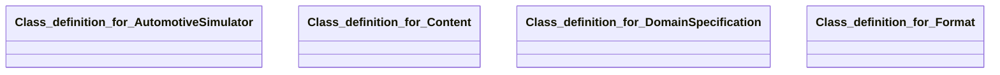

## automotive-simulator Properties

### Class Diagram

### Class Hierarchy

- Class definition for AutomotiveSimulator (https://w3id.org/gaia-x4plcaad/ontologies/automotive-simulator/v2/AutomotiveSimulator)
- Class definition for Content (https://w3id.org/gaia-x4plcaad/ontologies/automotive-simulator/v2/Content)
- Class definition for DomainSpecification (https://w3id.org/gaia-x4plcaad/ontologies/automotive-simulator/v2/DomainSpecification)
- Class definition for Format (https://w3id.org/gaia-x4plcaad/ontologies/automotive-simulator/v2/Format)

### Class Definitions

|Class|IRI|Description|Parents|
|---|---|---|---|
|Class definition for AutomotiveSimulator|https://w3id.org/gaia-x4plcaad/ontologies/automotive-simulator/v2/AutomotiveSimulator|An implementation of an automotive simulator.|SoftwareAsset|
|Class definition for Content|https://w3id.org/gaia-x4plcaad/ontologies/automotive-simulator/v2/Content|Describes the content properties of an automotive simulator (make, version, capabilities).|Content|
|Class definition for DomainSpecification|https://w3id.org/gaia-x4plcaad/ontologies/automotive-simulator/v2/DomainSpecification|Domain-specific metadata extension for automotive simulator assets.|DomainSpecification|
|Class definition for Format|https://w3id.org/gaia-x4plcaad/ontologies/automotive-simulator/v2/Format|Describes the format properties of an automotive simulator (scenario definitions, interfaces).|Format|

## Prefixes

- automotive-simulator: <https://w3id.org/gaia-x4plcaad/ontologies/automotive-simulator/v2/>
- brick: <https://brickschema.org/schema/Brick#>
- csvw: <http://www.w3.org/ns/csvw#>
- dc: <http://purl.org/dc/elements/1.1/>
- dcam: <http://purl.org/dc/dcam/>
- dcat: <http://www.w3.org/ns/dcat#>
- dcmitype: <http://purl.org/dc/dcmitype/>
- dcterms: <http://purl.org/dc/terms/>
- doap: <http://usefulinc.com/ns/doap#>
- envited-x: <https://w3id.org/ascs-ev/envited-x/envited-x/v3/>
- foaf: <http://xmlns.com/foaf/0.1/>
- geo: <http://www.opengis.net/ont/geosparql#>
- manifest: <https://w3id.org/ascs-ev/envited-x/manifest/v5/>
- odrl: <http://www.w3.org/ns/odrl/2/>
- org: <http://www.w3.org/ns/org#>
- owl: <http://www.w3.org/2002/07/owl#>
- prof: <http://www.w3.org/ns/dx/prof/>
- prov: <http://www.w3.org/ns/prov#>
- qb: <http://purl.org/linked-data/cube#>
- rdf: <http://www.w3.org/1999/02/22-rdf-syntax-ns#>
- rdfs: <http://www.w3.org/2000/01/rdf-schema#>
- schema: <https://schema.org/>
- sh: <http://www.w3.org/ns/shacl#>
- simulated-sensor: <https://w3id.org/gaia-x4plcaad/ontologies/simulated-sensor/v2/>
- skos: <http://www.w3.org/2004/02/skos/core#>
- sosa: <http://www.w3.org/ns/sosa/>
- ssn: <http://www.w3.org/ns/ssn/>
- time: <http://www.w3.org/2006/time#>
- vann: <http://purl.org/vocab/vann/>
- void: <http://rdfs.org/ns/void#>
- wgs: <https://www.w3.org/2003/01/geo/wgs84_pos#>
- xml: <http://www.w3.org/XML/1998/namespace>
- xsd: <http://www.w3.org/2001/XMLSchema#>

### SHACL Properties

#### automotive-simulator:hasContent {: #prop-https---w3id-org-gaia-x4plcaad-ontologies-automotive-simulator-v1-hascontent .property-anchor }
#### automotive-simulator:hasDomainSpecification {: #prop-https---w3id-org-gaia-x4plcaad-ontologies-automotive-simulator-v1-hasdomainspecification .property-anchor }
#### automotive-simulator:hasFormat {: #prop-https---w3id-org-gaia-x4plcaad-ontologies-automotive-simulator-v1-hasformat .property-anchor }
#### automotive-simulator:hasManifest {: #prop-https---w3id-org-gaia-x4plcaad-ontologies-automotive-simulator-v1-hasmanifest .property-anchor }
#### automotive-simulator:hasSoftwareResource {: #prop-https---w3id-org-gaia-x4plcaad-ontologies-automotive-simulator-v1-hassoftwareresource .property-anchor }
#### automotive-simulator:interface {: #prop-https---w3id-org-gaia-x4plcaad-ontologies-automotive-simulator-v1-interface .property-anchor }
#### automotive-simulator:scenarioDefinition {: #prop-https---w3id-org-gaia-x4plcaad-ontologies-automotive-simulator-v1-scenariodefinition .property-anchor }
#### automotive-simulator:sensorAttackFlag {: #prop-https---w3id-org-gaia-x4plcaad-ontologies-automotive-simulator-v1-sensorattackflag .property-anchor }
#### automotive-simulator:sensorFailureFlag {: #prop-https---w3id-org-gaia-x4plcaad-ontologies-automotive-simulator-v1-sensorfailureflag .property-anchor }
#### automotive-simulator:simulatorMake {: #prop-https---w3id-org-gaia-x4plcaad-ontologies-automotive-simulator-v1-simulatormake .property-anchor }
#### automotive-simulator:softwareVersion {: #prop-https---w3id-org-gaia-x4plcaad-ontologies-automotive-simulator-v1-softwareversion .property-anchor }
#### simulated-sensor:simulatedSensor {: #prop-https---w3id-org-gaia-x4plcaad-ontologies-simulated-sensor-v2-simulatedsensor .property-anchor }

|Shape|Property prefix|Property|MinCount|MaxCount|Description|Datatype/NodeKind|Filename|
|---|---|---|---|---|---|---|---|
|AutomotiveSimulatorShape|automotive-simulator|hasSoftwareResource|1|1|||automotive-simulator.shacl.ttl|
|AutomotiveSimulatorShape|automotive-simulator|hasDomainSpecification|1|1|||automotive-simulator.shacl.ttl|
|AutomotiveSimulatorShape|automotive-simulator|hasManifest|1|1|||automotive-simulator.shacl.ttl|
|DomainSpecificationShape|automotive-simulator|hasContent|1|1|||automotive-simulator.shacl.ttl|
|DomainSpecificationShape|automotive-simulator|hasFormat|1|1|||automotive-simulator.shacl.ttl|
|ContentShape|automotive-simulator|simulatorMake|1|1|Make/Type of automotive simulator.|<http://www.w3.org/2001/XMLSchema#string>|automotive-simulator.shacl.ttl|
|ContentShape|automotive-simulator|softwareVersion|1|1|Software version of the simulator.|<http://www.w3.org/2001/XMLSchema#string>|automotive-simulator.shacl.ttl|
|ContentShape|automotive-simulator|sensorFailureFlag|1|1|If true, the simulator supports the simulation of sensor failures.|<http://www.w3.org/2001/XMLSchema#boolean>|automotive-simulator.shacl.ttl|
|ContentShape|automotive-simulator|sensorAttackFlag|1|1|If true, the simulator supports the simulation of sensor attacks.|<http://www.w3.org/2001/XMLSchema#boolean>|automotive-simulator.shacl.ttl|
|ContentShape|simulated-sensor|simulatedSensor|0||Type and kinds of sensors that are natively included in the simulator.||automotive-simulator.shacl.ttl|
|FormatShape|automotive-simulator|scenarioDefinition|0||Description language for defining driving scenarios supported by the simulator.|<http://www.w3.org/2001/XMLSchema#string>|automotive-simulator.shacl.ttl|
|FormatShape|automotive-simulator|interface|0||Communication interface provided by the simulator.|<http://www.w3.org/2001/XMLSchema#string>|automotive-simulator.shacl.ttl|
