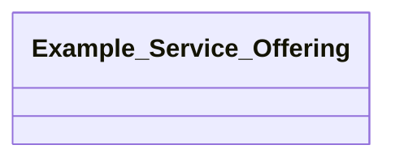

## description Properties

### Class Diagram

### Class Hierarchy

- Example Service Offering (https://w3id.org/gaia-x4plcaad/ontologies/description/v1/ExampleServiceOffering)

### Class Definitions

|Class|IRI|Description|Parents|
|---|---|---|---|
|Example Service Offering|https://w3id.org/gaia-x4plcaad/ontologies/description/v1/ExampleServiceOffering|Describes an example Service Offering.|ServiceOffering|

## Prefixes

- brick: <https://brickschema.org/schema/Brick#>
- csvw: <http://www.w3.org/ns/csvw#>
- dc: <http://purl.org/dc/elements/1.1/>
- dcam: <http://purl.org/dc/dcam/>
- dcat: <http://www.w3.org/ns/dcat#>
- dcmitype: <http://purl.org/dc/dcmitype/>
- dcterms: <http://purl.org/dc/terms/>
- description_ontology: <https://w3id.org/gaia-x4plcaad/ontologies/description/v1/>
- doap: <http://usefulinc.com/ns/doap#>
- foaf: <http://xmlns.com/foaf/0.1/>
- geo: <http://www.opengis.net/ont/geosparql#>
- odrl: <http://www.w3.org/ns/odrl/2/>
- openlabel: <https://openlabel.asam.net/V1-0-0/ontologies/>
- org: <http://www.w3.org/ns/org#>
- owl: <http://www.w3.org/2002/07/owl#>
- prof: <http://www.w3.org/ns/dx/prof/>
- prov: <http://www.w3.org/ns/prov#>
- qb: <http://purl.org/linked-data/cube#>
- rdf: <http://www.w3.org/1999/02/22-rdf-syntax-ns#>
- rdfs: <http://www.w3.org/2000/01/rdf-schema#>
- schema: <https://schema.org/>
- sh: <http://www.w3.org/ns/shacl#>
- skos: <http://www.w3.org/2004/02/skos/core#>
- sosa: <http://www.w3.org/ns/sosa/>
- ssn: <http://www.w3.org/ns/ssn/>
- time: <http://www.w3.org/2006/time#>
- vann: <http://purl.org/vocab/vann/>
- void: <http://rdfs.org/ns/void#>
- wgs: <https://www.w3.org/2003/01/geo/wgs84_pos#>
- xml: <http://www.w3.org/XML/1998/namespace>
- xsd: <http://www.w3.org/2001/XMLSchema#>

### SHACL Properties

#### description_ontology:belongsTo {: #prop-https---w3id-org-gaia-x4plcaad-ontologies-description-v1-belongsto .property-anchor }
#### description_ontology:hasJunctionIntersection {: #prop-https---w3id-org-gaia-x4plcaad-ontologies-description-v1-hasjunctionintersection .property-anchor }
#### description_ontology:property1 {: #prop-https---w3id-org-gaia-x4plcaad-ontologies-description-v1-property1 .property-anchor }
#### description_ontology:property2 {: #prop-https---w3id-org-gaia-x4plcaad-ontologies-description-v1-property2 .property-anchor }

|Shape|Property prefix|Property|MinCount|MaxCount|Description|Datatype/NodeKind|Filename|
|---|---|---|---|---|---|---|---|
|ExampleServiceOfferingShape|description_ontology|property1|1||A description that describes property 1.|<http://www.w3.org/2001/XMLSchema#string>|description.shacl.ttl|
|ExampleServiceOfferingShape|description_ontology|property2|1||A description that describes property 2.|<http://www.w3.org/2001/XMLSchema#string>|description.shacl.ttl|
|ExampleServiceOfferingShape|description_ontology|belongsTo|1||Identifier of related Self Description.|<http://www.w3.org/ns/shacl#IRI>|description.shacl.ttl|
|ExampleServiceOfferingShape|description_ontology|hasJunctionIntersection|1|1|Further description of the content of the scenario|<http://www.w3.org/ns/shacl#IRI>|description.shacl.ttl|
