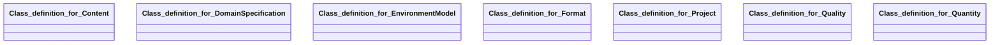

## environment-model Properties

### Class Diagram

### Class Hierarchy

- Class definition for Content (https://w3id.org/ascs-ev/envited-x/environment-model/v5/Content)
- Class definition for DomainSpecification (https://w3id.org/ascs-ev/envited-x/environment-model/v5/DomainSpecification)
- Class definition for EnvironmentModel (https://w3id.org/ascs-ev/envited-x/environment-model/v5/EnvironmentModel)
- Class definition for Format (https://w3id.org/ascs-ev/envited-x/environment-model/v5/Format)
- Class definition for Project (https://w3id.org/ascs-ev/envited-x/environment-model/v5/Project)
- Class definition for Quality (https://w3id.org/ascs-ev/envited-x/environment-model/v5/Quality)
- Class definition for Quantity (https://w3id.org/ascs-ev/envited-x/environment-model/v5/Quantity)

### Class Definitions

|Class|IRI|Description|Parents|
|---|---|---|---|
|Class definition for Content|https://w3id.org/ascs-ev/envited-x/environment-model/v5/Content|Describes the visual and functional elements included in an environment-model asset.|Content|
|Class definition for DomainSpecification|https://w3id.org/ascs-ev/envited-x/environment-model/v5/DomainSpecification|Environment-model specific domain specifications.|DomainSpecification|
|Class definition for EnvironmentModel|https://w3id.org/ascs-ev/envited-x/environment-model/v5/EnvironmentModel|Represents an environment-model asset with metadata describing format, content, project, quantity, and quality properties.|SimulationAsset|
|Class definition for Format|https://w3id.org/ascs-ev/envited-x/environment-model/v5/Format|Defines the format specifications of an environment-model asset.|Format|
|Class definition for Project|https://w3id.org/ascs-ev/envited-x/environment-model/v5/Project|Contains information about the tools and software used to create the environment-model asset.||
|Class definition for Quality|https://w3id.org/ascs-ev/envited-x/environment-model/v5/Quality|Describes the quality attributes of the environment-model asset, including detail level and texture resolution.|Quality|
|Class definition for Quantity|https://w3id.org/ascs-ev/envited-x/environment-model/v5/Quantity|Specifies numerical attributes like geometry count and triangle count for an environment-model asset.|Quantity|

## Prefixes

- brick: <https://brickschema.org/schema/Brick#>
- csvw: <http://www.w3.org/ns/csvw#>
- dc: <http://purl.org/dc/elements/1.1/>
- dcam: <http://purl.org/dc/dcam/>
- dcat: <http://www.w3.org/ns/dcat#>
- dcmitype: <http://purl.org/dc/dcmitype/>
- dcterms: <http://purl.org/dc/terms/>
- doap: <http://usefulinc.com/ns/doap#>
- environment-model: <https://w3id.org/ascs-ev/envited-x/environment-model/v5/>
- envited-x: <https://w3id.org/ascs-ev/envited-x/envited-x/v3/>
- foaf: <http://xmlns.com/foaf/0.1/>
- geo: <http://www.opengis.net/ont/geosparql#>
- georeference: <https://w3id.org/ascs-ev/envited-x/georeference/v5/>
- manifest: <https://w3id.org/ascs-ev/envited-x/manifest/v5/>
- odrl: <http://www.w3.org/ns/odrl/2/>
- org: <http://www.w3.org/ns/org#>
- owl: <http://www.w3.org/2002/07/owl#>
- prof: <http://www.w3.org/ns/dx/prof/>
- prov: <http://www.w3.org/ns/prov#>
- qb: <http://purl.org/linked-data/cube#>
- rdf: <http://www.w3.org/1999/02/22-rdf-syntax-ns#>
- rdfs: <http://www.w3.org/2000/01/rdf-schema#>
- schema: <https://schema.org/>
- sh: <http://www.w3.org/ns/shacl#>
- skos: <http://www.w3.org/2004/02/skos/core#>
- sosa: <http://www.w3.org/ns/sosa/>
- ssn: <http://www.w3.org/ns/ssn/>
- time: <http://www.w3.org/2006/time#>
- vann: <http://purl.org/vocab/vann/>
- void: <http://rdfs.org/ns/void#>
- wgs: <https://www.w3.org/2003/01/geo/wgs84_pos#>
- xml: <http://www.w3.org/XML/1998/namespace>
- xsd: <http://www.w3.org/2001/XMLSchema#>

### SHACL Properties

#### environment-model:creationToolName {: #prop-https---w3id-org-ascs-ev-envited-x-environment-model-v5-creationtoolname .property-anchor }
#### environment-model:creationToolVendor {: #prop-https---w3id-org-ascs-ev-envited-x-environment-model-v5-creationtoolvendor .property-anchor }
#### environment-model:creationToolVersion {: #prop-https---w3id-org-ascs-ev-envited-x-environment-model-v5-creationtoolversion .property-anchor }
#### environment-model:detailLevel {: #prop-https---w3id-org-ascs-ev-envited-x-environment-model-v5-detaillevel .property-anchor }
#### environment-model:elements {: #prop-https---w3id-org-ascs-ev-envited-x-environment-model-v5-elements .property-anchor }
#### environment-model:features {: #prop-https---w3id-org-ascs-ev-envited-x-environment-model-v5-features .property-anchor }
#### environment-model:formatType {: #prop-https---w3id-org-ascs-ev-envited-x-environment-model-v5-formattype .property-anchor }
#### environment-model:geometryCount {: #prop-https---w3id-org-ascs-ev-envited-x-environment-model-v5-geometrycount .property-anchor }
#### environment-model:hasContent {: #prop-https---w3id-org-ascs-ev-envited-x-environment-model-v5-hascontent .property-anchor }
#### environment-model:hasDomainSpecification {: #prop-https---w3id-org-ascs-ev-envited-x-environment-model-v5-hasdomainspecification .property-anchor }
#### environment-model:hasFormat {: #prop-https---w3id-org-ascs-ev-envited-x-environment-model-v5-hasformat .property-anchor }
#### environment-model:hasGeoreference {: #prop-https---w3id-org-ascs-ev-envited-x-environment-model-v5-hasgeoreference .property-anchor }
#### environment-model:hasManifest {: #prop-https---w3id-org-ascs-ev-envited-x-environment-model-v5-hasmanifest .property-anchor }
#### environment-model:hasProject {: #prop-https---w3id-org-ascs-ev-envited-x-environment-model-v5-hasproject .property-anchor }
#### environment-model:hasQuality {: #prop-https---w3id-org-ascs-ev-envited-x-environment-model-v5-hasquality .property-anchor }
#### environment-model:hasQuantity {: #prop-https---w3id-org-ascs-ev-envited-x-environment-model-v5-hasquantity .property-anchor }
#### environment-model:hasResourceDescription {: #prop-https---w3id-org-ascs-ev-envited-x-environment-model-v5-hasresourcedescription .property-anchor }
#### environment-model:textureMaterialCount {: #prop-https---w3id-org-ascs-ev-envited-x-environment-model-v5-texturematerialcount .property-anchor }
#### environment-model:textureResolution {: #prop-https---w3id-org-ascs-ev-envited-x-environment-model-v5-textureresolution .property-anchor }
#### environment-model:triangleCount {: #prop-https---w3id-org-ascs-ev-envited-x-environment-model-v5-trianglecount .property-anchor }
#### environment-model:useCase {: #prop-https---w3id-org-ascs-ev-envited-x-environment-model-v5-usecase .property-anchor }
#### environment-model:version {: #prop-https---w3id-org-ascs-ev-envited-x-environment-model-v5-version .property-anchor }
#### environment-model:visualisationToolName {: #prop-https---w3id-org-ascs-ev-envited-x-environment-model-v5-visualisationtoolname .property-anchor }
#### environment-model:visualisationToolVendor {: #prop-https---w3id-org-ascs-ev-envited-x-environment-model-v5-visualisationtoolvendor .property-anchor }
#### environment-model:visualisationToolVersion {: #prop-https---w3id-org-ascs-ev-envited-x-environment-model-v5-visualisationtoolversion .property-anchor }

|Shape|Property prefix|Property|MinCount|MaxCount|Description|Datatype/NodeKind|Filename|
|---|---|---|---|---|---|---|---|
|EnvironmentModelShape|environment-model|hasResourceDescription|1|1|||environment-model.shacl.ttl|
|EnvironmentModelShape|environment-model|hasDomainSpecification|1|1|||environment-model.shacl.ttl|
|EnvironmentModelShape|environment-model|hasManifest|1|1|||environment-model.shacl.ttl|
|DomainSpecificationShape|environment-model|hasProject|1|1|Contains properties to describe the project of the environment-model asset.||environment-model.shacl.ttl|
|DomainSpecificationShape|environment-model|hasFormat|1|1|Contains properties to describe the format of the environment-model asset.||environment-model.shacl.ttl|
|DomainSpecificationShape|environment-model|hasContent|1|1|Contains properties to describe the content (elements, use cases) of the environment-model asset.||environment-model.shacl.ttl|
|DomainSpecificationShape|environment-model|hasQuantity|1|1|Contains properties to describe the quantity (number of geometries, triangles, texture) of the environment-model asset.||environment-model.shacl.ttl|
|DomainSpecificationShape|environment-model|hasQuality|1|1|Contains properties to describe the quality (detail level, features) of the environment-model asset.||environment-model.shacl.ttl|
|DomainSpecificationShape|environment-model|hasGeoreference|1|1|||environment-model.shacl.ttl|
|FormatShape|environment-model|formatType||1|Defines the data type of the environment-model asset.|<http://www.w3.org/2001/XMLSchema#string>|environment-model.shacl.ttl|
|FormatShape|environment-model|version||1|Defines the version of the environment-model asset's data type.|<http://www.w3.org/2001/XMLSchema#string>|environment-model.shacl.ttl|
|ContentShape|environment-model|elements||1|Provides a description of the visual elements contained in the environment-model asset.|<http://www.w3.org/2001/XMLSchema#string>|environment-model.shacl.ttl|
|ContentShape|environment-model|useCase||1|Defines the potential use case of the environment-model asset.|<http://www.w3.org/2001/XMLSchema#string>|environment-model.shacl.ttl|
|ProjectShape|environment-model|visualisationToolName||1|Defines the name of the visualisation tool for which the environment-model was created.|<http://www.w3.org/2001/XMLSchema#string>|environment-model.shacl.ttl|
|ProjectShape|environment-model|visualisationToolVendor||1|Defines the vendor name of the visualisation tool.|<http://www.w3.org/2001/XMLSchema#string>|environment-model.shacl.ttl|
|ProjectShape|environment-model|visualisationToolVersion||1|Defines the version of the visualisation tool.|<http://www.w3.org/2001/XMLSchema#string>|environment-model.shacl.ttl|
|ProjectShape|environment-model|creationToolName||1|Defines the name of the creation tool used to create the environment-model.|<http://www.w3.org/2001/XMLSchema#string>|environment-model.shacl.ttl|
|ProjectShape|environment-model|creationToolVendor||1|Defines the vendor name of the creation tool.|<http://www.w3.org/2001/XMLSchema#string>|environment-model.shacl.ttl|
|ProjectShape|environment-model|creationToolVersion||1|Defines the version of the creation tool.|<http://www.w3.org/2001/XMLSchema#string>|environment-model.shacl.ttl|
|QualityShape|environment-model|features|0|1|Describes the features that influence the quality of the environment-model.|<http://www.w3.org/2001/XMLSchema#string>|environment-model.shacl.ttl|
|QualityShape|environment-model|detailLevel||1|Defines the category of the level of detail. High: the highest level with additional object enrichment; Medium: derived directly from data sources with environmental context; Low: a simple topological representation.|<http://www.w3.org/2001/XMLSchema#string>|environment-model.shacl.ttl|
|QualityShape|environment-model|textureResolution|0|1|Specifies the maximum real texture resolution in metres.|<http://www.w3.org/2001/XMLSchema#float>|environment-model.shacl.ttl|
|QuantityShape|environment-model|geometryCount||1|Defines the total number of geometries (all triangles with a material assignment), counting each instance only once.|<http://www.w3.org/2001/XMLSchema#integer>|environment-model.shacl.ttl|
|QuantityShape|environment-model|triangleCount||1|Defines the total number of triangles, counting each instance only once.|<http://www.w3.org/2001/XMLSchema#integer>|environment-model.shacl.ttl|
|QuantityShape|environment-model|textureMaterialCount||1|Specifies the total number of textures used.|<http://www.w3.org/2001/XMLSchema#integer>|environment-model.shacl.ttl|
