## envited-x Properties

### Class Diagram

```mermaid
classDiagram
class Class_definition_for_CodeArtifactBase
class Class_definition_for_CodeAsset
class Class_definition_for_Content
class Class_definition_for_DataSource
class Class_definition_for_DomainSpecification
class Class_definition_for_Format
class Class_definition_for_Manifest
class Class_definition_for_Quality
class Class_definition_for_Quantity
class Class_definition_for_ResourceDescription
class Class_definition_for_ServiceAsset
class Class_definition_for_ServiceOfferingBase
class Class_definition_for_SimulationAsset
class Class_definition_for_SoftwareAsset
class Class_definition_for_SoftwareResourceBase
```

### Class Hierarchy

- Class definition for CodeArtifactBase (https://w3id.org/ascs-ev/envited-x/envited-x/v3/CodeArtifactBase)
- Class definition for CodeAsset (https://w3id.org/ascs-ev/envited-x/envited-x/v3/CodeAsset)
- Class definition for Content (https://w3id.org/ascs-ev/envited-x/envited-x/v3/Content)
- Class definition for DataSource (https://w3id.org/ascs-ev/envited-x/envited-x/v3/DataSource)
- Class definition for DomainSpecification (https://w3id.org/ascs-ev/envited-x/envited-x/v3/DomainSpecification)
- Class definition for Format (https://w3id.org/ascs-ev/envited-x/envited-x/v3/Format)
- Class definition for Manifest (https://w3id.org/ascs-ev/envited-x/envited-x/v3/Manifest)
- Class definition for Quality (https://w3id.org/ascs-ev/envited-x/envited-x/v3/Quality)
- Class definition for Quantity (https://w3id.org/ascs-ev/envited-x/envited-x/v3/Quantity)
- Class definition for ResourceDescription (https://w3id.org/ascs-ev/envited-x/envited-x/v3/ResourceDescription)
- Class definition for ServiceAsset (https://w3id.org/ascs-ev/envited-x/envited-x/v3/ServiceAsset)
- Class definition for ServiceOfferingBase (https://w3id.org/ascs-ev/envited-x/envited-x/v3/ServiceOfferingBase)
- Class definition for SimulationAsset (https://w3id.org/ascs-ev/envited-x/envited-x/v3/SimulationAsset)
- Class definition for SoftwareAsset (https://w3id.org/ascs-ev/envited-x/envited-x/v3/SoftwareAsset)
- Class definition for SoftwareResourceBase (https://w3id.org/ascs-ev/envited-x/envited-x/v3/SoftwareResourceBase)

### Class Definitions

|Class|IRI|Description|Parents|
|---|---|---|---|
|Class definition for CodeArtifactBase|https://w3id.org/ascs-ev/envited-x/envited-x/v3/CodeArtifactBase|Base class coupling ENVITED-X code assets to gx:CodeArtifact.|CodeArtifact|
|Class definition for CodeAsset|https://w3id.org/ascs-ev/envited-x/envited-x/v3/CodeAsset|A structured digital asset in the ENVITED-X Data Space representing a code artifact.
                    Carries domain-specific metadata while delegating GX compliance
                    to the linked CodeArtifactBase node.|Thing|
|Class definition for Content|https://w3id.org/ascs-ev/envited-x/envited-x/v3/Content|Defines the content that can be extended for specific asset types.||
|Class definition for DataSource|https://w3id.org/ascs-ev/envited-x/envited-x/v3/DataSource|Defines which data resources or measurement systems were used that can be extended for specific asset types.||
|Class definition for DomainSpecification|https://w3id.org/ascs-ev/envited-x/envited-x/v3/DomainSpecification|A metadata extension that enriches a SimulationAsset with additional structured information.
                    Unlike envited-x:ResourceDescription, extensions do not represent standalone retrievable data assets but
                    serve as auxiliary metadata linked to a SimulationAsset.||
|Class definition for Format|https://w3id.org/ascs-ev/envited-x/envited-x/v3/Format|Contains properties to describe the format that can be extended for specific asset types.||
|Class definition for Manifest|https://w3id.org/ascs-ev/envited-x/envited-x/v3/Manifest|Defines a general manifest structure that can be extended for specific asset types, such as HD maps or vehicle models.|Manifest|
|Class definition for Quality|https://w3id.org/ascs-ev/envited-x/envited-x/v3/Quality|Contains properties to describe general quality criteria that can be extended for specific asset types.||
|Class definition for Quantity|https://w3id.org/ascs-ev/envited-x/envited-x/v3/Quantity|Contains properties to describe the quantity related criteria that can be extended for specific asset types.||
|Class definition for ResourceDescription|https://w3id.org/ascs-ev/envited-x/envited-x/v3/ResourceDescription|A base class for ENVITED-X resource descriptions, containing common metadata such as name and description of the simulation asset.
                    This class extends gx:VirtualResource and can be further specialized by domain-specific ontologies (e.g., HD Maps, Vehicle Models, or Sensor Data).|VirtualResource|
|Class definition for ServiceAsset|https://w3id.org/ascs-ev/envited-x/envited-x/v3/ServiceAsset|A structured digital asset in the ENVITED-X Data Space representing a service offering.
                    Carries domain-specific metadata while delegating GX compliance
                    to the linked ServiceOfferingBase node.|Thing|
|Class definition for ServiceOfferingBase|https://w3id.org/ascs-ev/envited-x/envited-x/v3/ServiceOfferingBase|Base class coupling ENVITED-X service assets to gx:ServiceOffering.|ServiceOffering|
|Class definition for SimulationAsset|https://w3id.org/ascs-ev/envited-x/envited-x/v3/SimulationAsset|A structured digital asset in the ENVITED-X Data Space that aggregates metadata and a structured manifest.
                    This class serves as a modular container for various simulation-related resources, ensuring interoperability and extensibility.
                    Every SimulationAsset must be linked to at least one ResourceDescription, which provides essential metadata,
                    and a Manifest, which defines its internal structure and licensing information.
                    Subclasses of SimulationAsset can be introduced to represent specific asset types, such as HD Maps or Vehicle Models.|Thing|
|Class definition for SoftwareAsset|https://w3id.org/ascs-ev/envited-x/envited-x/v3/SoftwareAsset|A structured digital asset in the ENVITED-X Data Space representing a software resource.
                    Carries domain-specific metadata while delegating GX compliance
                    to the linked SoftwareResourceBase node.|Thing|
|Class definition for SoftwareResourceBase|https://w3id.org/ascs-ev/envited-x/envited-x/v3/SoftwareResourceBase|Base class coupling ENVITED-X software assets to gx:SoftwareResource.|SoftwareResource|

## Prefixes

- brick: <https://brickschema.org/schema/Brick#>
- csvw: <http://www.w3.org/ns/csvw#>
- dc: <http://purl.org/dc/elements/1.1/>
- dcam: <http://purl.org/dc/dcam/>
- dcat: <http://www.w3.org/ns/dcat#>
- dcmitype: <http://purl.org/dc/dcmitype/>
- dcterms: <http://purl.org/dc/terms/>
- doap: <http://usefulinc.com/ns/doap#>
- envited-x: <https://w3id.org/ascs-ev/envited-x/envited-x/v3/>
- foaf: <http://xmlns.com/foaf/0.1/>
- geo: <http://www.opengis.net/ont/geosparql#>
- gx: <https://w3id.org/gaia-x/development#>
- manifest: <https://w3id.org/ascs-ev/envited-x/manifest/v5/>
- odrl: <http://www.w3.org/ns/odrl/2/>
- org: <http://www.w3.org/ns/org#>
- owl: <http://www.w3.org/2002/07/owl#>
- prof: <http://www.w3.org/ns/dx/prof/>
- prov: <http://www.w3.org/ns/prov#>
- qb: <http://purl.org/linked-data/cube#>
- rdf: <http://www.w3.org/1999/02/22-rdf-syntax-ns#>
- rdfs: <http://www.w3.org/2000/01/rdf-schema#>
- schema: <https://schema.org/>
- sh: <http://www.w3.org/ns/shacl#>
- skos: <http://www.w3.org/2004/02/skos/core#>
- sosa: <http://www.w3.org/ns/sosa/>
- ssn: <http://www.w3.org/ns/ssn/>
- time: <http://www.w3.org/2006/time#>
- vann: <http://purl.org/vocab/vann/>
- void: <http://rdfs.org/ns/void#>
- wgs: <https://www.w3.org/2003/01/geo/wgs84_pos#>
- xml: <http://www.w3.org/XML/1998/namespace>
- xsd: <http://www.w3.org/2001/XMLSchema#>

### SHACL Properties

#### envited-x:hasCodeArtifact {: #prop-https---w3id-org-ascs-ev-envited-x-envited-x-v3-hascodeartifact .property-anchor }
#### envited-x:hasContent {: #prop-https---w3id-org-ascs-ev-envited-x-envited-x-v3-hascontent .property-anchor }
#### envited-x:hasDataSource {: #prop-https---w3id-org-ascs-ev-envited-x-envited-x-v3-hasdatasource .property-anchor }
#### envited-x:hasDomainSpecification {: #prop-https---w3id-org-ascs-ev-envited-x-envited-x-v3-hasdomainspecification .property-anchor }
#### envited-x:hasFormat {: #prop-https---w3id-org-ascs-ev-envited-x-envited-x-v3-hasformat .property-anchor }
#### envited-x:hasManifest {: #prop-https---w3id-org-ascs-ev-envited-x-envited-x-v3-hasmanifest .property-anchor }
#### envited-x:hasQuality {: #prop-https---w3id-org-ascs-ev-envited-x-envited-x-v3-hasquality .property-anchor }
#### envited-x:hasQuantity {: #prop-https---w3id-org-ascs-ev-envited-x-envited-x-v3-hasquantity .property-anchor }
#### envited-x:hasResourceDescription {: #prop-https---w3id-org-ascs-ev-envited-x-envited-x-v3-hasresourcedescription .property-anchor }
#### envited-x:hasServiceOffering {: #prop-https---w3id-org-ascs-ev-envited-x-envited-x-v3-hasserviceoffering .property-anchor }
#### envited-x:hasSoftwareResource {: #prop-https---w3id-org-ascs-ev-envited-x-envited-x-v3-hassoftwareresource .property-anchor }
#### gx:copyrightOwnedBy {: #prop-https---w3id-org-gaia-x-development-copyrightownedby .property-anchor }
#### gx:description {: #prop-https---w3id-org-gaia-x-development-description .property-anchor }
#### gx:license {: #prop-https---w3id-org-gaia-x-development-license .property-anchor }
#### gx:name {: #prop-https---w3id-org-gaia-x-development-name .property-anchor }
#### gx:providedBy {: #prop-https---w3id-org-gaia-x-development-providedby .property-anchor }
#### gx:resourcePolicy {: #prop-https---w3id-org-gaia-x-development-resourcepolicy .property-anchor }
#### gx:serviceOfferingTermsAndConditions {: #prop-https---w3id-org-gaia-x-development-serviceofferingtermsandconditions .property-anchor }
#### manifest:hasAccessRole {: #prop-https---w3id-org-ascs-ev-envited-x-manifest-v5-hasaccessrole .property-anchor }
#### manifest:hasArtifacts {: #prop-https---w3id-org-ascs-ev-envited-x-manifest-v5-hasartifacts .property-anchor }
#### manifest:hasCategory {: #prop-https---w3id-org-ascs-ev-envited-x-manifest-v5-hascategory .property-anchor }
#### manifest:hasLicense {: #prop-https---w3id-org-ascs-ev-envited-x-manifest-v5-haslicense .property-anchor }
#### manifest:hasManifestReference {: #prop-https---w3id-org-ascs-ev-envited-x-manifest-v5-hasmanifestreference .property-anchor }
#### manifest:hasReferencedArtifacts {: #prop-https---w3id-org-ascs-ev-envited-x-manifest-v5-hasreferencedartifacts .property-anchor }
#### manifest:iri {: #prop-https---w3id-org-ascs-ev-envited-x-manifest-v5-iri .property-anchor }
#### rdf:type {: #prop-http---www-w3-org-1999-02-22-rdf-syntax-ns-type .property-anchor }
#### schema:description {: #prop-https---schema-org-description .property-anchor }
#### schema:name {: #prop-https---schema-org-name .property-anchor }

|Shape|Property prefix|Property|MinCount|MaxCount|Description|Datatype/NodeKind|Filename|
|---|---|---|---|---|---|---|---|
|SimulationAssetShape|envited-x|hasResourceDescription|1|1|||envited-x.shacl.ttl|
|SimulationAssetShape|envited-x|hasDomainSpecification|0||||envited-x.shacl.ttl|
|SimulationAssetShape|envited-x|hasManifest|1|1|||envited-x.shacl.ttl|
|SoftwareAssetShape|envited-x|hasSoftwareResource|1|1|||envited-x.shacl.ttl|
|SoftwareAssetShape|envited-x|hasDomainSpecification|0||||envited-x.shacl.ttl|
|SoftwareAssetShape|envited-x|hasManifest|1|1|||envited-x.shacl.ttl|
|ServiceAssetShape|envited-x|hasServiceOffering|1|1|||envited-x.shacl.ttl|
|ServiceAssetShape|envited-x|hasDomainSpecification|0||||envited-x.shacl.ttl|
|ServiceAssetShape|envited-x|hasManifest|1|1|||envited-x.shacl.ttl|
|CodeAssetShape|envited-x|hasCodeArtifact|1|1|||envited-x.shacl.ttl|
|CodeAssetShape|envited-x|hasDomainSpecification|0||||envited-x.shacl.ttl|
|CodeAssetShape|envited-x|hasManifest|1|1|||envited-x.shacl.ttl|
|ExtendedLinkShape|manifest|hasAccessRole|||||envited-x.shacl.ttl|
|ExtendedLinkShape|manifest|hasCategory|||||envited-x.shacl.ttl|
|ManifestLinkReferenceShape|manifest|hasCategory|||||envited-x.shacl.ttl|
|ManifestLinkReferenceShape|manifest|iri|1||||envited-x.shacl.ttl|
|LicenseLinkReferenceShape|manifest|hasCategory|||||envited-x.shacl.ttl|
|LicenseLinkReferenceShape|manifest|iri|1||||envited-x.shacl.ttl|
|ManifestShape|rdf|type|||||envited-x.shacl.ttl|
|ManifestShape|manifest|hasManifestReference|||||envited-x.shacl.ttl|
|ManifestShape|manifest|hasLicense|1|1|||envited-x.shacl.ttl|
|ManifestShape|manifest|hasArtifacts|||||envited-x.shacl.ttl|
|ManifestShape|manifest|hasReferencedArtifacts|||||envited-x.shacl.ttl|
|ManifestShape|manifest|hasArtifacts|||||envited-x.shacl.ttl|
|ManifestShape|manifest|hasArtifacts|||||envited-x.shacl.ttl|
|ManifestShape|manifest|hasArtifacts|||||envited-x.shacl.ttl|
|ManifestShape|manifest|hasArtifacts|||||envited-x.shacl.ttl|
|ResourceDescriptionShape|gx|name|1|1||<http://www.w3.org/2001/XMLSchema#string>|envited-x.shacl.ttl|
|ResourceDescriptionShape|gx|description|1|1||<http://www.w3.org/2001/XMLSchema#string>|envited-x.shacl.ttl|
|ResourceDescriptionShape|gx|license||1|Allows custom commercial identifiers in addition to Gaia-X standard SPDX checks.||envited-x.shacl.ttl|
|SoftwareResourceBaseShape|schema|name|1|1||<http://www.w3.org/2001/XMLSchema#string>|envited-x.shacl.ttl|
|SoftwareResourceBaseShape|schema|description||1||<http://www.w3.org/2001/XMLSchema#string>|envited-x.shacl.ttl|
|SoftwareResourceBaseShape|gx|license||1|||envited-x.shacl.ttl|
|SoftwareResourceBaseShape|gx|copyrightOwnedBy|1||||envited-x.shacl.ttl|
|SoftwareResourceBaseShape|gx|resourcePolicy|1|||<http://www.w3.org/2001/XMLSchema#string>|envited-x.shacl.ttl|
|ServiceOfferingBaseShape|schema|name|1|1||<http://www.w3.org/2001/XMLSchema#string>|envited-x.shacl.ttl|
|ServiceOfferingBaseShape|schema|description||1||<http://www.w3.org/2001/XMLSchema#string>|envited-x.shacl.ttl|
|ServiceOfferingBaseShape|gx|providedBy|1|1|||envited-x.shacl.ttl|
|ServiceOfferingBaseShape|gx|serviceOfferingTermsAndConditions|1||||envited-x.shacl.ttl|
|CodeArtifactBaseShape|schema|name|1|1||<http://www.w3.org/2001/XMLSchema#string>|envited-x.shacl.ttl|
|CodeArtifactBaseShape|schema|description||1||<http://www.w3.org/2001/XMLSchema#string>|envited-x.shacl.ttl|
|CodeArtifactBaseShape|gx|license||1|||envited-x.shacl.ttl|
|CodeArtifactBaseShape|gx|copyrightOwnedBy|1||||envited-x.shacl.ttl|
|CodeArtifactBaseShape|gx|resourcePolicy|1|||<http://www.w3.org/2001/XMLSchema#string>|envited-x.shacl.ttl|
|DomainSpecificationShape|envited-x|hasContent|1||||envited-x.shacl.ttl|
|DomainSpecificationShape|envited-x|hasFormat|0||||envited-x.shacl.ttl|
|DomainSpecificationShape|envited-x|hasDataSource|0||||envited-x.shacl.ttl|
|DomainSpecificationShape|envited-x|hasQuality|0||||envited-x.shacl.ttl|
|DomainSpecificationShape|envited-x|hasQuantity|0||||envited-x.shacl.ttl|
