## envited-x Properties

### Class Diagram

```mermaid
classDiagram
class Class_definition_for_Content
class Class_definition_for_DataResource
class Class_definition_for_DataResourceExtension
class Class_definition_for_DataSource
class Class_definition_for_Format
class Class_definition_for_Manifest
class Class_definition_for_Quality
class Class_definition_for_Quantity
class Class_definition_for_SimulationAsset
```

### Class Hierarchy

- Class definition for Content (https://w3id.org/ascs-ev/envited-x/envited-x/v3/Content)
- Class definition for DataResource (https://w3id.org/ascs-ev/envited-x/envited-x/v3/DataResource)
- Class definition for DataResourceExtension (https://w3id.org/ascs-ev/envited-x/envited-x/v3/DataResourceExtension)
- Class definition for DataSource (https://w3id.org/ascs-ev/envited-x/envited-x/v3/DataSource)
- Class definition for Format (https://w3id.org/ascs-ev/envited-x/envited-x/v3/Format)
- Class definition for Manifest (https://w3id.org/ascs-ev/envited-x/envited-x/v3/Manifest)
- Class definition for Quality (https://w3id.org/ascs-ev/envited-x/envited-x/v3/Quality)
- Class definition for Quantity (https://w3id.org/ascs-ev/envited-x/envited-x/v3/Quantity)
- Class definition for SimulationAsset (https://w3id.org/ascs-ev/envited-x/envited-x/v3/SimulationAsset)

### Class Definitions

|Class|IRI|Description|Parents|
|---|---|---|---|
|Class definition for Content|https://w3id.org/ascs-ev/envited-x/envited-x/v3/Content|Defines the content that can be extended for specific asset types.||
|Class definition for DataResource|https://w3id.org/ascs-ev/envited-x/envited-x/v3/DataResource|A base class for ENVITED-X DataResources, containing common metadata such as name and description of the simulation asset.
                    This class extends gx:DataResource and can be further specialized by domain-specific ontologies (e.g., HD Maps, Vehicle Models, or Sensor Data).|DataResource|
|Class definition for DataResourceExtension|https://w3id.org/ascs-ev/envited-x/envited-x/v3/DataResourceExtension|A metadata extension that enriches a SimulationAsset with additional structured information.
                    Unlike envited-x:DataResource, extensions do not represent standalone retrievable data assets but
                    serve as auxiliary metadata linked to a SimulationAsset.||
|Class definition for DataSource|https://w3id.org/ascs-ev/envited-x/envited-x/v3/DataSource|Defines which data resources or measurement systems were used that can be extended for specific asset types.||
|Class definition for Format|https://w3id.org/ascs-ev/envited-x/envited-x/v3/Format|Contains properties to describe the format that can be extended for specific asset types.||
|Class definition for Manifest|https://w3id.org/ascs-ev/envited-x/envited-x/v3/Manifest|Defines a general manifest structure that can be extended for specific asset types, such as HD maps or vehicle models.|Manifest|
|Class definition for Quality|https://w3id.org/ascs-ev/envited-x/envited-x/v3/Quality|Contains properties to describe general quality criteria that can be extended for specific asset types.||
|Class definition for Quantity|https://w3id.org/ascs-ev/envited-x/envited-x/v3/Quantity|Contains properties to describe the quantity related criteria that can be extended for specific asset types.||
|Class definition for SimulationAsset|https://w3id.org/ascs-ev/envited-x/envited-x/v3/SimulationAsset|A structured digital asset in the ENVITED-X Data Space that aggregates metadata and a structured manifest.
                    This class serves as a modular container for various simulation-related resources, ensuring interoperability and extensibility.
                    Every SimulationAsset must be linked to at least one DataResource, which provides essential metadata,
                    and a Manifest, which defines its internal structure and licensing information.
                    Subclasses of SimulationAsset can be introduced to represent specific asset types, such as HD Maps or Vehicle Models.|Thing|

## Prefixes

- brick: <https://brickschema.org/schema/Brick#>
- csvw: <http://www.w3.org/ns/csvw#>
- dc: <http://purl.org/dc/elements/1.1/>
- dcam: <http://purl.org/dc/dcam/>
- dcat: <http://www.w3.org/ns/dcat#>
- dcmitype: <http://purl.org/dc/dcmitype/>
- dcterms: <http://purl.org/dc/terms/>
- doap: <http://usefulinc.com/ns/doap#>
- envited-x: <https://w3id.org/ascs-ev/envited-x/envited-x/v3/>
- foaf: <http://xmlns.com/foaf/0.1/>
- geo: <http://www.opengis.net/ont/geosparql#>
- gx: <https://w3id.org/gaia-x/development/>
- manifest: <https://w3id.org/ascs-ev/envited-x/manifest/v5/>
- odrl: <http://www.w3.org/ns/odrl/2/>
- org: <http://www.w3.org/ns/org#>
- owl: <http://www.w3.org/2002/07/owl#>
- prof: <http://www.w3.org/ns/dx/prof/>
- prov: <http://www.w3.org/ns/prov#>
- qb: <http://purl.org/linked-data/cube#>
- rdf: <http://www.w3.org/1999/02/22-rdf-syntax-ns#>
- rdfs: <http://www.w3.org/2000/01/rdf-schema#>
- schema: <https://schema.org/>
- sh: <http://www.w3.org/ns/shacl#>
- skos: <http://www.w3.org/2004/02/skos/core#>
- sosa: <http://www.w3.org/ns/sosa/>
- ssn: <http://www.w3.org/ns/ssn/>
- time: <http://www.w3.org/2006/time#>
- vann: <http://purl.org/vocab/vann/>
- void: <http://rdfs.org/ns/void#>
- wgs: <https://www.w3.org/2003/01/geo/wgs84_pos#>
- xml: <http://www.w3.org/XML/1998/namespace>
- xsd: <http://www.w3.org/2001/XMLSchema#>

### SHACL Properties

|Shape|Property prefix|Property|MinCount|MaxCount|Description|Datatype/NodeKind|Filename|
|---|---|---|---|---|---|---|---|
|SimulationAssetShape|envited-x|hasDataResource|1|1|||envited-x.shacl.ttl|
|SimulationAssetShape|envited-x|hasDataResourceExtension|0||||envited-x.shacl.ttl|
|SimulationAssetShape|envited-x|hasManifest|1|1|||envited-x.shacl.ttl|
|ExtendedLinkShape|manifest|hasAccessRole|||||envited-x.shacl.ttl|
|ExtendedLinkShape|manifest|hasCategory|||||envited-x.shacl.ttl|
|ManifestLinkReferenceShape|manifest|hasCategory|||||envited-x.shacl.ttl|
|ManifestLinkReferenceShape|manifest|iri|1||||envited-x.shacl.ttl|
|LicenseLinkReferenceShape|manifest|hasCategory|||||envited-x.shacl.ttl|
|LicenseLinkReferenceShape|manifest|iri|1||||envited-x.shacl.ttl|
|ManifestShape|rdf|type|||||envited-x.shacl.ttl|
|ManifestShape|manifest|hasManifestReference|||||envited-x.shacl.ttl|
|ManifestShape|manifest|hasLicense|1|1|||envited-x.shacl.ttl|
|ManifestShape|manifest|hasArtifacts|||||envited-x.shacl.ttl|
|ManifestShape|manifest|hasReferencedArtifacts|||||envited-x.shacl.ttl|
|ManifestShape|manifest|hasArtifacts|||||envited-x.shacl.ttl|
|ManifestShape|manifest|hasArtifacts|||||envited-x.shacl.ttl|
|ManifestShape|manifest|hasArtifacts|||||envited-x.shacl.ttl|
|ManifestShape|manifest|hasArtifacts|||||envited-x.shacl.ttl|
|DataResourceShape|gx|name|1|1||<http://www.w3.org/2001/XMLSchema#string>|envited-x.shacl.ttl|
|DataResourceShape|gx|description|1|1||<http://www.w3.org/2001/XMLSchema#string>|envited-x.shacl.ttl|
|DataResourceShape|gx|license||1|Allows custom commercial identifiers in addition to Gaia-X standard SPDX checks.||envited-x.shacl.ttl|
|DataResourceExtensionShape|envited-x|hasContent|1||||envited-x.shacl.ttl|
|DataResourceExtensionShape|envited-x|hasFormat|1||||envited-x.shacl.ttl|
|DataResourceExtensionShape|envited-x|hasDataSource|0||||envited-x.shacl.ttl|
|DataResourceExtensionShape|envited-x|hasQuality|0||||envited-x.shacl.ttl|
|DataResourceExtensionShape|envited-x|hasQuantity|0||||envited-x.shacl.ttl|
