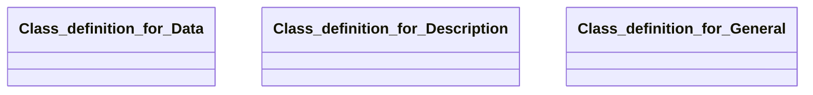

## general Properties

### Class Diagram

### Class Hierarchy

- Class definition for Data (https://w3id.org/gaia-x4plcaad/ontologies/general/v3/Data)
- Class definition for Description (https://w3id.org/gaia-x4plcaad/ontologies/general/v3/Description)
- Class definition for General (https://w3id.org/gaia-x4plcaad/ontologies/general/v3/General)

### Class Definitions

|Class|IRI|Description|Parents|
|---|---|---|---|
|Class definition for Data|https://w3id.org/gaia-x4plcaad/ontologies/general/v3/Data|General data properties of the simulation asset.||
|Class definition for Description|https://w3id.org/gaia-x4plcaad/ontologies/general/v3/Description|General text based description of the simulation asset.||
|Class definition for General|https://w3id.org/gaia-x4plcaad/ontologies/general/v3/General|General properties common for all simulation assets.||

## Prefixes

- brick: <https://brickschema.org/schema/Brick#>
- csvw: <http://www.w3.org/ns/csvw#>
- dc: <http://purl.org/dc/elements/1.1/>
- dcam: <http://purl.org/dc/dcam/>
- dcat: <http://www.w3.org/ns/dcat#>
- dcmitype: <http://purl.org/dc/dcmitype/>
- dcterms: <http://purl.org/dc/terms/>
- doap: <http://usefulinc.com/ns/doap#>
- foaf: <http://xmlns.com/foaf/0.1/>
- general: <https://w3id.org/gaia-x4plcaad/ontologies/general/v3/>
- geo: <http://www.opengis.net/ont/geosparql#>
- odrl: <http://www.w3.org/ns/odrl/2/>
- org: <http://www.w3.org/ns/org#>
- owl: <http://www.w3.org/2002/07/owl#>
- prof: <http://www.w3.org/ns/dx/prof/>
- prov: <http://www.w3.org/ns/prov#>
- qb: <http://purl.org/linked-data/cube#>
- rdf: <http://www.w3.org/1999/02/22-rdf-syntax-ns#>
- rdfs: <http://www.w3.org/2000/01/rdf-schema#>
- schema: <https://schema.org/>
- sh: <http://www.w3.org/ns/shacl#>
- skos: <http://www.w3.org/2004/02/skos/core#>
- sosa: <http://www.w3.org/ns/sosa/>
- ssn: <http://www.w3.org/ns/ssn/>
- time: <http://www.w3.org/2006/time#>
- vann: <http://purl.org/vocab/vann/>
- void: <http://rdfs.org/ns/void#>
- wgs: <https://www.w3.org/2003/01/geo/wgs84_pos#>
- xml: <http://www.w3.org/XML/1998/namespace>
- xsd: <http://www.w3.org/2001/XMLSchema#>

### SHACL Properties

|Shape|Property prefix|Property|MinCount|MaxCount|Description|Datatype/NodeKind|Filename|
|---|---|---|---|---|---|---|---|
|GeneralShape|general|description|1|1|General text based description of the simulation asset.||general.shacl.ttl|
|GeneralShape|general|data|1|1|Data properties of the simulation asset.||general.shacl.ttl|
|DescriptionShape|general|name|1|1|A human readable name of the entity.|<http://www.w3.org/2001/XMLSchema#string>|general.shacl.ttl|
|DescriptionShape|general|description|1|1|A free text description of the entity.|<http://www.w3.org/2001/XMLSchema#string>|general.shacl.ttl|
|DataShape|general|size|1|1|Size of the data file(s) (e.g. xodr, 3d model zip) to be downloaded in MB (megabyte).|<http://www.w3.org/2001/XMLSchema#float>|general.shacl.ttl|
|DataShape|general|recordingTime||1|Time of data acquisition used to generate the asset, if partial measurement: oldest date|<http://www.w3.org/2001/XMLSchema#dateTime>|general.shacl.ttl|
