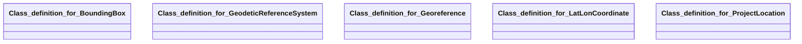

## georeference Properties

### Class Diagram

### Class Hierarchy

- Class definition for BoundingBox (https://w3id.org/ascs-ev/envited-x/georeference/v5/BoundingBox)
- Class definition for GeodeticReferenceSystem (https://w3id.org/ascs-ev/envited-x/georeference/v5/GeodeticReferenceSystem)
- Class definition for Georeference (https://w3id.org/ascs-ev/envited-x/georeference/v5/Georeference)
- Class definition for LatLonCoordinate (https://w3id.org/ascs-ev/envited-x/georeference/v5/LatLonCoordinate)
- Class definition for ProjectLocation (https://w3id.org/ascs-ev/envited-x/georeference/v5/ProjectLocation)

### Class Definitions

|Class|IRI|Description|Parents|
|---|---|---|---|
|Class definition for BoundingBox|https://w3id.org/ascs-ev/envited-x/georeference/v5/BoundingBox|Defines a rectangular spatial extent using minimum and maximum values for the x and y axes.||
|Class definition for GeodeticReferenceSystem|https://w3id.org/ascs-ev/envited-x/georeference/v5/GeodeticReferenceSystem|Defines the reference system used to represent coordinates, including projection type and ellipsoid model.||
|Class definition for Georeference|https://w3id.org/ascs-ev/envited-x/georeference/v5/Georeference|A georeferencing dataset that defines the coordinate system, location, and spatial properties of a simulation asset.
                    This class serves as an optional metadata extension and does not function as a standalone data resource.||
|Class definition for LatLonCoordinate|https://w3id.org/ascs-ev/envited-x/georeference/v5/LatLonCoordinate|Defines world coordinates in latitude and longitude, expressed in degrees.||
|Class definition for ProjectLocation|https://w3id.org/ascs-ev/envited-x/georeference/v5/ProjectLocation|Contains attributes describing the location of a simulation asset, such as country, region, city, and bounding box.||

## Prefixes

- brick: <https://brickschema.org/schema/Brick#>
- csvw: <http://www.w3.org/ns/csvw#>
- dc: <http://purl.org/dc/elements/1.1/>
- dcam: <http://purl.org/dc/dcam/>
- dcat: <http://www.w3.org/ns/dcat#>
- dcmitype: <http://purl.org/dc/dcmitype/>
- dcterms: <http://purl.org/dc/terms/>
- doap: <http://usefulinc.com/ns/doap#>
- foaf: <http://xmlns.com/foaf/0.1/>
- geo: <http://www.opengis.net/ont/geosparql#>
- georeference: <https://w3id.org/ascs-ev/envited-x/georeference/v5/>
- odrl: <http://www.w3.org/ns/odrl/2/>
- org: <http://www.w3.org/ns/org#>
- owl: <http://www.w3.org/2002/07/owl#>
- prof: <http://www.w3.org/ns/dx/prof/>
- prov: <http://www.w3.org/ns/prov#>
- qb: <http://purl.org/linked-data/cube#>
- rdf: <http://www.w3.org/1999/02/22-rdf-syntax-ns#>
- rdfs: <http://www.w3.org/2000/01/rdf-schema#>
- schema: <https://schema.org/>
- sh: <http://www.w3.org/ns/shacl#>
- skos: <http://www.w3.org/2004/02/skos/core#>
- sosa: <http://www.w3.org/ns/sosa/>
- ssn: <http://www.w3.org/ns/ssn/>
- time: <http://www.w3.org/2006/time#>
- vann: <http://purl.org/vocab/vann/>
- void: <http://rdfs.org/ns/void#>
- wgs: <https://www.w3.org/2003/01/geo/wgs84_pos#>
- xml: <http://www.w3.org/XML/1998/namespace>
- xsd: <http://www.w3.org/2001/XMLSchema#>

### SHACL Properties

|Shape|Property prefix|Property|MinCount|MaxCount|Description|Datatype/NodeKind|Filename|
|---|---|---|---|---|---|---|---|
|GeoreferenceShape|georeference|hasProjectLocation|1|1|Contains properties (state, city, region, country, bounding) to describe the location of the simulation asset.||georeference.shacl.ttl|
|GeoreferenceShape|georeference|hasGeodeticReferenceSystem|1|1|This ontology includes properties for positions (e.g., origin and viewpoint), projection type, and an ellipsoidal height system, which together define a geodetic reference system.||georeference.shacl.ttl|
|GeodeticReferenceSystemShape|georeference|hasOrigin|1|1|Defines the center position of the asset in world coordinates.||georeference.shacl.ttl|
|GeodeticReferenceSystemShape|georeference|hasViewPoint||1|Defines the imported viewpoint position of the asset in world coordinates.||georeference.shacl.ttl|
|GeodeticReferenceSystemShape|georeference|codeEPSG||1|Defines the projection EPSG code for the asset.|<http://www.w3.org/2001/XMLSchema#integer>|georeference.shacl.ttl|
|GeodeticReferenceSystemShape|georeference|coordinateSystemName||1|Describes the coordinate system name of the asset as an alternative to the EPSG code.|<http://www.w3.org/2001/XMLSchema#string>|georeference.shacl.ttl|
|GeodeticReferenceSystemShape|georeference|heightSystem||1|Defines the height system type of the asset.||georeference.shacl.ttl|
|BoundingBoxShape|georeference|xMin|1|1|Defines the minimum bounding box value along the x-axis.|<http://www.w3.org/2001/XMLSchema#float>|georeference.shacl.ttl|
|BoundingBoxShape|georeference|yMin|1|1|Defines the minimum bounding box value along the y-axis.|<http://www.w3.org/2001/XMLSchema#float>|georeference.shacl.ttl|
|BoundingBoxShape|georeference|xMax|1|1|Defines the maximum bounding box value along the x-axis.|<http://www.w3.org/2001/XMLSchema#float>|georeference.shacl.ttl|
|BoundingBoxShape|georeference|yMax|1|1|Defines the maximum bounding box value along the y-axis.|<http://www.w3.org/2001/XMLSchema#float>|georeference.shacl.ttl|
|LatLonCoordinateShape|georeference|lat|1|1|Defines a world latitude value (on the y-axis) in degrees.|<http://www.w3.org/2001/XMLSchema#float>|georeference.shacl.ttl|
|LatLonCoordinateShape|georeference|lon|1|1|Defines a world longitude value (on the x-axis) in degrees.|<http://www.w3.org/2001/XMLSchema#float>|georeference.shacl.ttl|
|ProjectLocationShape|georeference|state||1|Defines an ISO 3166-2 code for the state or province in which the asset centre is located.|<http://www.w3.org/2001/XMLSchema#string>|georeference.shacl.ttl|
|ProjectLocationShape|georeference|city||1|Specifies the name of the city in which the asset's centre is located.|<http://www.w3.org/2001/XMLSchema#string>|georeference.shacl.ttl|
|ProjectLocationShape|georeference|region||1|Specifies the name of the region in which the asset's centre is located.|<http://www.w3.org/2001/XMLSchema#string>|georeference.shacl.ttl|
|ProjectLocationShape|georeference|country||1|Defines an ISO 3166-1, alpha-2 code for the country in which the asset centre is located.|<http://www.w3.org/2001/XMLSchema#string>|georeference.shacl.ttl|
|ProjectLocationShape|georeference|hasBoundingBox|1|1|Defines the bounding box in world coordinates of the asset.||georeference.shacl.ttl|
|ProjectLocationShape|georeference|relationOrArea||1|Describes the area in which the asset is located, such as the name of the main street or the landscape region.|<http://www.w3.org/2001/XMLSchema#string>|georeference.shacl.ttl|
