## hdmap Properties

### Class Diagram

```mermaid
classDiagram
class Class_definition_for_Content
class Class_definition_for_DataSource
class Class_definition_for_DomainSpecification
class Class_definition_for_Format
class Class_definition_for_HdMap
class Class_definition_for_Quality
class Class_definition_for_Quantity
class Class_definition_for_Range2D
class Content_or_OpenLabel_OddScenery
```

### Class Hierarchy

- Class definition for Content (https://w3id.org/ascs-ev/envited-x/hdmap/v5/Content)
- Class definition for DataSource (https://w3id.org/ascs-ev/envited-x/hdmap/v5/DataSource)
- Class definition for DomainSpecification (https://w3id.org/ascs-ev/envited-x/hdmap/v5/DomainSpecification)
- Class definition for Format (https://w3id.org/ascs-ev/envited-x/hdmap/v5/Format)
- Class definition for HdMap (https://w3id.org/ascs-ev/envited-x/hdmap/v5/HdMap)
- Class definition for Quality (https://w3id.org/ascs-ev/envited-x/hdmap/v5/Quality)
- Class definition for Quantity (https://w3id.org/ascs-ev/envited-x/hdmap/v5/Quantity)
- Class definition for Range2D (https://w3id.org/ascs-ev/envited-x/hdmap/v5/Range2D)
- Content or OpenLabel OddScenery (https://w3id.org/ascs-ev/envited-x/hdmap/v5/ContentOrOddScenery)

### Class Definitions

|Class|IRI|Description|Parents|
|---|---|---|---|
|Class definition for Content|https://w3id.org/ascs-ev/envited-x/hdmap/v5/Content|Defines the content (road types, lane types, object types, traffic direction) of the HD map asset.|Content|
|Class definition for DataSource|https://w3id.org/ascs-ev/envited-x/hdmap/v5/DataSource|Defines which data resources or measurement systems were used to create the HD map asset.|DataSource|
|Class definition for DomainSpecification|https://w3id.org/ascs-ev/envited-x/hdmap/v5/DomainSpecification|HD map DomainSpecification containing additional metadata information of the simulation asset.|DomainSpecification|
|Class definition for Format|https://w3id.org/ascs-ev/envited-x/hdmap/v5/Format|Contains properties to describe the format of the HD map asset.|Format|
|Class definition for HdMap|https://w3id.org/ascs-ev/envited-x/hdmap/v5/HdMap|General properties for defining a high-definition map (HD map) asset used in simulation environments, such as format, content, quantity and quality properties.|SimulationAsset|
|Class definition for Quality|https://w3id.org/ascs-ev/envited-x/hdmap/v5/Quality|Contains properties to describe the accuracy of the HD map asset.|Quality|
|Class definition for Quantity|https://w3id.org/ascs-ev/envited-x/hdmap/v5/Quantity|Contains properties to describe the quantity (e.g. number of intersections, traffic lights, signs, length, range of speed limits/elevations) of the HD map asset.|Quantity|
|Class definition for Range2D|https://w3id.org/ascs-ev/envited-x/hdmap/v5/Range2D|Range2D definition with minimum to maximum data property usable in the HD map asset.||
|Content or OpenLabel OddScenery|https://w3id.org/ascs-ev/envited-x/hdmap/v5/ContentOrOddScenery|Combines HDMap content with OpenLABEL's OddScenery.||

## Prefixes

- brick: <https://brickschema.org/schema/Brick#>
- csvw: <http://www.w3.org/ns/csvw#>
- dc: <http://purl.org/dc/elements/1.1/>
- dcam: <http://purl.org/dc/dcam/>
- dcat: <http://www.w3.org/ns/dcat#>
- dcmitype: <http://purl.org/dc/dcmitype/>
- dcterms: <http://purl.org/dc/terms/>
- doap: <http://usefulinc.com/ns/doap#>
- envited-x: <https://w3id.org/ascs-ev/envited-x/envited-x/v3/>
- foaf: <http://xmlns.com/foaf/0.1/>
- geo: <http://www.opengis.net/ont/geosparql#>
- georeference: <https://w3id.org/ascs-ev/envited-x/georeference/v5/>
- hdmap: <https://w3id.org/ascs-ev/envited-x/hdmap/v5/>
- manifest: <https://w3id.org/ascs-ev/envited-x/manifest/v5/>
- odrl: <http://www.w3.org/ns/odrl/2/>
- openlabel: <https://openlabel.asam.net/V1-0-0/ontologies/>
- org: <http://www.w3.org/ns/org#>
- owl: <http://www.w3.org/2002/07/owl#>
- prof: <http://www.w3.org/ns/dx/prof/>
- prov: <http://www.w3.org/ns/prov#>
- qb: <http://purl.org/linked-data/cube#>
- rdf: <http://www.w3.org/1999/02/22-rdf-syntax-ns#>
- rdfs: <http://www.w3.org/2000/01/rdf-schema#>
- schema: <https://schema.org/>
- sh: <http://www.w3.org/ns/shacl#>
- skos: <http://www.w3.org/2004/02/skos/core#>
- sosa: <http://www.w3.org/ns/sosa/>
- ssn: <http://www.w3.org/ns/ssn/>
- time: <http://www.w3.org/2006/time#>
- vann: <http://purl.org/vocab/vann/>
- void: <http://rdfs.org/ns/void#>
- wgs: <https://www.w3.org/2003/01/geo/wgs84_pos#>
- xml: <http://www.w3.org/XML/1998/namespace>
- xsd: <http://www.w3.org/2001/XMLSchema#>

### SHACL Properties

#### hdmap:accuracyLaneModel2d {: #prop-https---w3id-org-ascs-ev-envited-x-hdmap-v5-accuracylanemodel2d .property-anchor }
#### hdmap:accuracyLaneModelHeight {: #prop-https---w3id-org-ascs-ev-envited-x-hdmap-v5-accuracylanemodelheight .property-anchor }
#### hdmap:accuracyObjects {: #prop-https---w3id-org-ascs-ev-envited-x-hdmap-v5-accuracyobjects .property-anchor }
#### hdmap:accuracySignals {: #prop-https---w3id-org-ascs-ev-envited-x-hdmap-v5-accuracysignals .property-anchor }
#### hdmap:elevationRange {: #prop-https---w3id-org-ascs-ev-envited-x-hdmap-v5-elevationrange .property-anchor }
#### hdmap:formatType {: #prop-https---w3id-org-ascs-ev-envited-x-hdmap-v5-formattype .property-anchor }
#### hdmap:hasContent {: #prop-https---w3id-org-ascs-ev-envited-x-hdmap-v5-hascontent .property-anchor }
#### hdmap:hasDataSource {: #prop-https---w3id-org-ascs-ev-envited-x-hdmap-v5-hasdatasource .property-anchor }
#### hdmap:hasDomainSpecification {: #prop-https---w3id-org-ascs-ev-envited-x-hdmap-v5-hasdomainspecification .property-anchor }
#### hdmap:hasFormat {: #prop-https---w3id-org-ascs-ev-envited-x-hdmap-v5-hasformat .property-anchor }
#### hdmap:hasGeoreference {: #prop-https---w3id-org-ascs-ev-envited-x-hdmap-v5-hasgeoreference .property-anchor }
#### hdmap:hasManifest {: #prop-https---w3id-org-ascs-ev-envited-x-hdmap-v5-hasmanifest .property-anchor }
#### hdmap:hasQuality {: #prop-https---w3id-org-ascs-ev-envited-x-hdmap-v5-hasquality .property-anchor }
#### hdmap:hasQuantity {: #prop-https---w3id-org-ascs-ev-envited-x-hdmap-v5-hasquantity .property-anchor }
#### hdmap:hasResourceDescription {: #prop-https---w3id-org-ascs-ev-envited-x-hdmap-v5-hasresourcedescription .property-anchor }
#### hdmap:laneTypes {: #prop-https---w3id-org-ascs-ev-envited-x-hdmap-v5-lanetypes .property-anchor }
#### hdmap:length {: #prop-https---w3id-org-ascs-ev-envited-x-hdmap-v5-length .property-anchor }
#### hdmap:levelOfDetail {: #prop-https---w3id-org-ascs-ev-envited-x-hdmap-v5-levelofdetail .property-anchor }
#### hdmap:max {: #prop-https---w3id-org-ascs-ev-envited-x-hdmap-v5-max .property-anchor }
#### hdmap:measurementSystem {: #prop-https---w3id-org-ascs-ev-envited-x-hdmap-v5-measurementsystem .property-anchor }
#### hdmap:min {: #prop-https---w3id-org-ascs-ev-envited-x-hdmap-v5-min .property-anchor }
#### hdmap:numberIntersections {: #prop-https---w3id-org-ascs-ev-envited-x-hdmap-v5-numberintersections .property-anchor }
#### hdmap:numberObjects {: #prop-https---w3id-org-ascs-ev-envited-x-hdmap-v5-numberobjects .property-anchor }
#### hdmap:numberOutlines {: #prop-https---w3id-org-ascs-ev-envited-x-hdmap-v5-numberoutlines .property-anchor }
#### hdmap:numberTrafficLights {: #prop-https---w3id-org-ascs-ev-envited-x-hdmap-v5-numbertrafficlights .property-anchor }
#### hdmap:numberTrafficSigns {: #prop-https---w3id-org-ascs-ev-envited-x-hdmap-v5-numbertrafficsigns .property-anchor }
#### hdmap:precision {: #prop-https---w3id-org-ascs-ev-envited-x-hdmap-v5-precision .property-anchor }
#### hdmap:rangeOfModeling {: #prop-https---w3id-org-ascs-ev-envited-x-hdmap-v5-rangeofmodeling .property-anchor }
#### hdmap:roadTypes {: #prop-https---w3id-org-ascs-ev-envited-x-hdmap-v5-roadtypes .property-anchor }
#### hdmap:speedLimit {: #prop-https---w3id-org-ascs-ev-envited-x-hdmap-v5-speedlimit .property-anchor }
#### hdmap:trafficDirection {: #prop-https---w3id-org-ascs-ev-envited-x-hdmap-v5-trafficdirection .property-anchor }
#### hdmap:usedDataSources {: #prop-https---w3id-org-ascs-ev-envited-x-hdmap-v5-useddatasources .property-anchor }
#### hdmap:version {: #prop-https---w3id-org-ascs-ev-envited-x-hdmap-v5-version .property-anchor }

|Shape|Property prefix|Property|MinCount|MaxCount|Description|Datatype/NodeKind|Filename|
|---|---|---|---|---|---|---|---|
|HdMapShape|hdmap|hasResourceDescription|1|1|||hdmap.shacl.ttl|
|HdMapShape|hdmap|hasDomainSpecification|1|1|||hdmap.shacl.ttl|
|HdMapShape|hdmap|hasManifest|1|1|||hdmap.shacl.ttl|
|DomainSpecificationShape|hdmap|hasFormat|1|1|Contains properties to describe the format of the HD map asset.||hdmap.shacl.ttl|
|DomainSpecificationShape|hdmap|hasContent|1||Defines the content (road types, lane types, object types, traffic direction) of the HD map asset.||hdmap.shacl.ttl|
|DomainSpecificationShape|hdmap|hasQuantity|1|1|Contains properties to describe the quantity of the HD map asset.||hdmap.shacl.ttl|
|DomainSpecificationShape|hdmap|hasQuality|1|1|Contains properties to describe the accuracy of the HD map asset.||hdmap.shacl.ttl|
|DomainSpecificationShape|hdmap|hasDataSource|1|1|Defines which data resources or measurement systems were used to create the HD map asset.||hdmap.shacl.ttl|
|DomainSpecificationShape|hdmap|hasGeoreference|1|1|||hdmap.shacl.ttl|
|ContentShape|hdmap|roadTypes|||Lists the road types used in the HD map asset.||hdmap.shacl.ttl|
|ContentShape|hdmap|laneTypes|||Lists the lanes types used in the HD map asset.||hdmap.shacl.ttl|
|ContentShape|hdmap|levelOfDetail|||Lists the object types used in the HD map asset.||hdmap.shacl.ttl|
|ContentShape|hdmap|trafficDirection||1|Indicates whether the HD map is designed for left or right-hand traffic.||hdmap.shacl.ttl|
|DataSourceShape|hdmap|measurementSystem||1|Specifies the name of the primary acquisition device.|<http://www.w3.org/2001/XMLSchema#string>|hdmap.shacl.ttl|
|DataSourceShape|hdmap|usedDataSources|||Indicates the source data used to create the HD map.|<http://www.w3.org/2001/XMLSchema#string>|hdmap.shacl.ttl|
|FormatShape|hdmap|version||1|Defines the version of the data format used for the HD map asset.|<http://www.w3.org/2001/XMLSchema#string>|hdmap.shacl.ttl|
|FormatShape|hdmap|formatType||1|Defines the type of data format used for the HD map asset.|<http://www.w3.org/2001/XMLSchema#string>|hdmap.shacl.ttl|
|QualityShape|hdmap|accuracySignals|0|1|Specifies the accuracy of traffic-relevant signals, signs and objects in metres.|<http://www.w3.org/2001/XMLSchema#float>|hdmap.shacl.ttl|
|QualityShape|hdmap|accuracyObjects|0|1|Specifies the accuracy, in metres, of objects within the traffic area that do not directly affect traffic.|<http://www.w3.org/2001/XMLSchema#float>|hdmap.shacl.ttl|
|QualityShape|hdmap|accuracyLaneModelHeight|0|1|Specifies the accuracy of the lane model's height in metres.|<http://www.w3.org/2001/XMLSchema#float>|hdmap.shacl.ttl|
|QualityShape|hdmap|precision|0|1|Specifies the relative precision of the measured road network in metres.|<http://www.w3.org/2001/XMLSchema#float>|hdmap.shacl.ttl|
|QualityShape|hdmap|accuracyLaneModel2d|0|1|Specifies the accuracy of the lane model in the 2D plane in metres.|<http://www.w3.org/2001/XMLSchema#float>|hdmap.shacl.ttl|
|QuantityShape|hdmap|numberIntersections||1|Specifies the total number of intersections defined in the HD map.|<http://www.w3.org/2001/XMLSchema#integer>|hdmap.shacl.ttl|
|QuantityShape|hdmap|numberTrafficLights||1|Specifies the number of all traffic lights defined in the HD map.|<http://www.w3.org/2001/XMLSchema#integer>|hdmap.shacl.ttl|
|QuantityShape|hdmap|rangeOfModeling|0|1|Indicates the distance (in metres) to which the area beyond the traffic area has been modeled.|<http://www.w3.org/2001/XMLSchema#float>|hdmap.shacl.ttl|
|QuantityShape|hdmap|numberOutlines||1|Specifies the number of all outline objects defined in the HD map.|<http://www.w3.org/2001/XMLSchema#integer>|hdmap.shacl.ttl|
|QuantityShape|hdmap|speedLimit||1|Specifies the range of speed limits defined in the HD map.||hdmap.shacl.ttl|
|QuantityShape|hdmap|length||1|Defines the total length (sum of road lengths) of the road network in kilometres.|<http://www.w3.org/2001/XMLSchema#float>|hdmap.shacl.ttl|
|QuantityShape|hdmap|elevationRange||1|Specifies the difference between the maximum and minimum height of the road elevation profiles in metres.|<http://www.w3.org/2001/XMLSchema#float>|hdmap.shacl.ttl|
|QuantityShape|hdmap|numberObjects||1|Specifies the number of all objects in the HD map.|<http://www.w3.org/2001/XMLSchema#integer>|hdmap.shacl.ttl|
|QuantityShape|hdmap|numberTrafficSigns||1|Specifies the number of all traffic signs (signals) in the HD map.|<http://www.w3.org/2001/XMLSchema#integer>|hdmap.shacl.ttl|
|Range2DShape|hdmap|max|||The maximum value of the range.|<http://www.w3.org/2001/XMLSchema#float>|hdmap.shacl.ttl|
|Range2DShape|hdmap|min|||The minimum value of the range.|<http://www.w3.org/2001/XMLSchema#float>|hdmap.shacl.ttl|
