## hdmap Properties

### Class Diagram

```mermaid
classDiagram
class Class_definition_for_Content
class Class_definition_for_DataResourceExtension
class Class_definition_for_DataSource
class Class_definition_for_Format
class Class_definition_for_HdMap
class Class_definition_for_Quality
class Class_definition_for_Quantity
class Class_definition_for_Range2D
class Content_or_OpenLabel_OddScenery
```

### Class Hierarchy

- Class definition for Content (https://w3id.org/ascs-ev/envited-x/hdmap/v5/Content)
- Class definition for DataResourceExtension (https://w3id.org/ascs-ev/envited-x/hdmap/v5/DataResourceExtension)
- Class definition for DataSource (https://w3id.org/ascs-ev/envited-x/hdmap/v5/DataSource)
- Class definition for Format (https://w3id.org/ascs-ev/envited-x/hdmap/v5/Format)
- Class definition for HdMap (https://w3id.org/ascs-ev/envited-x/hdmap/v5/HdMap)
- Class definition for Quality (https://w3id.org/ascs-ev/envited-x/hdmap/v5/Quality)
- Class definition for Quantity (https://w3id.org/ascs-ev/envited-x/hdmap/v5/Quantity)
- Class definition for Range2D (https://w3id.org/ascs-ev/envited-x/hdmap/v5/Range2D)
- Content or OpenLabel OddScenery (https://w3id.org/ascs-ev/envited-x/hdmap/v5/ContentOrOddScenery)

### Class Definitions

|Class|IRI|Description|Parents|
|---|---|---|---|
|Class definition for Content|https://w3id.org/ascs-ev/envited-x/hdmap/v5/Content|Defines the content (road types, lane types, object types, traffic direction) of the HD map asset.|Content|
|Class definition for DataResourceExtension|https://w3id.org/ascs-ev/envited-x/hdmap/v5/DataResourceExtension|HD map DataResourceExtension containing additional metadata information of the simulation asset.|DataResourceExtension|
|Class definition for DataSource|https://w3id.org/ascs-ev/envited-x/hdmap/v5/DataSource|Defines which data resources or measurement systems were used to create the HD map asset.|DataSource|
|Class definition for Format|https://w3id.org/ascs-ev/envited-x/hdmap/v5/Format|Contains properties to describe the format of the HD map asset.|Format|
|Class definition for HdMap|https://w3id.org/ascs-ev/envited-x/hdmap/v5/HdMap|General properties for defining a high-definition map (HD map) asset used in simulation environments, such as format, content, quantity and quality properties.|SimulationAsset|
|Class definition for Quality|https://w3id.org/ascs-ev/envited-x/hdmap/v5/Quality|Contains properties to describe the accuracy of the HD map asset.|Quality|
|Class definition for Quantity|https://w3id.org/ascs-ev/envited-x/hdmap/v5/Quantity|Contains properties to describe the quantity (e.g. number of intersections, traffic lights, signs, length, range of speed limits/elevations) of the HD map asset.|Quantity|
|Class definition for Range2D|https://w3id.org/ascs-ev/envited-x/hdmap/v5/Range2D|Range2D definition with minimum to maximum data property usable in the HD map asset.||
|Content or OpenLabel OddScenery|https://w3id.org/ascs-ev/envited-x/hdmap/v5/ContentOrOddScenery|Combines HDMap content with OpenLABEL's OddScenery.||

## Prefixes

- brick: <https://brickschema.org/schema/Brick#>
- csvw: <http://www.w3.org/ns/csvw#>
- dc: <http://purl.org/dc/elements/1.1/>
- dcam: <http://purl.org/dc/dcam/>
- dcat: <http://www.w3.org/ns/dcat#>
- dcmitype: <http://purl.org/dc/dcmitype/>
- dcterms: <http://purl.org/dc/terms/>
- doap: <http://usefulinc.com/ns/doap#>
- envited-x: <https://w3id.org/ascs-ev/envited-x/envited-x/v3/>
- foaf: <http://xmlns.com/foaf/0.1/>
- geo: <http://www.opengis.net/ont/geosparql#>
- georeference: <https://w3id.org/ascs-ev/envited-x/georeference/v5/>
- hdmap: <https://w3id.org/ascs-ev/envited-x/hdmap/v5/>
- manifest: <https://w3id.org/ascs-ev/envited-x/manifest/v5/>
- odrl: <http://www.w3.org/ns/odrl/2/>
- openlabel: <https://openlabel.asam.net/V1-0-0/ontologies/>
- org: <http://www.w3.org/ns/org#>
- owl: <http://www.w3.org/2002/07/owl#>
- prof: <http://www.w3.org/ns/dx/prof/>
- prov: <http://www.w3.org/ns/prov#>
- qb: <http://purl.org/linked-data/cube#>
- rdf: <http://www.w3.org/1999/02/22-rdf-syntax-ns#>
- rdfs: <http://www.w3.org/2000/01/rdf-schema#>
- schema: <https://schema.org/>
- sh: <http://www.w3.org/ns/shacl#>
- skos: <http://www.w3.org/2004/02/skos/core#>
- sosa: <http://www.w3.org/ns/sosa/>
- ssn: <http://www.w3.org/ns/ssn/>
- time: <http://www.w3.org/2006/time#>
- vann: <http://purl.org/vocab/vann/>
- void: <http://rdfs.org/ns/void#>
- wgs: <https://www.w3.org/2003/01/geo/wgs84_pos#>
- xml: <http://www.w3.org/XML/1998/namespace>
- xsd: <http://www.w3.org/2001/XMLSchema#>

### SHACL Properties

|Shape|Property prefix|Property|MinCount|MaxCount|Description|Datatype/NodeKind|Filename|
|---|---|---|---|---|---|---|---|
|HdMapShape|hdmap|hasDataResource|1|1|||hdmap.shacl.ttl|
|HdMapShape|hdmap|hasDataResourceExtension|1|1|||hdmap.shacl.ttl|
|HdMapShape|hdmap|hasManifest|1|1|||hdmap.shacl.ttl|
|DataResourceExtensionShape|hdmap|hasFormat|1|1|Contains properties to describe the format of the HD map asset.||hdmap.shacl.ttl|
|DataResourceExtensionShape|hdmap|hasContent|1||Defines the content (road types, lane types, object types, traffic direction) of the HD map asset.||hdmap.shacl.ttl|
|DataResourceExtensionShape|hdmap|hasQuantity|1|1|Contains properties to describe the quantity of the HD map asset.||hdmap.shacl.ttl|
|DataResourceExtensionShape|hdmap|hasQuality|1|1|Contains properties to describe the accuracy of the HD map asset.||hdmap.shacl.ttl|
|DataResourceExtensionShape|hdmap|hasDataSource|1|1|Defines which data resources or measurement systems were used to create the HD map asset.||hdmap.shacl.ttl|
|DataResourceExtensionShape|hdmap|hasGeoreference|1|1|||hdmap.shacl.ttl|
|ContentShape|hdmap|roadTypes|||Lists the road types used in the HD map asset.||hdmap.shacl.ttl|
|ContentShape|hdmap|laneTypes|||Lists the lanes types used in the HD map asset.||hdmap.shacl.ttl|
|ContentShape|hdmap|levelOfDetail|||Lists the object types used in the HD map asset.||hdmap.shacl.ttl|
|ContentShape|hdmap|trafficDirection||1|Indicates whether the HD map is designed for left or right-hand traffic.||hdmap.shacl.ttl|
|DataSourceShape|hdmap|measurementSystem||1|Specifies the name of the primary acquisition device.|<http://www.w3.org/2001/XMLSchema#string>|hdmap.shacl.ttl|
|DataSourceShape|hdmap|usedDataSources|||Indicates the source data used to create the HD map.|<http://www.w3.org/2001/XMLSchema#string>|hdmap.shacl.ttl|
|FormatShape|hdmap|version||1|Defines the version of the data format used for the HD map asset.|<http://www.w3.org/2001/XMLSchema#string>|hdmap.shacl.ttl|
|FormatShape|hdmap|formatType||1|Defines the type of data format used for the HD map asset.|<http://www.w3.org/2001/XMLSchema#string>|hdmap.shacl.ttl|
|QualityShape|hdmap|accuracySignals|0|1|Specifies the accuracy of traffic-relevant signals, signs and objects in metres.|<http://www.w3.org/2001/XMLSchema#float>|hdmap.shacl.ttl|
|QualityShape|hdmap|accuracyObjects|0|1|Specifies the accuracy, in metres, of objects within the traffic area that do not directly affect traffic.|<http://www.w3.org/2001/XMLSchema#float>|hdmap.shacl.ttl|
|QualityShape|hdmap|accuracyLaneModelHeight|0|1|Specifies the accuracy of the lane model's height in metres.|<http://www.w3.org/2001/XMLSchema#float>|hdmap.shacl.ttl|
|QualityShape|hdmap|precision|0|1|Specifies the relative precision of the measured road network in metres.|<http://www.w3.org/2001/XMLSchema#float>|hdmap.shacl.ttl|
|QualityShape|hdmap|accuracyLaneModel2d|0|1|Specifies the accuracy of the lane model in the 2D plane in metres.|<http://www.w3.org/2001/XMLSchema#float>|hdmap.shacl.ttl|
|QuantityShape|hdmap|numberIntersections||1|Specifies the total number of intersections defined in the HD map.|<http://www.w3.org/2001/XMLSchema#integer>|hdmap.shacl.ttl|
|QuantityShape|hdmap|numberTrafficLights||1|Specifies the number of all traffic lights defined in the HD map.|<http://www.w3.org/2001/XMLSchema#integer>|hdmap.shacl.ttl|
|QuantityShape|hdmap|rangeOfModeling|0|1|Indicates the distance (in metres) to which the area beyond the traffic area has been modeled.|<http://www.w3.org/2001/XMLSchema#float>|hdmap.shacl.ttl|
|QuantityShape|hdmap|numberOutlines||1|Specifies the number of all outline objects defined in the HD map.|<http://www.w3.org/2001/XMLSchema#integer>|hdmap.shacl.ttl|
|QuantityShape|hdmap|speedLimit||1|Specifies the range of speed limits defined in the HD map.||hdmap.shacl.ttl|
|QuantityShape|hdmap|length||1|Defines the total length (sum of road lengths) of the road network in kilometres.|<http://www.w3.org/2001/XMLSchema#float>|hdmap.shacl.ttl|
|QuantityShape|hdmap|elevationRange||1|Specifies the difference between the maximum and minimum height of the road elevation profiles in metres.|<http://www.w3.org/2001/XMLSchema#float>|hdmap.shacl.ttl|
|QuantityShape|hdmap|numberObjects||1|Specifies the number of all objects in the HD map.|<http://www.w3.org/2001/XMLSchema#integer>|hdmap.shacl.ttl|
|QuantityShape|hdmap|numberTrafficSigns||1|Specifies the number of all traffic signs (signals) in the HD map.|<http://www.w3.org/2001/XMLSchema#integer>|hdmap.shacl.ttl|
|Range2DShape|hdmap|max|||The maximum value of the range.|<http://www.w3.org/2001/XMLSchema#float>|hdmap.shacl.ttl|
|Range2DShape|hdmap|min|||The minimum value of the range.|<http://www.w3.org/2001/XMLSchema#float>|hdmap.shacl.ttl|
