## leakage-test Properties

### Class Diagram

```mermaid
classDiagram
class Class_definition_for_CodingDownholder
class Class_definition_for_CodingRFID
class Class_definition_for_CodingTestAdapter
class Class_definition_for_Content
class Class_definition_for_DomainSpecification
class Class_definition_for_LeakageTest
class Class_definition_for_MachineParameter
class Class_definition_for_MaximumPressure
class Class_definition_for_MinimumPressure
class Class_definition_for_ProcessParameter
```

### Class Hierarchy

- Class definition for CodingDownholder (https://w3id.org/gaia-x4plcaad/ontologies/leakage-test/v2/CodingDownholder)
- Class definition for CodingRFID (https://w3id.org/gaia-x4plcaad/ontologies/leakage-test/v2/CodingRFID)
- Class definition for CodingTestAdapter (https://w3id.org/gaia-x4plcaad/ontologies/leakage-test/v2/CodingTestAdapter)
- Class definition for Content (https://w3id.org/gaia-x4plcaad/ontologies/leakage-test/v2/Content)
- Class definition for DomainSpecification (https://w3id.org/gaia-x4plcaad/ontologies/leakage-test/v2/DomainSpecification)
- Class definition for LeakageTest (https://w3id.org/gaia-x4plcaad/ontologies/leakage-test/v2/LeakageTest)
- Class definition for MachineParameter (https://w3id.org/gaia-x4plcaad/ontologies/leakage-test/v2/MachineParameter)
- Class definition for MaximumPressure (https://w3id.org/gaia-x4plcaad/ontologies/leakage-test/v2/MaximumPressure)
- Class definition for MinimumPressure (https://w3id.org/gaia-x4plcaad/ontologies/leakage-test/v2/MinimumPressure)
- Class definition for ProcessParameter (https://w3id.org/gaia-x4plcaad/ontologies/leakage-test/v2/ProcessParameter)

### Class Definitions

|Class|IRI|Description|Parents|
|---|---|---|---|
|Class definition for CodingDownholder|https://w3id.org/gaia-x4plcaad/ontologies/leakage-test/v2/CodingDownholder|Attributes for coding downholder of a leakage test.||
|Class definition for CodingRFID|https://w3id.org/gaia-x4plcaad/ontologies/leakage-test/v2/CodingRFID|Attributes for coding RFID of a leakage test.||
|Class definition for CodingTestAdapter|https://w3id.org/gaia-x4plcaad/ontologies/leakage-test/v2/CodingTestAdapter|Attributes for coding test adapter of a leakage test.||
|Class definition for Content|https://w3id.org/gaia-x4plcaad/ontologies/leakage-test/v2/Content|Describes the content properties of a leakage test (machine and process parameters).|Content|
|Class definition for DomainSpecification|https://w3id.org/gaia-x4plcaad/ontologies/leakage-test/v2/DomainSpecification|Domain-specific metadata extension for leakage test assets.|DomainSpecification|
|Class definition for LeakageTest|https://w3id.org/gaia-x4plcaad/ontologies/leakage-test/v2/LeakageTest|Describes a leakage test.|CodeAsset|
|Class definition for MachineParameter|https://w3id.org/gaia-x4plcaad/ontologies/leakage-test/v2/MachineParameter|Attributes for machine parameter of a leakage test.||
|Class definition for MaximumPressure|https://w3id.org/gaia-x4plcaad/ontologies/leakage-test/v2/MaximumPressure|Attributes for maximum pressure of a leakage test.||
|Class definition for MinimumPressure|https://w3id.org/gaia-x4plcaad/ontologies/leakage-test/v2/MinimumPressure|Attributes for minimum pressure of a leakage test.||
|Class definition for ProcessParameter|https://w3id.org/gaia-x4plcaad/ontologies/leakage-test/v2/ProcessParameter|Attributes for process parameter of a leakage test.||

## Prefixes

- brick: <https://brickschema.org/schema/Brick#>
- csvw: <http://www.w3.org/ns/csvw#>
- dc: <http://purl.org/dc/elements/1.1/>
- dcam: <http://purl.org/dc/dcam/>
- dcat: <http://www.w3.org/ns/dcat#>
- dcmitype: <http://purl.org/dc/dcmitype/>
- dcterms: <http://purl.org/dc/terms/>
- doap: <http://usefulinc.com/ns/doap#>
- envited-x: <https://w3id.org/ascs-ev/envited-x/envited-x/v3/>
- foaf: <http://xmlns.com/foaf/0.1/>
- geo: <http://www.opengis.net/ont/geosparql#>
- gx: <https://w3id.org/gaia-x/development#>
- leakage-test: <https://w3id.org/gaia-x4plcaad/ontologies/leakage-test/v2/>
- manifest: <https://w3id.org/ascs-ev/envited-x/manifest/v5/>
- odrl: <http://www.w3.org/ns/odrl/2/>
- org: <http://www.w3.org/ns/org#>
- owl: <http://www.w3.org/2002/07/owl#>
- prof: <http://www.w3.org/ns/dx/prof/>
- prov: <http://www.w3.org/ns/prov#>
- qb: <http://purl.org/linked-data/cube#>
- rdf: <http://www.w3.org/1999/02/22-rdf-syntax-ns#>
- rdfs: <http://www.w3.org/2000/01/rdf-schema#>
- schema: <https://schema.org/>
- sh: <http://www.w3.org/ns/shacl#>
- skos: <http://www.w3.org/2004/02/skos/core#>
- sosa: <http://www.w3.org/ns/sosa/>
- ssn: <http://www.w3.org/ns/ssn/>
- time: <http://www.w3.org/2006/time#>
- vann: <http://purl.org/vocab/vann/>
- void: <http://rdfs.org/ns/void#>
- wgs: <https://www.w3.org/2003/01/geo/wgs84_pos#>
- xml: <http://www.w3.org/XML/1998/namespace>
- xsd: <http://www.w3.org/2001/XMLSchema#>

### SHACL Properties

#### leakage-test:codingDownholder {: #prop-https---w3id-org-gaia-x4plcaad-ontologies-leakage-test-v2-codingdownholder .property-anchor }
#### leakage-test:codingRFID {: #prop-https---w3id-org-gaia-x4plcaad-ontologies-leakage-test-v2-codingrfid .property-anchor }
#### leakage-test:codingTestAdapter {: #prop-https---w3id-org-gaia-x4plcaad-ontologies-leakage-test-v2-codingtestadapter .property-anchor }
#### leakage-test:hasCodeArtifact {: #prop-https---w3id-org-gaia-x4plcaad-ontologies-leakage-test-v2-hascodeartifact .property-anchor }
#### leakage-test:hasContent {: #prop-https---w3id-org-gaia-x4plcaad-ontologies-leakage-test-v2-hascontent .property-anchor }
#### leakage-test:hasDomainSpecification {: #prop-https---w3id-org-gaia-x4plcaad-ontologies-leakage-test-v2-hasdomainspecification .property-anchor }
#### leakage-test:hasManifest {: #prop-https---w3id-org-gaia-x4plcaad-ontologies-leakage-test-v2-hasmanifest .property-anchor }
#### leakage-test:lowerTolerance {: #prop-https---w3id-org-gaia-x4plcaad-ontologies-leakage-test-v2-lowertolerance .property-anchor }
#### leakage-test:machineParameter {: #prop-https---w3id-org-gaia-x4plcaad-ontologies-leakage-test-v2-machineparameter .property-anchor }
#### leakage-test:maximumPressure {: #prop-https---w3id-org-gaia-x4plcaad-ontologies-leakage-test-v2-maximumpressure .property-anchor }
#### leakage-test:minimumPressure {: #prop-https---w3id-org-gaia-x4plcaad-ontologies-leakage-test-v2-minimumpressure .property-anchor }
#### leakage-test:processParameter {: #prop-https---w3id-org-gaia-x4plcaad-ontologies-leakage-test-v2-processparameter .property-anchor }
#### leakage-test:setpoint {: #prop-https---w3id-org-gaia-x4plcaad-ontologies-leakage-test-v2-setpoint .property-anchor }
#### leakage-test:unit {: #prop-https---w3id-org-gaia-x4plcaad-ontologies-leakage-test-v2-unit .property-anchor }
#### leakage-test:upperTolerance {: #prop-https---w3id-org-gaia-x4plcaad-ontologies-leakage-test-v2-uppertolerance .property-anchor }

|Shape|Property prefix|Property|MinCount|MaxCount|Description|Datatype/NodeKind|Filename|
|---|---|---|---|---|---|---|---|
|LeakageTestShape|leakage-test|hasCodeArtifact|1|1|||leakage-test.shacl.ttl|
|LeakageTestShape|leakage-test|hasDomainSpecification|1|1|||leakage-test.shacl.ttl|
|LeakageTestShape|leakage-test|hasManifest|1|1|||leakage-test.shacl.ttl|
|DomainSpecificationShape|leakage-test|hasContent|1|1|||leakage-test.shacl.ttl|
|ContentShape|leakage-test|machineParameter|1|1|||leakage-test.shacl.ttl|
|ContentShape|leakage-test|processParameter|1|1|||leakage-test.shacl.ttl|
|MachineParameterShape|leakage-test|maximumPressure|1|1|||leakage-test.shacl.ttl|
|MachineParameterShape|leakage-test|minimumPressure|1|1|||leakage-test.shacl.ttl|
|ProcessParameterShape|leakage-test|codingDownholder|1|1|||leakage-test.shacl.ttl|
|ProcessParameterShape|leakage-test|codingTestAdapter|1|1|||leakage-test.shacl.ttl|
|ProcessParameterShape|leakage-test|codingRFID|1|1|||leakage-test.shacl.ttl|
|MaximumPressureShape|leakage-test|unit|1|1||<http://www.w3.org/2001/XMLSchema#string>|leakage-test.shacl.ttl|
|MaximumPressureShape|leakage-test|upperTolerance|1|1||<http://www.w3.org/2001/XMLSchema#float>|leakage-test.shacl.ttl|
|MaximumPressureShape|leakage-test|setpoint|1|1||<http://www.w3.org/2001/XMLSchema#float>|leakage-test.shacl.ttl|
|MaximumPressureShape|leakage-test|lowerTolerance|1|1||<http://www.w3.org/2001/XMLSchema#float>|leakage-test.shacl.ttl|
|MinimumPressureShape|leakage-test|unit|1|1||<http://www.w3.org/2001/XMLSchema#string>|leakage-test.shacl.ttl|
|MinimumPressureShape|leakage-test|upperTolerance|1|1||<http://www.w3.org/2001/XMLSchema#float>|leakage-test.shacl.ttl|
|MinimumPressureShape|leakage-test|setpoint|1|1||<http://www.w3.org/2001/XMLSchema#float>|leakage-test.shacl.ttl|
|MinimumPressureShape|leakage-test|lowerTolerance|1|1||<http://www.w3.org/2001/XMLSchema#float>|leakage-test.shacl.ttl|
|CodingDownholderShape|leakage-test|setpoint|1|1||<http://www.w3.org/2001/XMLSchema#integer>|leakage-test.shacl.ttl|
|CodingTestAdapterShape|leakage-test|setpoint|1|1||<http://www.w3.org/2001/XMLSchema#integer>|leakage-test.shacl.ttl|
|CodingRFIDShape|leakage-test|setpoint|1|1||<http://www.w3.org/2001/XMLSchema#integer>|leakage-test.shacl.ttl|
