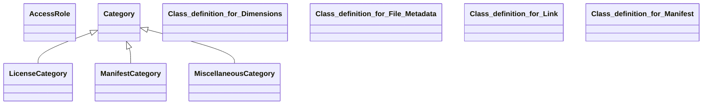

## manifest Properties

### Class Diagram

### Class Hierarchy

- AccessRole (https://w3id.org/ascs-ev/envited-x/manifest/v5/AccessRole)
- Category (https://w3id.org/ascs-ev/envited-x/manifest/v5/Category)
  - LicenseCategory (https://w3id.org/ascs-ev/envited-x/manifest/v5/LicenseCategory)
  - ManifestCategory (https://w3id.org/ascs-ev/envited-x/manifest/v5/ManifestCategory)
  - MiscellaneousCategory (https://w3id.org/ascs-ev/envited-x/manifest/v5/MiscellaneousCategory)
- Class definition for Dimensions (https://w3id.org/ascs-ev/envited-x/manifest/v5/Dimensions)
- Class definition for File Metadata (https://w3id.org/ascs-ev/envited-x/manifest/v5/FileMetadata)
- Class definition for Link (https://w3id.org/ascs-ev/envited-x/manifest/v5/Link)
- Class definition for Manifest (https://w3id.org/ascs-ev/envited-x/manifest/v5/Manifest)

### Class Definitions

|Class|IRI|Description|Parents|
|---|---|---|---|
|AccessRole|https://w3id.org/ascs-ev/envited-x/manifest/v5/AccessRole|A class representing different access roles of artifacts in a manifest.||
|Category|https://w3id.org/ascs-ev/envited-x/manifest/v5/Category|A class representing different categories of artifacts in a manifest.||
|Class definition for Dimensions|https://w3id.org/ascs-ev/envited-x/manifest/v5/Dimensions|General class for defining the dimensions of a data file, e.g., of type image or video, referenced inside a manifest:FileMetadata.||
|Class definition for File Metadata|https://w3id.org/ascs-ev/envited-x/manifest/v5/FileMetadata|Represents the properties of a data file referenced within a Link instance.||
|Class definition for Link|https://w3id.org/ascs-ev/envited-x/manifest/v5/Link|Defines a Link instance that connects to data and mandatory metadata
                    within an asset or related published simulation assets; can include
                    web references.||
|Class definition for Manifest|https://w3id.org/ascs-ev/envited-x/manifest/v5/Manifest|Defines the structure of an asset (e.g. simulation asset) as list of contents
                    using a manifest.json, listing explicitely included artifacts, referenced
                    artifacts and license information as linked properties. Typically used for
                    archives.||
|LicenseCategory|https://w3id.org/ascs-ev/envited-x/manifest/v5/LicenseCategory||Category|
|ManifestCategory|https://w3id.org/ascs-ev/envited-x/manifest/v5/ManifestCategory||Category|
|MiscellaneousCategory|https://w3id.org/ascs-ev/envited-x/manifest/v5/MiscellaneousCategory||Category|

## Prefixes

- brick: <https://brickschema.org/schema/Brick#>
- csvw: <http://www.w3.org/ns/csvw#>
- dc: <http://purl.org/dc/elements/1.1/>
- dcam: <http://purl.org/dc/dcam/>
- dcat: <http://www.w3.org/ns/dcat#>
- dcmitype: <http://purl.org/dc/dcmitype/>
- dcterms: <http://purl.org/dc/terms/>
- doap: <http://usefulinc.com/ns/doap#>
- foaf: <http://xmlns.com/foaf/0.1/>
- geo: <http://www.opengis.net/ont/geosparql#>
- gx: <https://w3id.org/gaia-x/development/>
- manifest: <https://w3id.org/ascs-ev/envited-x/manifest/v5/>
- odrl: <http://www.w3.org/ns/odrl/2/>
- org: <http://www.w3.org/ns/org#>
- owl: <http://www.w3.org/2002/07/owl#>
- prof: <http://www.w3.org/ns/dx/prof/>
- prov: <http://www.w3.org/ns/prov#>
- qb: <http://purl.org/linked-data/cube#>
- rdf: <http://www.w3.org/1999/02/22-rdf-syntax-ns#>
- rdfs: <http://www.w3.org/2000/01/rdf-schema#>
- schema: <https://schema.org/>
- sh: <http://www.w3.org/ns/shacl#>
- skos: <http://www.w3.org/2004/02/skos/core#>
- sosa: <http://www.w3.org/ns/sosa/>
- ssn: <http://www.w3.org/ns/ssn/>
- time: <http://www.w3.org/2006/time#>
- vann: <http://purl.org/vocab/vann/>
- void: <http://rdfs.org/ns/void#>
- wgs: <https://www.w3.org/2003/01/geo/wgs84_pos#>
- xml: <http://www.w3.org/XML/1998/namespace>
- xsd: <http://www.w3.org/2001/XMLSchema#>

### SHACL Properties

#### manifest:cid {: #prop-https---w3id-org-ascs-ev-envited-x-manifest-v5-cid .property-anchor }
#### manifest:depth {: #prop-https---w3id-org-ascs-ev-envited-x-manifest-v5-depth .property-anchor }
#### manifest:filename {: #prop-https---w3id-org-ascs-ev-envited-x-manifest-v5-filename .property-anchor }
#### manifest:filePath {: #prop-https---w3id-org-ascs-ev-envited-x-manifest-v5-filepath .property-anchor }
#### manifest:fileSize {: #prop-https---w3id-org-ascs-ev-envited-x-manifest-v5-filesize .property-anchor }
#### manifest:hasAccessRole {: #prop-https---w3id-org-ascs-ev-envited-x-manifest-v5-hasaccessrole .property-anchor }
#### manifest:hasArtifacts {: #prop-https---w3id-org-ascs-ev-envited-x-manifest-v5-hasartifacts .property-anchor }
#### manifest:hasCategory {: #prop-https---w3id-org-ascs-ev-envited-x-manifest-v5-hascategory .property-anchor }
#### manifest:hasDimensions {: #prop-https---w3id-org-ascs-ev-envited-x-manifest-v5-hasdimensions .property-anchor }
#### manifest:hasFileMetadata {: #prop-https---w3id-org-ascs-ev-envited-x-manifest-v5-hasfilemetadata .property-anchor }
#### manifest:hasLicense {: #prop-https---w3id-org-ascs-ev-envited-x-manifest-v5-haslicense .property-anchor }
#### manifest:hasManifestReference {: #prop-https---w3id-org-ascs-ev-envited-x-manifest-v5-hasmanifestreference .property-anchor }
#### manifest:hasReferencedArtifacts {: #prop-https---w3id-org-ascs-ev-envited-x-manifest-v5-hasreferencedartifacts .property-anchor }
#### manifest:height {: #prop-https---w3id-org-ascs-ev-envited-x-manifest-v5-height .property-anchor }
#### manifest:iri {: #prop-https---w3id-org-ascs-ev-envited-x-manifest-v5-iri .property-anchor }
#### manifest:mimeType {: #prop-https---w3id-org-ascs-ev-envited-x-manifest-v5-mimetype .property-anchor }
#### manifest:timestamp {: #prop-https---w3id-org-ascs-ev-envited-x-manifest-v5-timestamp .property-anchor }
#### manifest:unit {: #prop-https---w3id-org-ascs-ev-envited-x-manifest-v5-unit .property-anchor }
#### manifest:width {: #prop-https---w3id-org-ascs-ev-envited-x-manifest-v5-width .property-anchor }
#### sh:conformsTo {: #prop-http---www-w3-org-ns-shacl-conformsto .property-anchor }
#### skos:note {: #prop-http---www-w3-org-2004-02-skos-core-note .property-anchor }

|Shape|Property prefix|Property|MinCount|MaxCount|Description|Datatype/NodeKind|Filename|
|---|---|---|---|---|---|---|---|
|ManifestShape|manifest|hasManifestReference|1|1|Self-reference to the manifest.json providing the structure and list of contents for a domain specific asset.||manifest.shacl.ttl|
|ManifestShape|manifest|hasLicense|1|1|Defines the license valid for all content referenced in the manifest. Does not apply to linked data(sets) with explicit license terms.||manifest.shacl.ttl|
|ManifestShape|manifest|hasArtifacts|1||Defines the links to all relevant artifacts for a digital asset. This is extended by the domain specific ontology.||manifest.shacl.ttl|
|ManifestShape|manifest|hasReferencedArtifacts|0||Defines the links to all related referenced artifacts for a digital asset. This is extended by the domain specific ontology.||manifest.shacl.ttl|
|LicenseLinkReferenceShape|manifest|hasCategory|||||manifest.shacl.ttl|
|ManifestLinkReferenceShape|manifest|hasCategory|||||manifest.shacl.ttl|
|LinkShape|manifest|iri|0|1|IRI required if the file is RDF/JSON-LD.|<http://www.w3.org/ns/shacl#IRI>|manifest.shacl.ttl|
|LinkShape|skos|note|0|1|Additional information about the manifest reference.|<http://www.w3.org/2001/XMLSchema#string>|manifest.shacl.ttl|
|LinkShape|sh|conformsTo|0||Specifies ontology conformance.|<http://www.w3.org/ns/shacl#IRI>|manifest.shacl.ttl|
|LinkShape|manifest|hasAccessRole|1|1|||manifest.shacl.ttl|
|LinkShape|manifest|hasCategory|1|1|Specifies artifact category.||manifest.shacl.ttl|
|LinkShape|manifest|hasFileMetadata|1|1|||manifest.shacl.ttl|
|FileMetadataShape|manifest|filePath|1|1|A local or remote path/URL from which the file can be retrieved (e.g. './manifest_reference.json', 'ipfs://...', 's3://...', 'https://...').|<http://www.w3.org/2001/XMLSchema#anyURI>|manifest.shacl.ttl|
|FileMetadataShape|manifest|mimeType|1|1|Defines the MIME type of the file.|<http://www.w3.org/2001/XMLSchema#string>|manifest.shacl.ttl|
|FileMetadataShape|manifest|cid|0|1|Defines the IPFS CIDv1 identifier of the file.|<http://www.w3.org/2001/XMLSchema#string>|manifest.shacl.ttl|
|FileMetadataShape|manifest|fileSize|0|1|Specifies the file size in bytes.|<http://www.w3.org/2001/XMLSchema#integer>|manifest.shacl.ttl|
|FileMetadataShape|manifest|filename|0|1|Specifies the file name (excluding the path) along with its extension.|<http://www.w3.org/2001/XMLSchema#string>|manifest.shacl.ttl|
|FileMetadataShape|manifest|timestamp|0|1|Represents a date or time associated with the file, such as recording time or creation time.|<http://www.w3.org/2001/XMLSchema#dateTime>|manifest.shacl.ttl|
|FileMetadataShape|manifest|hasDimensions|0|1|Defines the dimensions for images and videos.||manifest.shacl.ttl|
|DimensionsShape|manifest|unit|1|1|Specifies the unit of measurement (e.g., metres, inches).||manifest.shacl.ttl|
|DimensionsShape|manifest|width|1|1|Specifies the width (x-axis) of the item in appropriate units.|<http://www.w3.org/2001/XMLSchema#float>|manifest.shacl.ttl|
|DimensionsShape|manifest|height|1|1|Specifies the height (y-axis) of the item in appropriate units.|<http://www.w3.org/2001/XMLSchema#float>|manifest.shacl.ttl|
|DimensionsShape|manifest|depth|0|1|Specifies the depth (z-axis) of the item in appropriate units.|<http://www.w3.org/2001/XMLSchema#float>|manifest.shacl.ttl|
