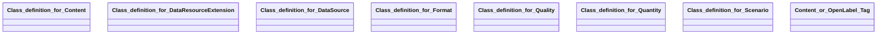

## scenario Properties

### Class Diagram

### Class Hierarchy

- Class definition for Content (https://w3id.org/ascs-ev/envited-x/scenario/v5/Content)
- Class definition for DataResourceExtension (https://w3id.org/ascs-ev/envited-x/scenario/v5/DataResourceExtension)
- Class definition for DataSource (https://w3id.org/ascs-ev/envited-x/scenario/v5/DataSource)
- Class definition for Format (https://w3id.org/ascs-ev/envited-x/scenario/v5/Format)
- Class definition for Quality (https://w3id.org/ascs-ev/envited-x/scenario/v5/Quality)
- Class definition for Quantity (https://w3id.org/ascs-ev/envited-x/scenario/v5/Quantity)
- Class definition for Scenario (https://w3id.org/ascs-ev/envited-x/scenario/v5/Scenario)
- Content or OpenLabel Tag (https://w3id.org/ascs-ev/envited-x/scenario/v5/ContentOrTag)

### Class Definitions

|Class|IRI|Description|Parents|
|---|---|---|---|
|Class definition for Content|https://w3id.org/ascs-ev/envited-x/scenario/v5/Content|Defines the content of the scenario asset, such as time, abstraction level, and links.|Content|
|Class definition for DataResourceExtension|https://w3id.org/ascs-ev/envited-x/scenario/v5/DataResourceExtension|Scenario DataResourceExtension containing additional metadata information of the simulation asset.|DataResourceExtension|
|Class definition for DataSource|https://w3id.org/ascs-ev/envited-x/scenario/v5/DataSource|Defines which data resources were used to create the scenario asset.|DataSource|
|Class definition for Format|https://w3id.org/ascs-ev/envited-x/scenario/v5/Format|Contains properties that describe the format of the scenario asset.|Format|
|Class definition for Quality|https://w3id.org/ascs-ev/envited-x/scenario/v5/Quality|Contains properties that describe the accuracy of objects and the calibration of the scenario asset.|Quality|
|Class definition for Quantity|https://w3id.org/ascs-ev/envited-x/scenario/v5/Quantity|Contains properties that describe the quantity of the scenario asset (e.g., number of traffic objects, controllers).|Quantity|
|Class definition for Scenario|https://w3id.org/ascs-ev/envited-x/scenario/v5/Scenario|General properties for defining a scenario asset, including format, content, data sources, quantity, and quality attributes.|Scenario, SimulationAsset|
|Content or OpenLabel Tag|https://w3id.org/ascs-ev/envited-x/scenario/v5/ContentOrTag|Combines Scenario content with OpenLABEL's Tag.||

## Prefixes

- brick: <https://brickschema.org/schema/Brick#>
- csvw: <http://www.w3.org/ns/csvw#>
- dc: <http://purl.org/dc/elements/1.1/>
- dcam: <http://purl.org/dc/dcam/>
- dcat: <http://www.w3.org/ns/dcat#>
- dcmitype: <http://purl.org/dc/dcmitype/>
- dcterms: <http://purl.org/dc/terms/>
- doap: <http://usefulinc.com/ns/doap#>
- environment-model: <https://w3id.org/ascs-ev/envited-x/environment-model/v5/>
- envited-x: <https://w3id.org/ascs-ev/envited-x/envited-x/v3/>
- foaf: <http://xmlns.com/foaf/0.1/>
- geo: <http://www.opengis.net/ont/geosparql#>
- georeference: <https://w3id.org/ascs-ev/envited-x/georeference/v5/>
- gx: <https://w3id.org/gaia-x/development/>
- hdmap: <https://w3id.org/ascs-ev/envited-x/hdmap/v5/>
- manifest: <https://w3id.org/ascs-ev/envited-x/manifest/v5/>
- odrl: <http://www.w3.org/ns/odrl/2/>
- openlabel: <https://openlabel.asam.net/V1-0-0/ontologies/>
- org: <http://www.w3.org/ns/org#>
- owl: <http://www.w3.org/2002/07/owl#>
- prof: <http://www.w3.org/ns/dx/prof/>
- prov: <http://www.w3.org/ns/prov#>
- qb: <http://purl.org/linked-data/cube#>
- rdf: <http://www.w3.org/1999/02/22-rdf-syntax-ns#>
- rdfs: <http://www.w3.org/2000/01/rdf-schema#>
- scenario: <https://w3id.org/ascs-ev/envited-x/scenario/v5/>
- schema: <https://schema.org/>
- sh: <http://www.w3.org/ns/shacl#>
- skos: <http://www.w3.org/2004/02/skos/core#>
- sosa: <http://www.w3.org/ns/sosa/>
- ssn: <http://www.w3.org/ns/ssn/>
- time: <http://www.w3.org/2006/time#>
- vann: <http://purl.org/vocab/vann/>
- void: <http://rdfs.org/ns/void#>
- wgs: <https://www.w3.org/2003/01/geo/wgs84_pos#>
- xml: <http://www.w3.org/XML/1998/namespace>
- xsd: <http://www.w3.org/2001/XMLSchema#>

### SHACL Properties

|Shape|Property prefix|Property|MinCount|MaxCount|Description|Datatype/NodeKind|Filename|
|---|---|---|---|---|---|---|---|
|ScenarioShape|scenario|hasDataResource|1|1|||scenario.shacl.ttl|
|ScenarioShape|scenario|hasDataResourceExtension|1|1|||scenario.shacl.ttl|
|ScenarioShape|scenario|hasManifest|1|1|||scenario.shacl.ttl|
|ScenarioManifestConstraints|manifest|hasReferencedArtifacts|||||scenario.shacl.ttl|
|DataResourceExtensionShape|scenario|hasContent|1||Attributes describing the content of the scenario.||scenario.shacl.ttl|
|DataResourceExtensionShape|scenario|hasFormat|1|1|File format details of the scenario.||scenario.shacl.ttl|
|DataResourceExtensionShape|scenario|hasQuality|1|1|Quality metrics of the scenario.||scenario.shacl.ttl|
|DataResourceExtensionShape|scenario|hasQuantity|1|1|Quantitative metrics describing the scenario.||scenario.shacl.ttl|
|DataResourceExtensionShape|scenario|hasDataSource|1|1|Data sources used to create the scenario.||scenario.shacl.ttl|
|DataResourceExtensionShape|scenario|hasGeoreference|1|1|Georeferencing information for the scenario.||scenario.shacl.ttl|
|FormatShape|scenario|formatType||1|Defines the type of data format used for the scenario asset.||scenario.shacl.ttl|
|FormatShape|scenario|version||1|Defines the version of the data format used for the scenario asset.|<http://www.w3.org/2001/XMLSchema#string>|scenario.shacl.ttl|
|ContentShape|scenario|abstractionLevel||1|Specifies the abstraction level (as defined in the Pegasus project) of the scenario asset.||scenario.shacl.ttl|
|ContentShape|scenario|timeDate|0|1|Optionally specifies the time associated with the scenario asset (e.g., time of recording or time of event for a synthetic scenario).|<http://www.w3.org/2001/XMLSchema#dateTime>|scenario.shacl.ttl|
|ContentShape|scenario|aim|0|1|Defines the purpose of the scenario asset.|<http://www.w3.org/2001/XMLSchema#string>|scenario.shacl.ttl|
|ContentShape|scenario|usedStandardFunctions|0|1|Specifies which functions (e.g., actions) from the standard are utilized.|<http://www.w3.org/2001/XMLSchema#string>|scenario.shacl.ttl|
|ContentShape|scenario|movementDescription||1|Indicates the type of movement employed by traffic participants according to the ASAM OpenSCENARIO standard.|<http://www.w3.org/2001/XMLSchema#string>|scenario.shacl.ttl|
|ContentShape|scenario|customCommands|0|1|Defines scenario- or domain-specific commands or actions used in the scenario asset.|<http://www.w3.org/2001/XMLSchema#string>|scenario.shacl.ttl|
|ContentShape|scenario|sunAzimuth|0||Defines the azimuth of the sun in degrees.|<http://www.w3.org/2001/XMLSchema#float>|scenario.shacl.ttl|
|ContentShape|scenario|countrySpecificSign|0|1|Indicates which country-specific traffic signs are used in the scenario asset.|<http://www.w3.org/2001/XMLSchema#string>|scenario.shacl.ttl|
|ContentShape|scenario|countrySpecificTrafficParticipants|0|1|Indicates which country-specific participants are used in the scenario asset.|<http://www.w3.org/2001/XMLSchema#string>|scenario.shacl.ttl|
|ContentShape|scenario|country|0|1|Indicates the country of origin for the scenario asset.|<http://www.w3.org/2001/XMLSchema#string>|scenario.shacl.ttl|
|QuantityShape|scenario|temporaryTrafficObjects||1|Specifies the total number of temporary traffic objects defined in the scenario asset.|<http://www.w3.org/2001/XMLSchema#integer>|scenario.shacl.ttl|
|QuantityShape|scenario|numberTrafficObjects||1|Specifies the total number of traffic objects defined in the scenario asset.|<http://www.w3.org/2001/XMLSchema#integer>|scenario.shacl.ttl|
|QuantityShape|scenario|controllers|0||Specifies the simulation core controllers (internal or external) used in the scenario.|<http://www.w3.org/2001/XMLSchema#string>|scenario.shacl.ttl|
|QuantityShape|scenario|permanentTrafficObjects||1|Specifies the total number of permanent traffic objects defined in the scenario asset.|<http://www.w3.org/2001/XMLSchema#integer>|scenario.shacl.ttl|
|QualityShape|scenario|accuracyObjects|0|1|Defines the accuracy of moving objects in the scenario asset (only applicable for scenarios based on real measurements).|<http://www.w3.org/2001/XMLSchema#float>|scenario.shacl.ttl|
|QualityShape|scenario|calibration|0|1|Describes the calibration steps performed prior to the measurements.|<http://www.w3.org/2001/XMLSchema#string>|scenario.shacl.ttl|
|DataSourceShape|scenario|sourceType|0|1|Specifies the category of source data used to create the scenario.||scenario.shacl.ttl|
|DataSourceShape|scenario|sourceDescription|0|1|Provides a detailed description of the source data used.|<http://www.w3.org/2001/XMLSchema#string>|scenario.shacl.ttl|
