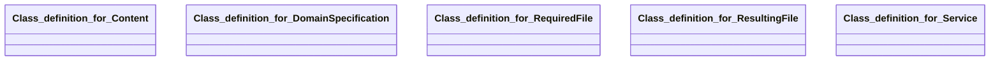

## service Properties

### Class Diagram

### Class Hierarchy

- Class definition for Content (https://w3id.org/gaia-x4plcaad/ontologies/service/v2/Content)
- Class definition for DomainSpecification (https://w3id.org/gaia-x4plcaad/ontologies/service/v2/DomainSpecification)
- Class definition for RequiredFile (https://w3id.org/gaia-x4plcaad/ontologies/service/v2/RequiredFile)
- Class definition for ResultingFile (https://w3id.org/gaia-x4plcaad/ontologies/service/v2/ResultingFile)
- Class definition for Service (https://w3id.org/gaia-x4plcaad/ontologies/service/v2/Service)

### Class Definitions

|Class|IRI|Description|Parents|
|---|---|---|---|
|Class definition for Content|https://w3id.org/gaia-x4plcaad/ontologies/service/v2/Content|Describes the content properties of a simulation service (required files, resulting files).|Content|
|Class definition for DomainSpecification|https://w3id.org/gaia-x4plcaad/ontologies/service/v2/DomainSpecification|Domain-specific metadata extension for simulation service assets.|DomainSpecification|
|Class definition for RequiredFile|https://w3id.org/gaia-x4plcaad/ontologies/service/v2/RequiredFile|Attributes for required files of simulation services.||
|Class definition for ResultingFile|https://w3id.org/gaia-x4plcaad/ontologies/service/v2/ResultingFile|Attributes for resulting files of simulation services.||
|Class definition for Service|https://w3id.org/gaia-x4plcaad/ontologies/service/v2/Service|A structured digital asset representing a simulation service in the ENVITED-X Data Space.|ServiceAsset|

## Prefixes

- brick: <https://brickschema.org/schema/Brick#>
- csvw: <http://www.w3.org/ns/csvw#>
- dc: <http://purl.org/dc/elements/1.1/>
- dcam: <http://purl.org/dc/dcam/>
- dcat: <http://www.w3.org/ns/dcat#>
- dcmitype: <http://purl.org/dc/dcmitype/>
- dcterms: <http://purl.org/dc/terms/>
- doap: <http://usefulinc.com/ns/doap#>
- envited-x: <https://w3id.org/ascs-ev/envited-x/envited-x/v3/>
- foaf: <http://xmlns.com/foaf/0.1/>
- geo: <http://www.opengis.net/ont/geosparql#>
- manifest: <https://w3id.org/ascs-ev/envited-x/manifest/v5/>
- odrl: <http://www.w3.org/ns/odrl/2/>
- org: <http://www.w3.org/ns/org#>
- owl: <http://www.w3.org/2002/07/owl#>
- prof: <http://www.w3.org/ns/dx/prof/>
- prov: <http://www.w3.org/ns/prov#>
- qb: <http://purl.org/linked-data/cube#>
- rdf: <http://www.w3.org/1999/02/22-rdf-syntax-ns#>
- rdfs: <http://www.w3.org/2000/01/rdf-schema#>
- schema: <https://schema.org/>
- service: <https://w3id.org/gaia-x4plcaad/ontologies/service/v2/>
- sh: <http://www.w3.org/ns/shacl#>
- skos: <http://www.w3.org/2004/02/skos/core#>
- sosa: <http://www.w3.org/ns/sosa/>
- ssn: <http://www.w3.org/ns/ssn/>
- time: <http://www.w3.org/2006/time#>
- vann: <http://purl.org/vocab/vann/>
- void: <http://rdfs.org/ns/void#>
- wgs: <https://www.w3.org/2003/01/geo/wgs84_pos#>
- xml: <http://www.w3.org/XML/1998/namespace>
- xsd: <http://www.w3.org/2001/XMLSchema#>

### SHACL Properties

#### service:description {: #prop-https---w3id-org-gaia-x4plcaad-ontologies-service-v2-description .property-anchor }
#### service:hasContent {: #prop-https---w3id-org-gaia-x4plcaad-ontologies-service-v2-hascontent .property-anchor }
#### service:hasDomainSpecification {: #prop-https---w3id-org-gaia-x4plcaad-ontologies-service-v2-hasdomainspecification .property-anchor }
#### service:hasManifest {: #prop-https---w3id-org-gaia-x4plcaad-ontologies-service-v2-hasmanifest .property-anchor }
#### service:hasServiceOffering {: #prop-https---w3id-org-gaia-x4plcaad-ontologies-service-v2-hasserviceoffering .property-anchor }
#### service:requiredFile {: #prop-https---w3id-org-gaia-x4plcaad-ontologies-service-v2-requiredfile .property-anchor }
#### service:resultingFile {: #prop-https---w3id-org-gaia-x4plcaad-ontologies-service-v2-resultingfile .property-anchor }
#### service:specification {: #prop-https---w3id-org-gaia-x4plcaad-ontologies-service-v2-specification .property-anchor }
#### service:tooling {: #prop-https---w3id-org-gaia-x4plcaad-ontologies-service-v2-tooling .property-anchor }

|Shape|Property prefix|Property|MinCount|MaxCount|Description|Datatype/NodeKind|Filename|
|---|---|---|---|---|---|---|---|
|ServiceShape|service|hasServiceOffering|1|1|||service.shacl.ttl|
|ServiceShape|service|hasDomainSpecification|1|1|||service.shacl.ttl|
|ServiceShape|service|hasManifest|1|1|||service.shacl.ttl|
|DomainSpecificationShape|service|hasContent|1|1|||service.shacl.ttl|
|ContentShape|service|requiredFile|||Required file object with properties for urls and description.||service.shacl.ttl|
|ContentShape|service|resultingFile|1||Resulting file object with properties for url and description.||service.shacl.ttl|
|RequiredFileShape|service|description|1|1|Human readable description of the required file.|<http://www.w3.org/2001/XMLSchema#string>|service.shacl.ttl|
|RequiredFileShape|service|specification||1|Uniform Resource Identifier (URI) to identify to a formal specification of the file.|<http://www.w3.org/2001/XMLSchema#anyURI>|service.shacl.ttl|
|RequiredFileShape|service|tooling||1|Uniform Resource Identifier (URI) to identify to a tool to help create the file.|<http://www.w3.org/2001/XMLSchema#anyURI>|service.shacl.ttl|
|ResultingFileShape|service|description|1|1|Human readable description.|<http://www.w3.org/2001/XMLSchema#string>|service.shacl.ttl|
|ResultingFileShape|service|specification|1|1|Uniform Resource Identifier (URI) to identify to a formal specification of the file.|<http://www.w3.org/2001/XMLSchema#anyURI>|service.shacl.ttl|
