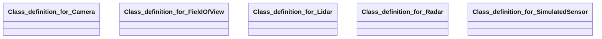

## simulated-sensor Properties

### Class Diagram

### Class Hierarchy

- Class definition for Camera (https://w3id.org/gaia-x4plcaad/ontologies/simulated-sensor/v2/Camera)
- Class definition for FieldOfView (https://w3id.org/gaia-x4plcaad/ontologies/simulated-sensor/v2/FieldOfView)
- Class definition for Lidar (https://w3id.org/gaia-x4plcaad/ontologies/simulated-sensor/v2/Lidar)
- Class definition for Radar (https://w3id.org/gaia-x4plcaad/ontologies/simulated-sensor/v2/Radar)
- Class definition for SimulatedSensor (https://w3id.org/gaia-x4plcaad/ontologies/simulated-sensor/v2/SimulatedSensor)

### Class Definitions

|Class|IRI|Description|Parents|
|---|---|---|---|
|Class definition for Camera|https://w3id.org/gaia-x4plcaad/ontologies/simulated-sensor/v2/Camera|A simulated CAMERA sensor in an automotive driving simulator.||
|Class definition for FieldOfView|https://w3id.org/gaia-x4plcaad/ontologies/simulated-sensor/v2/FieldOfView|A Field of View (FoV) of a perception sensor as float angles in an automotive driving simulator.||
|Class definition for Lidar|https://w3id.org/gaia-x4plcaad/ontologies/simulated-sensor/v2/Lidar|A simulated LIDAR sensor in an automotive driving simulator.||
|Class definition for Radar|https://w3id.org/gaia-x4plcaad/ontologies/simulated-sensor/v2/Radar|A simulated RADAR sensor in an automotive driving simulator.||
|Class definition for SimulatedSensor|https://w3id.org/gaia-x4plcaad/ontologies/simulated-sensor/v2/SimulatedSensor|A sensor in an automotive driving simulator.|DataResource|

## Prefixes

- brick: <https://brickschema.org/schema/Brick#>
- csvw: <http://www.w3.org/ns/csvw#>
- dc: <http://purl.org/dc/elements/1.1/>
- dcam: <http://purl.org/dc/dcam/>
- dcat: <http://www.w3.org/ns/dcat#>
- dcmitype: <http://purl.org/dc/dcmitype/>
- dcterms: <http://purl.org/dc/terms/>
- doap: <http://usefulinc.com/ns/doap#>
- foaf: <http://xmlns.com/foaf/0.1/>
- geo: <http://www.opengis.net/ont/geosparql#>
- odrl: <http://www.w3.org/ns/odrl/2/>
- org: <http://www.w3.org/ns/org#>
- owl: <http://www.w3.org/2002/07/owl#>
- prof: <http://www.w3.org/ns/dx/prof/>
- prov: <http://www.w3.org/ns/prov#>
- qb: <http://purl.org/linked-data/cube#>
- rdf: <http://www.w3.org/1999/02/22-rdf-syntax-ns#>
- rdfs: <http://www.w3.org/2000/01/rdf-schema#>
- schema: <https://schema.org/>
- sh: <http://www.w3.org/ns/shacl#>
- simulated-sensor: <https://w3id.org/gaia-x4plcaad/ontologies/simulated-sensor/v2/>
- skos: <http://www.w3.org/2004/02/skos/core#>
- sosa: <http://www.w3.org/ns/sosa/>
- ssn: <http://www.w3.org/ns/ssn/>
- time: <http://www.w3.org/2006/time#>
- vann: <http://purl.org/vocab/vann/>
- void: <http://rdfs.org/ns/void#>
- wgs: <https://www.w3.org/2003/01/geo/wgs84_pos#>
- xml: <http://www.w3.org/XML/1998/namespace>
- xsd: <http://www.w3.org/2001/XMLSchema#>

### SHACL Properties

#### simulated-sensor:depthFlag {: #prop-https---w3id-org-gaia-x4plcaad-ontologies-simulated-sensor-v2-depthflag .property-anchor }
#### simulated-sensor:distance {: #prop-https---w3id-org-gaia-x4plcaad-ontologies-simulated-sensor-v2-distance .property-anchor }
#### simulated-sensor:fieldOfView {: #prop-https---w3id-org-gaia-x4plcaad-ontologies-simulated-sensor-v2-fieldofview .property-anchor }
#### simulated-sensor:flag3D {: #prop-https---w3id-org-gaia-x4plcaad-ontologies-simulated-sensor-v2-flag3d .property-anchor }
#### simulated-sensor:fovAngle1 {: #prop-https---w3id-org-gaia-x4plcaad-ontologies-simulated-sensor-v2-fovangle1 .property-anchor }
#### simulated-sensor:fovAngle2 {: #prop-https---w3id-org-gaia-x4plcaad-ontologies-simulated-sensor-v2-fovangle2 .property-anchor }
#### simulated-sensor:fovAngle3 {: #prop-https---w3id-org-gaia-x4plcaad-ontologies-simulated-sensor-v2-fovangle3 .property-anchor }
#### simulated-sensor:mountingPosition {: #prop-https---w3id-org-gaia-x4plcaad-ontologies-simulated-sensor-v2-mountingposition .property-anchor }
#### simulated-sensor:numberOfBeams {: #prop-https---w3id-org-gaia-x4plcaad-ontologies-simulated-sensor-v2-numberofbeams .property-anchor }
#### simulated-sensor:rgbFlag {: #prop-https---w3id-org-gaia-x4plcaad-ontologies-simulated-sensor-v2-rgbflag .property-anchor }
#### simulated-sensor:sensorIdentifier {: #prop-https---w3id-org-gaia-x4plcaad-ontologies-simulated-sensor-v2-sensoridentifier .property-anchor }
#### simulated-sensor:sensorType {: #prop-https---w3id-org-gaia-x4plcaad-ontologies-simulated-sensor-v2-sensortype .property-anchor }

|Shape|Property prefix|Property|MinCount|MaxCount|Description|Datatype/NodeKind|Filename|
|---|---|---|---|---|---|---|---|
|SimulatedSensorShape|simulated-sensor|sensorType|1|1|Perception and other relevant sensors for autonomous driving.||simulated-sensor.shacl.ttl|
|SimulatedSensorShape|simulated-sensor|sensorIdentifier|0|1|Name/Identifier of the sensor in the simulator.|<http://www.w3.org/2001/XMLSchema#string>|simulated-sensor.shacl.ttl|
|SimulatedSensorShape|simulated-sensor|mountingPosition|0|1|Possible mounting positions of the radar.|<http://www.w3.org/2001/XMLSchema#string>|simulated-sensor.shacl.ttl|
|RadarShape|simulated-sensor|numberOfBeams|0|1|Number of beams sent by the radar sensor.|<http://www.w3.org/2001/XMLSchema#integer>|simulated-sensor.shacl.ttl|
|RadarShape|simulated-sensor|distance|0|1|Covered distance or range in metres.|<http://www.w3.org/2001/XMLSchema#float>|simulated-sensor.shacl.ttl|
|RadarShape|simulated-sensor|fieldOfView|0|1|Field of view angles, supporting up to three values (e.g., horizontal, upper, and lower FoV).||simulated-sensor.shacl.ttl|
|LidarShape|simulated-sensor|numberOfBeams|0|1|Number of beams sent by the lidar sensor.|<http://www.w3.org/2001/XMLSchema#integer>|simulated-sensor.shacl.ttl|
|LidarShape|simulated-sensor|distance|0|1|Covered distance or range in metres.|<http://www.w3.org/2001/XMLSchema#float>|simulated-sensor.shacl.ttl|
|LidarShape|simulated-sensor|fieldOfView|0|1|Field of view angles, supporting up to three values (e.g., horizontal, upper, and lower FoV).||simulated-sensor.shacl.ttl|
|CameraShape|simulated-sensor|rgbFlag|0|1|If true, camera is RGB camera.|<http://www.w3.org/2001/XMLSchema#boolean>|simulated-sensor.shacl.ttl|
|CameraShape|simulated-sensor|flag3D|0|1|If true, camera is 3D camera.|<http://www.w3.org/2001/XMLSchema#boolean>|simulated-sensor.shacl.ttl|
|CameraShape|simulated-sensor|depthFlag|0|1|If true, camera is depth camera.|<http://www.w3.org/2001/XMLSchema#boolean>|simulated-sensor.shacl.ttl|
|CameraShape|simulated-sensor|fieldOfView|0|1|Field of view angles, supporting up to three values (e.g., horizontal, upper, and lower FoV).||simulated-sensor.shacl.ttl|
|FieldOfViewShape|simulated-sensor|fovAngle1|1|1|FoV angle 1 (mandatory if FoV attribute is used).|<http://www.w3.org/2001/XMLSchema#float>|simulated-sensor.shacl.ttl|
|FieldOfViewShape|simulated-sensor|fovAngle2|0|1|FoV angle 2 (optional, depending on simulator and sensor type).|<http://www.w3.org/2001/XMLSchema#float>|simulated-sensor.shacl.ttl|
|FieldOfViewShape|simulated-sensor|fovAngle3|0|1|FoV angle 3 (optional, depending on simulator and sensor type).|<http://www.w3.org/2001/XMLSchema#float>|simulated-sensor.shacl.ttl|
