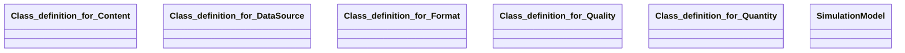

## simulation-model Properties

### Class Diagram

### Class Hierarchy

- Class definition for Content (https://w3id.org/gaia-x4plcaad/ontologies/simulation-model/v2/Content)
- Class definition for DataSource (https://w3id.org/gaia-x4plcaad/ontologies/simulation-model/v2/DataSource)
- Class definition for Format (https://w3id.org/gaia-x4plcaad/ontologies/simulation-model/v2/Format)
- Class definition for Quality (https://w3id.org/gaia-x4plcaad/ontologies/simulation-model/v2/Quality)
- Class definition for Quantity (https://w3id.org/gaia-x4plcaad/ontologies/simulation-model/v2/Quantity)
- SimulationModel (https://w3id.org/gaia-x4plcaad/ontologies/simulation-model/v2/SimulationModel)

### Class Definitions

|Class|IRI|Description|Parents|
|---|---|---|---|
|Class definition for Content|https://w3id.org/gaia-x4plcaad/ontologies/simulation-model/v2/Content|Class with attributes for the content of a simulation model.||
|Class definition for DataSource|https://w3id.org/gaia-x4plcaad/ontologies/simulation-model/v2/DataSource|Class with attributes for the data source of a simulation model.||
|Class definition for Format|https://w3id.org/gaia-x4plcaad/ontologies/simulation-model/v2/Format|Class with attributes for the format of a simulation model.||
|Class definition for Quality|https://w3id.org/gaia-x4plcaad/ontologies/simulation-model/v2/Quality|Class with attributes for the quality of a simulation model.||
|Class definition for Quantity|https://w3id.org/gaia-x4plcaad/ontologies/simulation-model/v2/Quantity|Class with attributes for the quantity of a simulation model.||
|SimulationModel|https://w3id.org/gaia-x4plcaad/ontologies/simulation-model/v2/SimulationModel|Class definition for a simulation model.|DataResource|

## Prefixes

- brick: <https://brickschema.org/schema/Brick#>
- csvw: <http://www.w3.org/ns/csvw#>
- dc: <http://purl.org/dc/elements/1.1/>
- dcam: <http://purl.org/dc/dcam/>
- dcat: <http://www.w3.org/ns/dcat#>
- dcmitype: <http://purl.org/dc/dcmitype/>
- dcterms: <http://purl.org/dc/terms/>
- doap: <http://usefulinc.com/ns/doap#>
- foaf: <http://xmlns.com/foaf/0.1/>
- general: <https://w3id.org/gaia-x4plcaad/ontologies/general/v3/>
- geo: <http://www.opengis.net/ont/geosparql#>
- odrl: <http://www.w3.org/ns/odrl/2/>
- org: <http://www.w3.org/ns/org#>
- owl: <http://www.w3.org/2002/07/owl#>
- prof: <http://www.w3.org/ns/dx/prof/>
- prov: <http://www.w3.org/ns/prov#>
- qb: <http://purl.org/linked-data/cube#>
- rdf: <http://www.w3.org/1999/02/22-rdf-syntax-ns#>
- rdfs: <http://www.w3.org/2000/01/rdf-schema#>
- schema: <https://schema.org/>
- sh: <http://www.w3.org/ns/shacl#>
- simulation-model: <https://w3id.org/gaia-x4plcaad/ontologies/simulation-model/v2/>
- skos: <http://www.w3.org/2004/02/skos/core#>
- sosa: <http://www.w3.org/ns/sosa/>
- ssn: <http://www.w3.org/ns/ssn/>
- time: <http://www.w3.org/2006/time#>
- vann: <http://purl.org/vocab/vann/>
- void: <http://rdfs.org/ns/void#>
- wgs: <https://www.w3.org/2003/01/geo/wgs84_pos#>
- xml: <http://www.w3.org/XML/1998/namespace>
- xsd: <http://www.w3.org/2001/XMLSchema#>

### SHACL Properties

|Shape|Property prefix|Property|MinCount|MaxCount|Description|Datatype/NodeKind|Filename|
|---|---|---|---|---|---|---|---|
|SimulationModelShape|simulation-model|general|1|1|general object with properties for descriptions, data, links, bundle||simulation-model.shacl.ttl|
|SimulationModelShape|simulation-model|format|1|1|format object with properties for format informations||simulation-model.shacl.ttl|
|SimulationModelShape|simulation-model|content|1|1|content object with properties for simulation-model intrinsic attributes||simulation-model.shacl.ttl|
|SimulationModelShape|simulation-model|quantity|1|1|quantity object with properties for quantity informations||simulation-model.shacl.ttl|
|SimulationModelShape|simulation-model|quality|1|1|quality object with properties for quality informations||simulation-model.shacl.ttl|
|SimulationModelShape|simulation-model|dataSource|1|1|dataSource object with properties for data sources||simulation-model.shacl.ttl|
|FormatShape|simulation-model|modelImplementationFormat|1|1|Format of model implementation, e.g. OSMP 1.0/OSI 3.1.2/FMI 2.0|<http://www.w3.org/2001/XMLSchema#string>|simulation-model.shacl.ttl|
|FormatShape|simulation-model|modelPreconditions||1|Preconditions for model validity, e.g. things that the rest of the simulation should provide the model with so that the model can work within its foreseen validity range.|<http://www.w3.org/2001/XMLSchema#string>|simulation-model.shacl.ttl|
|FormatShape|simulation-model|modelImplementationPreconditions||1|Implementation requirements.|<http://www.w3.org/2001/XMLSchema#string>|simulation-model.shacl.ttl|
|FormatShape|simulation-model|modelIntegrationRequirements||1|Provide a link to requirements and considerations for operating the model.|<http://www.w3.org/2001/XMLSchema#anyURI>|simulation-model.shacl.ttl|
|ContentShape|simulation-model|modelType|1|1|Type of model. This entry defines what domain specific entries are relevant and is mandatory|<http://www.w3.org/2001/XMLSchema#string>|simulation-model.shacl.ttl|
|ContentShape|simulation-model|modelManufacturer|1|1|Provider of the Model, no specific convention defined, it can be a company, a department a person or a combination of those.|<http://www.w3.org/2001/XMLSchema#string>|simulation-model.shacl.ttl|
|ContentShape|simulation-model|modelFamily||1|Model Family Name, in some case a model is a concrete instance of a more generic model belonging to a family. In this case, the family can be mentioned here.|<http://www.w3.org/2001/XMLSchema#string>|simulation-model.shacl.ttl|
|ContentShape|simulation-model|modelName|1|1|Model Name. This can be the name of the model file or the name of the model as it is called|<http://www.w3.org/2001/XMLSchema#string>|simulation-model.shacl.ttl|
|ContentShape|simulation-model|modelVersion|1|1|Model Version, no specific convention defined|<http://www.w3.org/2001/XMLSchema#string>|simulation-model.shacl.ttl|
|ContentShape|simulation-model|modelReleasedate|1|1|Model Release Date in ISO8601|<http://www.w3.org/2001/XMLSchema#dateTime>|simulation-model.shacl.ttl|
|ContentShape|simulation-model|modelReleasestatus|1|1|The status of the model version released in the life cycle of the model.|<http://www.w3.org/2001/XMLSchema#string>|simulation-model.shacl.ttl|
|ContentShape|simulation-model|modelGuid||1|For FMU-based models, this should be the GUID of the FMU.|<http://www.w3.org/2001/XMLSchema#string>|simulation-model.shacl.ttl|
|ContentShape|simulation-model|modelPurpose||1|Purpose for which the model has been built/validated.|<http://www.w3.org/2001/XMLSchema#string>|simulation-model.shacl.ttl|
|ContentShape|simulation-model|modelModellingApproach||1|Description of the modelling approach taken.|<http://www.w3.org/2001/XMLSchema#string>|simulation-model.shacl.ttl|
|ContentShape|simulation-model|sensorManufacturer||1|Company Name manufacturing the sensor. Alternatively, If the model does not relate to a particular manufacturer, mention it here.|<http://www.w3.org/2001/XMLSchema#string>|simulation-model.shacl.ttl|
|ContentShape|simulation-model|sensorFamily||1|Actual Sensor HW Family Name.|<http://www.w3.org/2001/XMLSchema#string>|simulation-model.shacl.ttl|
|ContentShape|simulation-model|sensorName||1|Actual Sensor HW Name.|<http://www.w3.org/2001/XMLSchema#string>|simulation-model.shacl.ttl|
|ContentShape|simulation-model|sensorVersion||1|Actual Sensor HW Version.|<http://www.w3.org/2001/XMLSchema#string>|simulation-model.shacl.ttl|
|ContentShape|simulation-model|sensorManufacturerPartnumber||1|Partnumber at Manufacturer.|<http://www.w3.org/2001/XMLSchema#string>|simulation-model.shacl.ttl|
|ContentShape|simulation-model|sensorType||1|Type of Output of Sensor.|<http://www.w3.org/2001/XMLSchema#string>|simulation-model.shacl.ttl|
|ContentShape|simulation-model|sensorTechnology||1|HW Technology of sensor.|<http://www.w3.org/2001/XMLSchema#string>|simulation-model.shacl.ttl|
|ContentShape|simulation-model|sensorTechnologyVariant||1|HW Technology variant of sensor.|<http://www.w3.org/2001/XMLSchema#string>|simulation-model.shacl.ttl|
|QuantityShape|simulation-model|maxDetections|0|1|The maximum number of detections.|<http://www.w3.org/2001/XMLSchema#integer>|simulation-model.shacl.ttl|
|QuantityShape|simulation-model|maxObjects|0|1|The maximum number of objects.|<http://www.w3.org/2001/XMLSchema#integer>|simulation-model.shacl.ttl|
|QualityShape|simulation-model|modelLimitations|0|1|Description of all limitations that apply to the model and its usage.|<http://www.w3.org/2001/XMLSchema#string>|simulation-model.shacl.ttl|
|QualityShape|simulation-model|modelValidityRange|0|1|Restrictions on the model validity, typically on quantifiable aspects.|<http://www.w3.org/2001/XMLSchema#string>|simulation-model.shacl.ttl|
|QualityShape|simulation-model|modelVerificationStatus|1|1|Is the model verified|<http://www.w3.org/2001/XMLSchema#boolean>|simulation-model.shacl.ttl|
|QualityShape|simulation-model|modelVerificationReport|0|1|Link to model verification report, if any exists|<http://www.w3.org/2001/XMLSchema#anyURI>|simulation-model.shacl.ttl|
|QualityShape|simulation-model|modelValidationStatus|1|1|Is the model validated, according to the validation concept|<http://www.w3.org/2001/XMLSchema#boolean>|simulation-model.shacl.ttl|
|QualityShape|simulation-model|modelValidationPlatform|0||Specification of simulation environment used for model validation.|<http://www.w3.org/2001/XMLSchema#string>|simulation-model.shacl.ttl|
|QualityShape|simulation-model|modelValidationReport|0|1|Link to model validation report, if any exists|<http://www.w3.org/2001/XMLSchema#anyURI>|simulation-model.shacl.ttl|
|QualityShape|simulation-model|modelValidationConcept|0|1|Link to document detailing the validation concepts used for model validation, if any exists|<http://www.w3.org/2001/XMLSchema#anyURI>|simulation-model.shacl.ttl|
|QualityShape|simulation-model|modelImplementationPerformanceCharacteristics|0|1|Description of model performance characteristics.|<http://www.w3.org/2001/XMLSchema#string>|simulation-model.shacl.ttl|
|DataSourceShape|simulation-model|modelSpecification|0|1|Provide a link to the model specification document|<http://www.w3.org/2001/XMLSchema#anyURI>|simulation-model.shacl.ttl|
