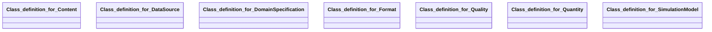

## simulation-model Properties

### Class Diagram

### Class Hierarchy

- Class definition for Content (https://w3id.org/gaia-x4plcaad/ontologies/simulation-model/v2/Content)
- Class definition for DataSource (https://w3id.org/gaia-x4plcaad/ontologies/simulation-model/v2/DataSource)
- Class definition for DomainSpecification (https://w3id.org/gaia-x4plcaad/ontologies/simulation-model/v2/DomainSpecification)
- Class definition for Format (https://w3id.org/gaia-x4plcaad/ontologies/simulation-model/v2/Format)
- Class definition for Quality (https://w3id.org/gaia-x4plcaad/ontologies/simulation-model/v2/Quality)
- Class definition for Quantity (https://w3id.org/gaia-x4plcaad/ontologies/simulation-model/v2/Quantity)
- Class definition for SimulationModel (https://w3id.org/gaia-x4plcaad/ontologies/simulation-model/v2/SimulationModel)

### Class Definitions

|Class|IRI|Description|Parents|
|---|---|---|---|
|Class definition for Content|https://w3id.org/gaia-x4plcaad/ontologies/simulation-model/v2/Content|Class with attributes for the content of a simulation model.|Content|
|Class definition for DataSource|https://w3id.org/gaia-x4plcaad/ontologies/simulation-model/v2/DataSource|Class with attributes for the data source of a simulation model.|DataSource|
|Class definition for DomainSpecification|https://w3id.org/gaia-x4plcaad/ontologies/simulation-model/v2/DomainSpecification|Domain-specific metadata extension for simulation model assets.|DomainSpecification|
|Class definition for Format|https://w3id.org/gaia-x4plcaad/ontologies/simulation-model/v2/Format|Class with attributes for the format of a simulation model.|Format|
|Class definition for Quality|https://w3id.org/gaia-x4plcaad/ontologies/simulation-model/v2/Quality|Class with attributes for the quality of a simulation model.|Quality|
|Class definition for Quantity|https://w3id.org/gaia-x4plcaad/ontologies/simulation-model/v2/Quantity|Class with attributes for the quantity of a simulation model.|Quantity|
|Class definition for SimulationModel|https://w3id.org/gaia-x4plcaad/ontologies/simulation-model/v2/SimulationModel|Class definition for a simulation model.|SoftwareAsset|

## Prefixes

- brick: <https://brickschema.org/schema/Brick#>
- csvw: <http://www.w3.org/ns/csvw#>
- dc: <http://purl.org/dc/elements/1.1/>
- dcam: <http://purl.org/dc/dcam/>
- dcat: <http://www.w3.org/ns/dcat#>
- dcmitype: <http://purl.org/dc/dcmitype/>
- dcterms: <http://purl.org/dc/terms/>
- doap: <http://usefulinc.com/ns/doap#>
- envited-x: <https://w3id.org/ascs-ev/envited-x/envited-x/v3/>
- foaf: <http://xmlns.com/foaf/0.1/>
- geo: <http://www.opengis.net/ont/geosparql#>
- manifest: <https://w3id.org/ascs-ev/envited-x/manifest/v5/>
- odrl: <http://www.w3.org/ns/odrl/2/>
- org: <http://www.w3.org/ns/org#>
- owl: <http://www.w3.org/2002/07/owl#>
- prof: <http://www.w3.org/ns/dx/prof/>
- prov: <http://www.w3.org/ns/prov#>
- qb: <http://purl.org/linked-data/cube#>
- rdf: <http://www.w3.org/1999/02/22-rdf-syntax-ns#>
- rdfs: <http://www.w3.org/2000/01/rdf-schema#>
- schema: <https://schema.org/>
- sh: <http://www.w3.org/ns/shacl#>
- simulation-model: <https://w3id.org/gaia-x4plcaad/ontologies/simulation-model/v2/>
- skos: <http://www.w3.org/2004/02/skos/core#>
- sosa: <http://www.w3.org/ns/sosa/>
- ssn: <http://www.w3.org/ns/ssn/>
- time: <http://www.w3.org/2006/time#>
- vann: <http://purl.org/vocab/vann/>
- void: <http://rdfs.org/ns/void#>
- wgs: <https://www.w3.org/2003/01/geo/wgs84_pos#>
- xml: <http://www.w3.org/XML/1998/namespace>
- xsd: <http://www.w3.org/2001/XMLSchema#>

### SHACL Properties

#### simulation-model:hasContent {: #prop-https---w3id-org-gaia-x4plcaad-ontologies-simulation-model-v2-hascontent .property-anchor }
#### simulation-model:hasDataSource {: #prop-https---w3id-org-gaia-x4plcaad-ontologies-simulation-model-v2-hasdatasource .property-anchor }
#### simulation-model:hasDomainSpecification {: #prop-https---w3id-org-gaia-x4plcaad-ontologies-simulation-model-v2-hasdomainspecification .property-anchor }
#### simulation-model:hasFormat {: #prop-https---w3id-org-gaia-x4plcaad-ontologies-simulation-model-v2-hasformat .property-anchor }
#### simulation-model:hasManifest {: #prop-https---w3id-org-gaia-x4plcaad-ontologies-simulation-model-v2-hasmanifest .property-anchor }
#### simulation-model:hasQuality {: #prop-https---w3id-org-gaia-x4plcaad-ontologies-simulation-model-v2-hasquality .property-anchor }
#### simulation-model:hasQuantity {: #prop-https---w3id-org-gaia-x4plcaad-ontologies-simulation-model-v2-hasquantity .property-anchor }
#### simulation-model:hasSoftwareResource {: #prop-https---w3id-org-gaia-x4plcaad-ontologies-simulation-model-v2-hassoftwareresource .property-anchor }
#### simulation-model:maxDetections {: #prop-https---w3id-org-gaia-x4plcaad-ontologies-simulation-model-v2-maxdetections .property-anchor }
#### simulation-model:maxObjects {: #prop-https---w3id-org-gaia-x4plcaad-ontologies-simulation-model-v2-maxobjects .property-anchor }
#### simulation-model:modelFamily {: #prop-https---w3id-org-gaia-x4plcaad-ontologies-simulation-model-v2-modelfamily .property-anchor }
#### simulation-model:modelGuid {: #prop-https---w3id-org-gaia-x4plcaad-ontologies-simulation-model-v2-modelguid .property-anchor }
#### simulation-model:modelImplementationFormat {: #prop-https---w3id-org-gaia-x4plcaad-ontologies-simulation-model-v2-modelimplementationformat .property-anchor }
#### simulation-model:modelImplementationPerformanceCharacteristics {: #prop-https---w3id-org-gaia-x4plcaad-ontologies-simulation-model-v2-modelimplementationperformancecharacteristics .property-anchor }
#### simulation-model:modelImplementationPreconditions {: #prop-https---w3id-org-gaia-x4plcaad-ontologies-simulation-model-v2-modelimplementationpreconditions .property-anchor }
#### simulation-model:modelIntegrationRequirements {: #prop-https---w3id-org-gaia-x4plcaad-ontologies-simulation-model-v2-modelintegrationrequirements .property-anchor }
#### simulation-model:modelLimitations {: #prop-https---w3id-org-gaia-x4plcaad-ontologies-simulation-model-v2-modellimitations .property-anchor }
#### simulation-model:modelManufacturer {: #prop-https---w3id-org-gaia-x4plcaad-ontologies-simulation-model-v2-modelmanufacturer .property-anchor }
#### simulation-model:modelModellingApproach {: #prop-https---w3id-org-gaia-x4plcaad-ontologies-simulation-model-v2-modelmodellingapproach .property-anchor }
#### simulation-model:modelName {: #prop-https---w3id-org-gaia-x4plcaad-ontologies-simulation-model-v2-modelname .property-anchor }
#### simulation-model:modelPreconditions {: #prop-https---w3id-org-gaia-x4plcaad-ontologies-simulation-model-v2-modelpreconditions .property-anchor }
#### simulation-model:modelPurpose {: #prop-https---w3id-org-gaia-x4plcaad-ontologies-simulation-model-v2-modelpurpose .property-anchor }
#### simulation-model:modelReleasedate {: #prop-https---w3id-org-gaia-x4plcaad-ontologies-simulation-model-v2-modelreleasedate .property-anchor }
#### simulation-model:modelReleasestatus {: #prop-https---w3id-org-gaia-x4plcaad-ontologies-simulation-model-v2-modelreleasestatus .property-anchor }
#### simulation-model:modelSpecification {: #prop-https---w3id-org-gaia-x4plcaad-ontologies-simulation-model-v2-modelspecification .property-anchor }
#### simulation-model:modelType {: #prop-https---w3id-org-gaia-x4plcaad-ontologies-simulation-model-v2-modeltype .property-anchor }
#### simulation-model:modelValidationConcept {: #prop-https---w3id-org-gaia-x4plcaad-ontologies-simulation-model-v2-modelvalidationconcept .property-anchor }
#### simulation-model:modelValidationPlatform {: #prop-https---w3id-org-gaia-x4plcaad-ontologies-simulation-model-v2-modelvalidationplatform .property-anchor }
#### simulation-model:modelValidationReport {: #prop-https---w3id-org-gaia-x4plcaad-ontologies-simulation-model-v2-modelvalidationreport .property-anchor }
#### simulation-model:modelValidationStatus {: #prop-https---w3id-org-gaia-x4plcaad-ontologies-simulation-model-v2-modelvalidationstatus .property-anchor }
#### simulation-model:modelValidityRange {: #prop-https---w3id-org-gaia-x4plcaad-ontologies-simulation-model-v2-modelvalidityrange .property-anchor }
#### simulation-model:modelVerificationReport {: #prop-https---w3id-org-gaia-x4plcaad-ontologies-simulation-model-v2-modelverificationreport .property-anchor }
#### simulation-model:modelVerificationStatus {: #prop-https---w3id-org-gaia-x4plcaad-ontologies-simulation-model-v2-modelverificationstatus .property-anchor }
#### simulation-model:modelVersion {: #prop-https---w3id-org-gaia-x4plcaad-ontologies-simulation-model-v2-modelversion .property-anchor }
#### simulation-model:sensorFamily {: #prop-https---w3id-org-gaia-x4plcaad-ontologies-simulation-model-v2-sensorfamily .property-anchor }
#### simulation-model:sensorManufacturer {: #prop-https---w3id-org-gaia-x4plcaad-ontologies-simulation-model-v2-sensormanufacturer .property-anchor }
#### simulation-model:sensorManufacturerPartnumber {: #prop-https---w3id-org-gaia-x4plcaad-ontologies-simulation-model-v2-sensormanufacturerpartnumber .property-anchor }
#### simulation-model:sensorName {: #prop-https---w3id-org-gaia-x4plcaad-ontologies-simulation-model-v2-sensorname .property-anchor }
#### simulation-model:sensorTechnology {: #prop-https---w3id-org-gaia-x4plcaad-ontologies-simulation-model-v2-sensortechnology .property-anchor }
#### simulation-model:sensorTechnologyVariant {: #prop-https---w3id-org-gaia-x4plcaad-ontologies-simulation-model-v2-sensortechnologyvariant .property-anchor }
#### simulation-model:sensorType {: #prop-https---w3id-org-gaia-x4plcaad-ontologies-simulation-model-v2-sensortype .property-anchor }
#### simulation-model:sensorVersion {: #prop-https---w3id-org-gaia-x4plcaad-ontologies-simulation-model-v2-sensorversion .property-anchor }

|Shape|Property prefix|Property|MinCount|MaxCount|Description|Datatype/NodeKind|Filename|
|---|---|---|---|---|---|---|---|
|SimulationModelShape|simulation-model|hasSoftwareResource|1|1|||simulation-model.shacl.ttl|
|SimulationModelShape|simulation-model|hasDomainSpecification|1|1|||simulation-model.shacl.ttl|
|SimulationModelShape|simulation-model|hasManifest|1|1|||simulation-model.shacl.ttl|
|DomainSpecificationShape|simulation-model|hasContent|1|1|||simulation-model.shacl.ttl|
|DomainSpecificationShape|simulation-model|hasFormat|1|1|||simulation-model.shacl.ttl|
|DomainSpecificationShape|simulation-model|hasQuality|1|1|||simulation-model.shacl.ttl|
|DomainSpecificationShape|simulation-model|hasQuantity|1|1|||simulation-model.shacl.ttl|
|DomainSpecificationShape|simulation-model|hasDataSource|1|1|||simulation-model.shacl.ttl|
|FormatShape|simulation-model|modelImplementationFormat|1|1|Format of model implementation, e.g. OSMP 1.0/OSI 3.1.2/FMI 2.0|<http://www.w3.org/2001/XMLSchema#string>|simulation-model.shacl.ttl|
|FormatShape|simulation-model|modelPreconditions||1|Preconditions for model validity, e.g. things that the rest of the simulation should provide the model with so that the model can work within its foreseen validity range.|<http://www.w3.org/2001/XMLSchema#string>|simulation-model.shacl.ttl|
|FormatShape|simulation-model|modelImplementationPreconditions||1|Implementation requirements.|<http://www.w3.org/2001/XMLSchema#string>|simulation-model.shacl.ttl|
|FormatShape|simulation-model|modelIntegrationRequirements||1|Provide a link to requirements and considerations for operating the model.|<http://www.w3.org/2001/XMLSchema#anyURI>|simulation-model.shacl.ttl|
|ContentShape|simulation-model|modelType|1|1|Type of model. This entry defines what domain specific entries are relevant and is mandatory|<http://www.w3.org/2001/XMLSchema#string>|simulation-model.shacl.ttl|
|ContentShape|simulation-model|modelManufacturer|1|1|Provider of the Model, no specific convention defined, it can be a company, a department a person or a combination of those.|<http://www.w3.org/2001/XMLSchema#string>|simulation-model.shacl.ttl|
|ContentShape|simulation-model|modelFamily||1|Model Family Name, in some case a model is a concrete instance of a more generic model belonging to a family. In this case, the family can be mentioned here.|<http://www.w3.org/2001/XMLSchema#string>|simulation-model.shacl.ttl|
|ContentShape|simulation-model|modelName|1|1|Model Name. This can be the name of the model file or the name of the model as it is called|<http://www.w3.org/2001/XMLSchema#string>|simulation-model.shacl.ttl|
|ContentShape|simulation-model|modelVersion|1|1|Model Version, no specific convention defined|<http://www.w3.org/2001/XMLSchema#string>|simulation-model.shacl.ttl|
|ContentShape|simulation-model|modelReleasedate|1|1|Model Release Date in ISO8601|<http://www.w3.org/2001/XMLSchema#dateTime>|simulation-model.shacl.ttl|
|ContentShape|simulation-model|modelReleasestatus|1|1|The status of the model version released in the life cycle of the model.|<http://www.w3.org/2001/XMLSchema#string>|simulation-model.shacl.ttl|
|ContentShape|simulation-model|modelGuid||1|For FMU-based models, this should be the GUID of the FMU.|<http://www.w3.org/2001/XMLSchema#string>|simulation-model.shacl.ttl|
|ContentShape|simulation-model|modelPurpose||1|Purpose for which the model has been built/validated.|<http://www.w3.org/2001/XMLSchema#string>|simulation-model.shacl.ttl|
|ContentShape|simulation-model|modelModellingApproach||1|Description of the modelling approach taken.|<http://www.w3.org/2001/XMLSchema#string>|simulation-model.shacl.ttl|
|ContentShape|simulation-model|sensorManufacturer||1|Company Name manufacturing the sensor. Alternatively, If the model does not relate to a particular manufacturer, mention it here.|<http://www.w3.org/2001/XMLSchema#string>|simulation-model.shacl.ttl|
|ContentShape|simulation-model|sensorFamily||1|Actual Sensor HW Family Name.|<http://www.w3.org/2001/XMLSchema#string>|simulation-model.shacl.ttl|
|ContentShape|simulation-model|sensorName||1|Actual Sensor HW Name.|<http://www.w3.org/2001/XMLSchema#string>|simulation-model.shacl.ttl|
|ContentShape|simulation-model|sensorVersion||1|Actual Sensor HW Version.|<http://www.w3.org/2001/XMLSchema#string>|simulation-model.shacl.ttl|
|ContentShape|simulation-model|sensorManufacturerPartnumber||1|Partnumber at Manufacturer.|<http://www.w3.org/2001/XMLSchema#string>|simulation-model.shacl.ttl|
|ContentShape|simulation-model|sensorType||1|Type of Output of Sensor.|<http://www.w3.org/2001/XMLSchema#string>|simulation-model.shacl.ttl|
|ContentShape|simulation-model|sensorTechnology||1|HW Technology of sensor.|<http://www.w3.org/2001/XMLSchema#string>|simulation-model.shacl.ttl|
|ContentShape|simulation-model|sensorTechnologyVariant||1|HW Technology variant of sensor.|<http://www.w3.org/2001/XMLSchema#string>|simulation-model.shacl.ttl|
|QuantityShape|simulation-model|maxDetections|0|1|The maximum number of detections.|<http://www.w3.org/2001/XMLSchema#integer>|simulation-model.shacl.ttl|
|QuantityShape|simulation-model|maxObjects|0|1|The maximum number of objects.|<http://www.w3.org/2001/XMLSchema#integer>|simulation-model.shacl.ttl|
|QualityShape|simulation-model|modelLimitations|0|1|Description of all limitations that apply to the model and its usage.|<http://www.w3.org/2001/XMLSchema#string>|simulation-model.shacl.ttl|
|QualityShape|simulation-model|modelValidityRange|0|1|Restrictions on the model validity, typically on quantifiable aspects.|<http://www.w3.org/2001/XMLSchema#string>|simulation-model.shacl.ttl|
|QualityShape|simulation-model|modelVerificationStatus|1|1|Is the model verified|<http://www.w3.org/2001/XMLSchema#boolean>|simulation-model.shacl.ttl|
|QualityShape|simulation-model|modelVerificationReport|0|1|Link to model verification report, if any exists|<http://www.w3.org/2001/XMLSchema#anyURI>|simulation-model.shacl.ttl|
|QualityShape|simulation-model|modelValidationStatus|1|1|Is the model validated, according to the validation concept|<http://www.w3.org/2001/XMLSchema#boolean>|simulation-model.shacl.ttl|
|QualityShape|simulation-model|modelValidationPlatform|0||Specification of simulation environment used for model validation.|<http://www.w3.org/2001/XMLSchema#string>|simulation-model.shacl.ttl|
|QualityShape|simulation-model|modelValidationReport|0|1|Link to model validation report, if any exists|<http://www.w3.org/2001/XMLSchema#anyURI>|simulation-model.shacl.ttl|
|QualityShape|simulation-model|modelValidationConcept|0|1|Link to document detailing the validation concepts used for model validation, if any exists|<http://www.w3.org/2001/XMLSchema#anyURI>|simulation-model.shacl.ttl|
|QualityShape|simulation-model|modelImplementationPerformanceCharacteristics|0|1|Description of model performance characteristics.|<http://www.w3.org/2001/XMLSchema#string>|simulation-model.shacl.ttl|
|DataSourceShape|simulation-model|modelSpecification|0|1|Provide a link to the model specification document|<http://www.w3.org/2001/XMLSchema#anyURI>|simulation-model.shacl.ttl|
