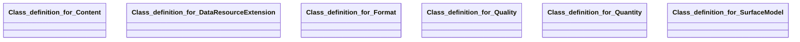

## surface-model Properties

### Class Diagram

### Class Hierarchy

- Class definition for Content (https://w3id.org/ascs-ev/envited-x/surface-model/v6/Content)
- Class definition for DataResourceExtension (https://w3id.org/ascs-ev/envited-x/surface-model/v6/DataResourceExtension)
- Class definition for Format (https://w3id.org/ascs-ev/envited-x/surface-model/v6/Format)
- Class definition for Quality (https://w3id.org/ascs-ev/envited-x/surface-model/v6/Quality)
- Class definition for Quantity (https://w3id.org/ascs-ev/envited-x/surface-model/v6/Quantity)
- Class definition for SurfaceModel (https://w3id.org/ascs-ev/envited-x/surface-model/v6/SurfaceModel)

### Class Definitions

|Class|IRI|Description|Parents|
|---|---|---|---|
|Class definition for Content|https://w3id.org/ascs-ev/envited-x/surface-model/v6/Content|Contains properties that describe the content type of the surface model asset.|Content|
|Class definition for DataResourceExtension|https://w3id.org/ascs-ev/envited-x/surface-model/v6/DataResourceExtension|Surface model DataResourceExtension containing additional metadata information of the simulation asset.|DataResourceExtension|
|Class definition for Format|https://w3id.org/ascs-ev/envited-x/surface-model/v6/Format|Contains properties that describe the format of the surface model asset.|Format|
|Class definition for Quality|https://w3id.org/ascs-ev/envited-x/surface-model/v6/Quality|Contains properties that describe the accuracy of the surface model asset.|Quality|
|Class definition for Quantity|https://w3id.org/ascs-ev/envited-x/surface-model/v6/Quantity|Contains properties that describe the quantity of the surface model asset.|Quantity|
|Class definition for SurfaceModel|https://w3id.org/ascs-ev/envited-x/surface-model/v6/SurfaceModel|General properties for defining a surface model asset, including format, content, data sources, quantity, and quality attributes.|SimulationAsset|

## Prefixes

- brick: <https://brickschema.org/schema/Brick#>
- csvw: <http://www.w3.org/ns/csvw#>
- dc: <http://purl.org/dc/elements/1.1/>
- dcam: <http://purl.org/dc/dcam/>
- dcat: <http://www.w3.org/ns/dcat#>
- dcmitype: <http://purl.org/dc/dcmitype/>
- dcterms: <http://purl.org/dc/terms/>
- doap: <http://usefulinc.com/ns/doap#>
- envited-x: <https://w3id.org/ascs-ev/envited-x/envited-x/v3/>
- foaf: <http://xmlns.com/foaf/0.1/>
- geo: <http://www.opengis.net/ont/geosparql#>
- georeference: <https://w3id.org/ascs-ev/envited-x/georeference/v5/>
- manifest: <https://w3id.org/ascs-ev/envited-x/manifest/v5/>
- odrl: <http://www.w3.org/ns/odrl/2/>
- org: <http://www.w3.org/ns/org#>
- owl: <http://www.w3.org/2002/07/owl#>
- prof: <http://www.w3.org/ns/dx/prof/>
- prov: <http://www.w3.org/ns/prov#>
- qb: <http://purl.org/linked-data/cube#>
- rdf: <http://www.w3.org/1999/02/22-rdf-syntax-ns#>
- rdfs: <http://www.w3.org/2000/01/rdf-schema#>
- schema: <https://schema.org/>
- sh: <http://www.w3.org/ns/shacl#>
- skos: <http://www.w3.org/2004/02/skos/core#>
- sosa: <http://www.w3.org/ns/sosa/>
- ssn: <http://www.w3.org/ns/ssn/>
- surface-model: <https://w3id.org/ascs-ev/envited-x/surface-model/v6/>
- time: <http://www.w3.org/2006/time#>
- vann: <http://purl.org/vocab/vann/>
- void: <http://rdfs.org/ns/void#>
- wgs: <https://www.w3.org/2003/01/geo/wgs84_pos#>
- xml: <http://www.w3.org/XML/1998/namespace>
- xsd: <http://www.w3.org/2001/XMLSchema#>

### SHACL Properties

#### surface-model:contentType {: #prop-https---w3id-org-ascs-ev-envited-x-surface-model-v6-contenttype .property-anchor }
#### surface-model:elevationRange {: #prop-https---w3id-org-ascs-ev-envited-x-surface-model-v6-elevationrange .property-anchor }
#### surface-model:formatType {: #prop-https---w3id-org-ascs-ev-envited-x-surface-model-v6-formattype .property-anchor }
#### surface-model:hasContent {: #prop-https---w3id-org-ascs-ev-envited-x-surface-model-v6-hascontent .property-anchor }
#### surface-model:hasDataResource {: #prop-https---w3id-org-ascs-ev-envited-x-surface-model-v6-hasdataresource .property-anchor }
#### surface-model:hasDataResourceExtension {: #prop-https---w3id-org-ascs-ev-envited-x-surface-model-v6-hasdataresourceextension .property-anchor }
#### surface-model:hasFormat {: #prop-https---w3id-org-ascs-ev-envited-x-surface-model-v6-hasformat .property-anchor }
#### surface-model:hasGeoreference {: #prop-https---w3id-org-ascs-ev-envited-x-surface-model-v6-hasgeoreference .property-anchor }
#### surface-model:hasManifest {: #prop-https---w3id-org-ascs-ev-envited-x-surface-model-v6-hasmanifest .property-anchor }
#### surface-model:hasQuality {: #prop-https---w3id-org-ascs-ev-envited-x-surface-model-v6-hasquality .property-anchor }
#### surface-model:hasQuantity {: #prop-https---w3id-org-ascs-ev-envited-x-surface-model-v6-hasquantity .property-anchor }
#### surface-model:length {: #prop-https---w3id-org-ascs-ev-envited-x-surface-model-v6-length .property-anchor }
#### surface-model:mapDataField {: #prop-https---w3id-org-ascs-ev-envited-x-surface-model-v6-mapdatafield .property-anchor }
#### surface-model:orientation {: #prop-https---w3id-org-ascs-ev-envited-x-surface-model-v6-orientation .property-anchor }
#### surface-model:platformExists {: #prop-https---w3id-org-ascs-ev-envited-x-surface-model-v6-platformexists .property-anchor }
#### surface-model:rampExists {: #prop-https---w3id-org-ascs-ev-envited-x-surface-model-v6-rampexists .property-anchor }
#### surface-model:resolutionLateral {: #prop-https---w3id-org-ascs-ev-envited-x-surface-model-v6-resolutionlateral .property-anchor }
#### surface-model:resolutionLongitudinal {: #prop-https---w3id-org-ascs-ev-envited-x-surface-model-v6-resolutionlongitudinal .property-anchor }
#### surface-model:version {: #prop-https---w3id-org-ascs-ev-envited-x-surface-model-v6-version .property-anchor }

|Shape|Property prefix|Property|MinCount|MaxCount|Description|Datatype/NodeKind|Filename|
|---|---|---|---|---|---|---|---|
|SurfaceModelShape|surface-model|hasDataResource|1|1|||surface-model.shacl.ttl|
|SurfaceModelShape|surface-model|hasDataResourceExtension|1|1|||surface-model.shacl.ttl|
|SurfaceModelShape|surface-model|hasManifest|1|1|||surface-model.shacl.ttl|
|DataResourceExtensionShape|surface-model|hasContent|1|1|Attributes describing the content type of the surface model.||surface-model.shacl.ttl|
|DataResourceExtensionShape|surface-model|hasFormat|1|1|File format details of the surface model.||surface-model.shacl.ttl|
|DataResourceExtensionShape|surface-model|hasQuality|1|1|Quality metrics of the surface model.||surface-model.shacl.ttl|
|DataResourceExtensionShape|surface-model|hasQuantity|1|1|Quantitative metrics describing the surface model.||surface-model.shacl.ttl|
|DataResourceExtensionShape|surface-model|hasGeoreference|1|1|Georeferencing information for the surface model.||surface-model.shacl.ttl|
|ContentShape|surface-model|contentType||1|Specifies the content type (e.g., height, friction) used in the surface-model asset.|<http://www.w3.org/2001/XMLSchema#string>|surface-model.shacl.ttl|
|FormatShape|surface-model|formatType||1|Defines the format type of the surface model asset.||surface-model.shacl.ttl|
|FormatShape|surface-model|version||1|Defines the version of the surface model's format.|<http://www.w3.org/2001/XMLSchema#string>|surface-model.shacl.ttl|
|QualityShape|surface-model|resolutionLongitudinal||1|Specifies the longitudinal resolution (s) in meters.|<http://www.w3.org/2001/XMLSchema#float>|surface-model.shacl.ttl|
|QualityShape|surface-model|orientation||1|Specifies the alignment at the starting position in radians.|<http://www.w3.org/2001/XMLSchema#float>|surface-model.shacl.ttl|
|QualityShape|surface-model|platformExists||1|Indicates whether a horizontal start platform exists.|<http://www.w3.org/2001/XMLSchema#boolean>|surface-model.shacl.ttl|
|QualityShape|surface-model|rampExists||1|Indicates whether there is a smooth ramp from the platform to the road.|<http://www.w3.org/2001/XMLSchema#boolean>|surface-model.shacl.ttl|
|QualityShape|surface-model|resolutionLateral||1|Specifies the lateral resolution (t) in meters.|<http://www.w3.org/2001/XMLSchema#float>|surface-model.shacl.ttl|
|QuantityShape|surface-model|mapDataField||1|Indicates whether the projection system is included in the dataset.|<http://www.w3.org/2001/XMLSchema#boolean>|surface-model.shacl.ttl|
|QuantityShape|surface-model|elevationRange||1|Indicates the difference between the maximum and minimum elevation values in meters.|<http://www.w3.org/2001/XMLSchema#float>|surface-model.shacl.ttl|
|QuantityShape|surface-model|length||1|Defines the total length of all elements in kilometers.|<http://www.w3.org/2001/XMLSchema#float>|surface-model.shacl.ttl|
