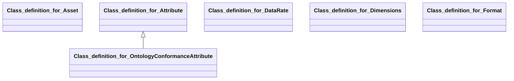

## tzip21 Properties

### Class Diagram

### Class Hierarchy

- Class definition for Asset (https://w3id.org/ascs-ev/envited-x/tzip21/v1/Asset)
- Class definition for Attribute (https://w3id.org/ascs-ev/envited-x/tzip21/v1/Attribute)
  - Class definition for OntologyConformanceAttribute (https://w3id.org/ascs-ev/envited-x/tzip21/v1/OntologyConformanceAttribute)
- Class definition for DataRate (https://w3id.org/ascs-ev/envited-x/tzip21/v1/DataRate)
- Class definition for Dimensions (https://w3id.org/ascs-ev/envited-x/tzip21/v1/Dimensions)
- Class definition for Format (https://w3id.org/ascs-ev/envited-x/tzip21/v1/Format)

### Class Definitions

|Class|IRI|Description|Parents|
|---|---|---|---|
|Class definition for Asset|https://w3id.org/ascs-ev/envited-x/tzip21/v1/Asset|A class representing a rich metadata asset, acting as a Virtual Resource in Gaia-X.|VirtualResource|
|Class definition for Attribute|https://w3id.org/ascs-ev/envited-x/tzip21/v1/Attribute|A class representing custom attributes of an asset.||
|Class definition for DataRate|https://w3id.org/ascs-ev/envited-x/tzip21/v1/DataRate|A class representing the data rate of an asset.||
|Class definition for Dimensions|https://w3id.org/ascs-ev/envited-x/tzip21/v1/Dimensions|A class representing the dimensions of an asset.||
|Class definition for Format|https://w3id.org/ascs-ev/envited-x/tzip21/v1/Format|A class representing the format of an asset.||
|Class definition for OntologyConformanceAttribute|https://w3id.org/ascs-ev/envited-x/tzip21/v1/OntologyConformanceAttribute|An attribute declaring that the underlying simulation asset (referenced via tzip21:identifier)
                    conforms to a specific ontology. This specialized attribute type is used to express semantic
                    conformance relationships in the ENVITED-X ecosystem. The 'name' field contains the reverse
                    domain notation identifier (e.g., 'com.github.ascs-ev.ontology-management-base.hdmap.ontology'),
                    and the 'value' field contains the w3id.org ontology URI
                    (e.g., 'https://w3id.org/ascs-ev/envited-x/hdmap/v5/').|Attribute|

## Prefixes

- brick: <https://brickschema.org/schema/Brick#>
- csvw: <http://www.w3.org/ns/csvw#>
- dc: <http://purl.org/dc/elements/1.1/>
- dcam: <http://purl.org/dc/dcam/>
- dcat: <http://www.w3.org/ns/dcat#>
- dcmitype: <http://purl.org/dc/dcmitype/>
- dcterms: <http://purl.org/dc/terms/>
- doap: <http://usefulinc.com/ns/doap#>
- envited-x: <https://w3id.org/ascs-ev/envited-x/envited-x/v3/>
- foaf: <http://xmlns.com/foaf/0.1/>
- geo: <http://www.opengis.net/ont/geosparql#>
- odrl: <http://www.w3.org/ns/odrl/2/>
- org: <http://www.w3.org/ns/org#>
- owl: <http://www.w3.org/2002/07/owl#>
- prof: <http://www.w3.org/ns/dx/prof/>
- prov: <http://www.w3.org/ns/prov#>
- qb: <http://purl.org/linked-data/cube#>
- rdf: <http://www.w3.org/1999/02/22-rdf-syntax-ns#>
- rdfs: <http://www.w3.org/2000/01/rdf-schema#>
- schema: <https://schema.org/>
- sh: <http://www.w3.org/ns/shacl#>
- skos: <http://www.w3.org/2004/02/skos/core#>
- sosa: <http://www.w3.org/ns/sosa/>
- ssn: <http://www.w3.org/ns/ssn/>
- time: <http://www.w3.org/2006/time#>
- tzip21: <https://w3id.org/ascs-ev/envited-x/tzip21/v1/>
- vann: <http://purl.org/vocab/vann/>
- void: <http://rdfs.org/ns/void#>
- wgs: <https://www.w3.org/2003/01/geo/wgs84_pos#>
- xml: <http://www.w3.org/XML/1998/namespace>
- xsd: <http://www.w3.org/2001/XMLSchema#>

### SHACL Properties

#### tzip21:artifactUri {: #prop-https---w3id-org-ascs-ev-envited-x-tzip21-v1-artifacturi .property-anchor }
#### tzip21:assets {: #prop-https---w3id-org-ascs-ev-envited-x-tzip21-v1-assets .property-anchor }
#### tzip21:attributes {: #prop-https---w3id-org-ascs-ev-envited-x-tzip21-v1-attributes .property-anchor }
#### tzip21:blockLevel {: #prop-https---w3id-org-ascs-ev-envited-x-tzip21-v1-blocklevel .property-anchor }
#### tzip21:contributors {: #prop-https---w3id-org-ascs-ev-envited-x-tzip21-v1-contributors .property-anchor }
#### tzip21:creators {: #prop-https---w3id-org-ascs-ev-envited-x-tzip21-v1-creators .property-anchor }
#### tzip21:dataRate {: #prop-https---w3id-org-ascs-ev-envited-x-tzip21-v1-datarate .property-anchor }
#### tzip21:date {: #prop-https---w3id-org-ascs-ev-envited-x-tzip21-v1-date .property-anchor }
#### tzip21:decimals {: #prop-https---w3id-org-ascs-ev-envited-x-tzip21-v1-decimals .property-anchor }
#### tzip21:description {: #prop-https---w3id-org-ascs-ev-envited-x-tzip21-v1-description .property-anchor }
#### tzip21:dimensions {: #prop-https---w3id-org-ascs-ev-envited-x-tzip21-v1-dimensions .property-anchor }
#### tzip21:displayUri {: #prop-https---w3id-org-ascs-ev-envited-x-tzip21-v1-displayuri .property-anchor }
#### tzip21:duration {: #prop-https---w3id-org-ascs-ev-envited-x-tzip21-v1-duration .property-anchor }
#### tzip21:externalUri {: #prop-https---w3id-org-ascs-ev-envited-x-tzip21-v1-externaluri .property-anchor }
#### tzip21:fileName {: #prop-https---w3id-org-ascs-ev-envited-x-tzip21-v1-filename .property-anchor }
#### tzip21:fileSize {: #prop-https---w3id-org-ascs-ev-envited-x-tzip21-v1-filesize .property-anchor }
#### tzip21:formats {: #prop-https---w3id-org-ascs-ev-envited-x-tzip21-v1-formats .property-anchor }
#### tzip21:genres {: #prop-https---w3id-org-ascs-ev-envited-x-tzip21-v1-genres .property-anchor }
#### tzip21:hash {: #prop-https---w3id-org-ascs-ev-envited-x-tzip21-v1-hash .property-anchor }
#### tzip21:identifier {: #prop-https---w3id-org-ascs-ev-envited-x-tzip21-v1-identifier .property-anchor }
#### tzip21:isBooleanAmount {: #prop-https---w3id-org-ascs-ev-envited-x-tzip21-v1-isbooleanamount .property-anchor }
#### tzip21:isTransferable {: #prop-https---w3id-org-ascs-ev-envited-x-tzip21-v1-istransferable .property-anchor }
#### tzip21:language {: #prop-https---w3id-org-ascs-ev-envited-x-tzip21-v1-language .property-anchor }
#### tzip21:mimeType {: #prop-https---w3id-org-ascs-ev-envited-x-tzip21-v1-mimetype .property-anchor }
#### tzip21:minter {: #prop-https---w3id-org-ascs-ev-envited-x-tzip21-v1-minter .property-anchor }
#### tzip21:name {: #prop-https---w3id-org-ascs-ev-envited-x-tzip21-v1-name .property-anchor }
#### tzip21:publishers {: #prop-https---w3id-org-ascs-ev-envited-x-tzip21-v1-publishers .property-anchor }
#### tzip21:rights {: #prop-https---w3id-org-ascs-ev-envited-x-tzip21-v1-rights .property-anchor }
#### tzip21:rightsUri {: #prop-https---w3id-org-ascs-ev-envited-x-tzip21-v1-rightsuri .property-anchor }
#### tzip21:shouldPreferSymbol {: #prop-https---w3id-org-ascs-ev-envited-x-tzip21-v1-shouldprefersymbol .property-anchor }
#### tzip21:symbol {: #prop-https---w3id-org-ascs-ev-envited-x-tzip21-v1-symbol .property-anchor }
#### tzip21:tags {: #prop-https---w3id-org-ascs-ev-envited-x-tzip21-v1-tags .property-anchor }
#### tzip21:thumbnailUri {: #prop-https---w3id-org-ascs-ev-envited-x-tzip21-v1-thumbnailuri .property-anchor }
#### tzip21:ttl {: #prop-https---w3id-org-ascs-ev-envited-x-tzip21-v1-ttl .property-anchor }
#### tzip21:type {: #prop-https---w3id-org-ascs-ev-envited-x-tzip21-v1-type .property-anchor }
#### tzip21:unit {: #prop-https---w3id-org-ascs-ev-envited-x-tzip21-v1-unit .property-anchor }
#### tzip21:uri {: #prop-https---w3id-org-ascs-ev-envited-x-tzip21-v1-uri .property-anchor }
#### tzip21:value {: #prop-https---w3id-org-ascs-ev-envited-x-tzip21-v1-value .property-anchor }

|Shape|Property prefix|Property|MinCount|MaxCount|Description|Datatype/NodeKind|Filename|
|---|---|---|---|---|---|---|---|
|AssetShape|tzip21|name|0|1|A UTF-8 string giving a display name to the token. (Highly recommended from TZIP-012)|<http://www.w3.org/2001/XMLSchema#string>|tzip21.shacl.ttl|
|AssetShape|tzip21|symbol|0|1|A UTF-8 string for the short identifier of the token (e.g. XTZ, EUR, etc.). (Highly recommended from TZIP-012)|<http://www.w3.org/2001/XMLSchema#string>|tzip21.shacl.ttl|
|AssetShape|tzip21|decimals|1|1|An integer defining the position of the decimal point in token balances for display purposes. (Required by TZIP-012)|<http://www.w3.org/2001/XMLSchema#integer>|tzip21.shacl.ttl|
|AssetShape|tzip21|description|0|1|General notes, abstracts, or summaries about the contents of an asset. (Optional)|<http://www.w3.org/2001/XMLSchema#string>|tzip21.shacl.ttl|
|AssetShape|tzip21|minter|0|1|The tz address responsible for minting the asset. Expected format: tzaddress. (Recommended for semi‑fungible and NFT tokens)|<http://www.w3.org/2001/XMLSchema#string>|tzip21.shacl.ttl|
|AssetShape|tzip21|creators|0||Array of unique strings representing the primary creators of the asset. (Recommended for semi‑fungible and NFT tokens)|<http://www.w3.org/2001/XMLSchema#string>|tzip21.shacl.ttl|
|AssetShape|tzip21|contributors|0||Array of unique strings representing those who made substantial creative contributions. (Optional)|<http://www.w3.org/2001/XMLSchema#string>|tzip21.shacl.ttl|
|AssetShape|tzip21|publishers|0||Array of unique strings representing those primarily responsible for distributing the asset. (Optional)|<http://www.w3.org/2001/XMLSchema#string>|tzip21.shacl.ttl|
|AssetShape|tzip21|date|0|1|A date associated with the creation or availability of the asset, per JSON Schema. (Optional)|<http://www.w3.org/2001/XMLSchema#dateTime>|tzip21.shacl.ttl|
|AssetShape|tzip21|blockLevel|0|1|Chain block level associated with the asset. (Optional)|<http://www.w3.org/2001/XMLSchema#integer>|tzip21.shacl.ttl|
|AssetShape|tzip21|type|0|1|A broad definition of the content type of the asset. (Optional)|<http://www.w3.org/2001/XMLSchema#string>|tzip21.shacl.ttl|
|AssetShape|tzip21|tags|0||Array of unique strings that describe the subject or content of the asset. (Recommended for Multimedia NFTs)|<http://www.w3.org/2001/XMLSchema#string>|tzip21.shacl.ttl|
|AssetShape|tzip21|genres|0||Array of unique strings that describe the genres of the asset. (Optional)|<http://www.w3.org/2001/XMLSchema#string>|tzip21.shacl.ttl|
|AssetShape|tzip21|language|0|1|The language of the asset’s intellectual content (per RFC 1766). (Optional)|<http://www.w3.org/2001/XMLSchema#language>|tzip21.shacl.ttl|
|AssetShape|tzip21|identifier|0|1|Links to the specific envited-x:SimulationAsset (e.g., hdmap:HdMap) that this TZIP21 service offering represents.||tzip21.shacl.ttl|
|AssetShape|tzip21|rights|0|1|A statement about the asset rights. (Optional)|<http://www.w3.org/2001/XMLSchema#string>|tzip21.shacl.ttl|
|AssetShape|tzip21|rightsUri|0|1|A URI linking to a statement of rights. Format: uri-reference. (Optional)|<http://www.w3.org/2001/XMLSchema#anyURI>|tzip21.shacl.ttl|
|AssetShape|tzip21|artifactUri|0|1|A URI to the asset. Format: uri-reference. (Recommended for semi‑fungible and NFT tokens)|<http://www.w3.org/2001/XMLSchema#anyURI>|tzip21.shacl.ttl|
|AssetShape|tzip21|displayUri|0|1|A URI to an image of the asset for display purposes. Format: uri-reference. (Recommended for semi‑fungible and NFT tokens)|<http://www.w3.org/2001/XMLSchema#anyURI>|tzip21.shacl.ttl|
|AssetShape|tzip21|thumbnailUri|0|1|A URI to a scaled-down image for wallets/clients (max recommended size: 350x350px). Format: uri-reference. (Recommended for fungible and NFT tokens)|<http://www.w3.org/2001/XMLSchema#anyURI>|tzip21.shacl.ttl|
|AssetShape|tzip21|externalUri|0|1|A URI with additional information about the asset. Format: uri-reference. (Optional)|<http://www.w3.org/2001/XMLSchema#anyURI>|tzip21.shacl.ttl|
|AssetShape|tzip21|isTransferable|0|1|Indicates if tokens are transferable. Default is true.|<http://www.w3.org/2001/XMLSchema#boolean>|tzip21.shacl.ttl|
|AssetShape|tzip21|isBooleanAmount|0|1|Indicates whether an account’s balance can only be 0 or 1. Default is false. (Recommended for nonfungible tokens)|<http://www.w3.org/2001/XMLSchema#boolean>|tzip21.shacl.ttl|
|AssetShape|tzip21|shouldPreferSymbol|0|1|Indicates if a symbol should be shown instead of a name. Default is false.|<http://www.w3.org/2001/XMLSchema#boolean>|tzip21.shacl.ttl|
|AssetShape|tzip21|ttl|0|1|Time-to-live (in seconds) for metadata caching. Default is 0 (indefinite caching). If used, it is advised not to set below 600 seconds.|<http://www.w3.org/2001/XMLSchema#integer>|tzip21.shacl.ttl|
|AssetShape|tzip21|formats|0||An array of format objects describing various representations of the asset. (Optional)||tzip21.shacl.ttl|
|AssetShape|tzip21|attributes|0||An array of attribute objects providing custom properties. Attribute names must be unique within the array. (Optional)||tzip21.shacl.ttl|
|AssetShape|tzip21|assets|0||An array of asset objects for describing collections or composite resources. (Optional)||tzip21.shacl.ttl|
|FormatShape|tzip21|uri|1|1|A URI to the asset in this format. Format: uri-reference. (Recommended)|<http://www.w3.org/2001/XMLSchema#anyURI>|tzip21.shacl.ttl|
|FormatShape|tzip21|hash|0|1|Checksum hash of the asset content in this format. (Optional)|<http://www.w3.org/2001/XMLSchema#string>|tzip21.shacl.ttl|
|FormatShape|tzip21|mimeType|0|1|Media (MIME) type as registered by IANA. (Optional)|<http://www.w3.org/2001/XMLSchema#string>|tzip21.shacl.ttl|
|FormatShape|tzip21|fileSize|0|1|Size in bytes of the asset content in this format. (Optional)|<http://www.w3.org/2001/XMLSchema#integer>|tzip21.shacl.ttl|
|FormatShape|tzip21|fileName|0|1|Display filename for the asset in this format. (Optional)|<http://www.w3.org/2001/XMLSchema#string>|tzip21.shacl.ttl|
|FormatShape|tzip21|duration|0|1|Time duration of the asset content in this format. Format: time. (Optional)|<http://www.w3.org/2001/XMLSchema#time>|tzip21.shacl.ttl|
|FormatShape|tzip21|dimensions|0|1|Dimensions of the asset content (e.g. ‘512x512’ with unit ‘px’).||tzip21.shacl.ttl|
|FormatShape|tzip21|dataRate|0|1|Data rate at which the asset content was captured (e.g. 320 kbps).||tzip21.shacl.ttl|
|AttributeShape|tzip21|name|1|1|Name of the attribute. Must be unique within the attributes array.|<http://www.w3.org/2001/XMLSchema#string>|tzip21.shacl.ttl|
|AttributeShape|tzip21|value|1|1|Value of the attribute.|<http://www.w3.org/2001/XMLSchema#string>|tzip21.shacl.ttl|
|AttributeShape|tzip21|type|0|1|Type of the attribute value (e.g. number, integer, percentage) for display purposes. (Optional)|<http://www.w3.org/2001/XMLSchema#string>|tzip21.shacl.ttl|
|OntologyConformanceAttributeShape|tzip21|name|1|1|Reverse domain notation identifier for the ontology (e.g., 'com.github.ascs-ev.ontology-management-base.hdmap.ontology').|<http://www.w3.org/2001/XMLSchema#string>|tzip21.shacl.ttl|
|OntologyConformanceAttributeShape|tzip21|value|1|1|The w3id.org URI of the ontology that the simulation asset conforms to (e.g., 'https://w3id.org/ascs-ev/envited-x/hdmap/v5/').|<http://www.w3.org/2001/XMLSchema#string>|tzip21.shacl.ttl|
|OntologyConformanceAttributeShape|tzip21|type|1|1|Must be 'uri' for ontology conformance attributes.|<http://www.w3.org/2001/XMLSchema#string>|tzip21.shacl.ttl|
|DataRateShape|tzip21|value|1|1|Numeric value of the data rate.|<http://www.w3.org/2001/XMLSchema#integer>|tzip21.shacl.ttl|
|DataRateShape|tzip21|unit|1|1|Unit for the data rate (e.g. 'kbps').|<http://www.w3.org/2001/XMLSchema#string>|tzip21.shacl.ttl|
|DimensionsShape|tzip21|value|1|1|The dimensions value (e.g. '512x512').|<http://www.w3.org/2001/XMLSchema#string>|tzip21.shacl.ttl|
|DimensionsShape|tzip21|unit|1|1|The unit of measurement for the dimensions (e.g. 'px').|<http://www.w3.org/2001/XMLSchema#string>|tzip21.shacl.ttl|
