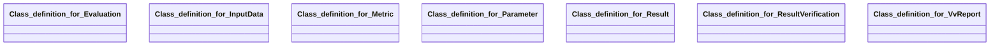

## vv-report Properties

### Class Diagram

### Class Hierarchy

- Class definition for Evaluation (https://w3id.org/gaia-x4plcaad/ontologies/vv-report/v2/Evaluation)
- Class definition for InputData (https://w3id.org/gaia-x4plcaad/ontologies/vv-report/v2/InputData)
- Class definition for Metric (https://w3id.org/gaia-x4plcaad/ontologies/vv-report/v2/Metric)
- Class definition for Parameter (https://w3id.org/gaia-x4plcaad/ontologies/vv-report/v2/Parameter)
- Class definition for Result (https://w3id.org/gaia-x4plcaad/ontologies/vv-report/v2/Result)
- Class definition for ResultVerification (https://w3id.org/gaia-x4plcaad/ontologies/vv-report/v2/ResultVerification)
- Class definition for VvReport (https://w3id.org/gaia-x4plcaad/ontologies/vv-report/v2/VvReport)

### Class Definitions

|Class|IRI|Description|Parents|
|---|---|---|---|
|Class definition for Evaluation|https://w3id.org/gaia-x4plcaad/ontologies/vv-report/v2/Evaluation|Attributes for an evaluation element of a verification & validation report.||
|Class definition for InputData|https://w3id.org/gaia-x4plcaad/ontologies/vv-report/v2/InputData|Attributes for the definition of an input data element of a verification & validation report.||
|Class definition for Metric|https://w3id.org/gaia-x4plcaad/ontologies/vv-report/v2/Metric|Attributes for the definition of a quality metric of a verification & validation report.||
|Class definition for Parameter|https://w3id.org/gaia-x4plcaad/ontologies/vv-report/v2/Parameter|Attributes for the definition of parameter element of a verification & validation report.||
|Class definition for Result|https://w3id.org/gaia-x4plcaad/ontologies/vv-report/v2/Result|Attributes for evaluation results of a verification & validation report.||
|Class definition for ResultVerification|https://w3id.org/gaia-x4plcaad/ontologies/vv-report/v2/ResultVerification|Attributes for the verification of the result by a third party of a verification & validation report.||
|Class definition for VvReport|https://w3id.org/gaia-x4plcaad/ontologies/vv-report/v2/VvReport|Attributes for a verification & validation report.|DataResource|

## Prefixes

- brick: <https://brickschema.org/schema/Brick#>
- csvw: <http://www.w3.org/ns/csvw#>
- dc: <http://purl.org/dc/elements/1.1/>
- dcam: <http://purl.org/dc/dcam/>
- dcat: <http://www.w3.org/ns/dcat#>
- dcmitype: <http://purl.org/dc/dcmitype/>
- dcterms: <http://purl.org/dc/terms/>
- doap: <http://usefulinc.com/ns/doap#>
- foaf: <http://xmlns.com/foaf/0.1/>
- general: <https://w3id.org/gaia-x4plcaad/ontologies/general/v3/>
- geo: <http://www.opengis.net/ont/geosparql#>
- odrl: <http://www.w3.org/ns/odrl/2/>
- org: <http://www.w3.org/ns/org#>
- owl: <http://www.w3.org/2002/07/owl#>
- prof: <http://www.w3.org/ns/dx/prof/>
- prov: <http://www.w3.org/ns/prov#>
- qb: <http://purl.org/linked-data/cube#>
- rdf: <http://www.w3.org/1999/02/22-rdf-syntax-ns#>
- rdfs: <http://www.w3.org/2000/01/rdf-schema#>
- schema: <https://schema.org/>
- sh: <http://www.w3.org/ns/shacl#>
- skos: <http://www.w3.org/2004/02/skos/core#>
- sosa: <http://www.w3.org/ns/sosa/>
- ssn: <http://www.w3.org/ns/ssn/>
- time: <http://www.w3.org/2006/time#>
- vann: <http://purl.org/vocab/vann/>
- void: <http://rdfs.org/ns/void#>
- vv-report: <https://w3id.org/gaia-x4plcaad/ontologies/vv-report/v2/>
- wgs: <https://www.w3.org/2003/01/geo/wgs84_pos#>
- xml: <http://www.w3.org/XML/1998/namespace>
- xsd: <http://www.w3.org/2001/XMLSchema#>

### SHACL Properties

#### vv-report:conceptSpecificData {: #prop-https---w3id-org-gaia-x4plcaad-ontologies-vv-report-v2-conceptspecificdata .property-anchor }
#### vv-report:evaluations {: #prop-https---w3id-org-gaia-x4plcaad-ontologies-vv-report-v2-evaluations .property-anchor }
#### vv-report:general {: #prop-https---w3id-org-gaia-x4plcaad-ontologies-vv-report-v2-general .property-anchor }
#### vv-report:inputData {: #prop-https---w3id-org-gaia-x4plcaad-ontologies-vv-report-v2-inputdata .property-anchor }
#### vv-report:inputDescription {: #prop-https---w3id-org-gaia-x4plcaad-ontologies-vv-report-v2-inputdescription .property-anchor }
#### vv-report:inputReference {: #prop-https---w3id-org-gaia-x4plcaad-ontologies-vv-report-v2-inputreference .property-anchor }
#### vv-report:metric {: #prop-https---w3id-org-gaia-x4plcaad-ontologies-vv-report-v2-metric .property-anchor }
#### vv-report:metricDescription {: #prop-https---w3id-org-gaia-x4plcaad-ontologies-vv-report-v2-metricdescription .property-anchor }
#### vv-report:metricReference {: #prop-https---w3id-org-gaia-x4plcaad-ontologies-vv-report-v2-metricreference .property-anchor }
#### vv-report:metricTitle {: #prop-https---w3id-org-gaia-x4plcaad-ontologies-vv-report-v2-metrictitle .property-anchor }
#### vv-report:parameterDescription {: #prop-https---w3id-org-gaia-x4plcaad-ontologies-vv-report-v2-parameterdescription .property-anchor }
#### vv-report:parameterName {: #prop-https---w3id-org-gaia-x4plcaad-ontologies-vv-report-v2-parametername .property-anchor }
#### vv-report:parameters {: #prop-https---w3id-org-gaia-x4plcaad-ontologies-vv-report-v2-parameters .property-anchor }
#### vv-report:parameterValue {: #prop-https---w3id-org-gaia-x4plcaad-ontologies-vv-report-v2-parametervalue .property-anchor }
#### vv-report:result {: #prop-https---w3id-org-gaia-x4plcaad-ontologies-vv-report-v2-result .property-anchor }
#### vv-report:resultLog {: #prop-https---w3id-org-gaia-x4plcaad-ontologies-vv-report-v2-resultlog .property-anchor }
#### vv-report:resultTestPassed {: #prop-https---w3id-org-gaia-x4plcaad-ontologies-vv-report-v2-resulttestpassed .property-anchor }
#### vv-report:resultVerifiable {: #prop-https---w3id-org-gaia-x4plcaad-ontologies-vv-report-v2-resultverifiable .property-anchor }
#### vv-report:resultVerification {: #prop-https---w3id-org-gaia-x4plcaad-ontologies-vv-report-v2-resultverification .property-anchor }
#### vv-report:resultVerificationDescription {: #prop-https---w3id-org-gaia-x4plcaad-ontologies-vv-report-v2-resultverificationdescription .property-anchor }
#### vv-report:resultVerificationReference {: #prop-https---w3id-org-gaia-x4plcaad-ontologies-vv-report-v2-resultverificationreference .property-anchor }
#### vv-report:systemUnderTest {: #prop-https---w3id-org-gaia-x4plcaad-ontologies-vv-report-v2-systemundertest .property-anchor }

|Shape|Property prefix|Property|MinCount|MaxCount|Description|Datatype/NodeKind|Filename|
|---|---|---|---|---|---|---|---|
|VvReportShape|vv-report|general|1|1|General object with properties for descriptions, data, links, bundle.||vv-report.shacl.ttl|
|VvReportShape|vv-report|systemUnderTest|1|1|Uniform Resource Identifier (URI) to identify the tested artifact, like a simulation, model by location, name, or both.|<http://www.w3.org/2001/XMLSchema#anyURI>|vv-report.shacl.ttl|
|VvReportShape|vv-report|evaluations|1||A list of all measures carried out on the subject under test.||vv-report.shacl.ttl|
|EvaluationShape|vv-report|metric|1|1|The definition of the quality metric that has been used in this evaluation item.||vv-report.shacl.ttl|
|EvaluationShape|vv-report|inputData|1||The definition of a dataset that has been used as input to the quality metric.||vv-report.shacl.ttl|
|EvaluationShape|vv-report|parameters|0||A list of parameters that have been used to configure the quality metric and/or quality criterion.||vv-report.shacl.ttl|
|EvaluationShape|vv-report|result|1|1|The summary of the result of this evaluation item.||vv-report.shacl.ttl|
|EvaluationShape|vv-report|conceptSpecificData|0||Additional arbitrary V&V-concept specific data, to further describe the evaluation.||vv-report.shacl.ttl|
|MetricShape|vv-report|metricTitle|1|1|A meaningful name of this metric.|<http://www.w3.org/2001/XMLSchema#string>|vv-report.shacl.ttl|
|MetricShape|vv-report|metricDescription|1|1|A short description of what is tested within this quality metric.|<http://www.w3.org/2001/XMLSchema#string>|vv-report.shacl.ttl|
|MetricShape|vv-report|metricReference|1|1|Uniform Resource Identifier (URI) to identify the metric by location, name, or both.|<http://www.w3.org/2001/XMLSchema#anyURI>|vv-report.shacl.ttl|
|InputDataShape|vv-report|inputDescription|1|1|A short description for interpreting this input data element|<http://www.w3.org/2001/XMLSchema#string>|vv-report.shacl.ttl|
|InputDataShape|vv-report|inputReference|1|1|Uniform Resource Identifier (URI) to identify the utilized input data element by location, name, or both.|<http://www.w3.org/2001/XMLSchema#anyURI>|vv-report.shacl.ttl|
|ParameterShape|vv-report|parameterName|1|1|The formal name of the parameter, as it appears in the validation system|<http://www.w3.org/2001/XMLSchema#string>|vv-report.shacl.ttl|
|ParameterShape|vv-report|parameterDescription|1|1|A short description of the parameter in order to unambigously interpret it.|<http://www.w3.org/2001/XMLSchema#string>|vv-report.shacl.ttl|
|ParameterShape|vv-report|parameterValue|1|1|The value of the parameter.||vv-report.shacl.ttl|
|ResultShape|vv-report|resultTestPassed|1|1|Statement if the test has been passed or not.|<http://www.w3.org/2001/XMLSchema#boolean>|vv-report.shacl.ttl|
|ResultShape|vv-report|resultLog|0||Additional information about the test result, e.g., why it has failed.|<http://www.w3.org/2001/XMLSchema#string>|vv-report.shacl.ttl|
|ResultShape|vv-report|resultVerifiable|1|1|Information if the result can be verified by a third party.|<http://www.w3.org/2001/XMLSchema#boolean>|vv-report.shacl.ttl|
|ResultShape|vv-report|resultVerification|0|1|The necessary attributes to carry out verification of the result by a third party.||vv-report.shacl.ttl|
|ResultVerificationShape|vv-report|resultVerificationDescription|1|1|A short description of how the result can be verified with the given reference.|<http://www.w3.org/2001/XMLSchema#string>|vv-report.shacl.ttl|
|ResultVerificationShape|vv-report|resultVerificationReference|1||Uniform Resource Identifier (URI) to identify the reference used to verify the result of this evalation by location, name, or both.|<http://www.w3.org/2001/XMLSchema#anyURI>|vv-report.shacl.ttl|
