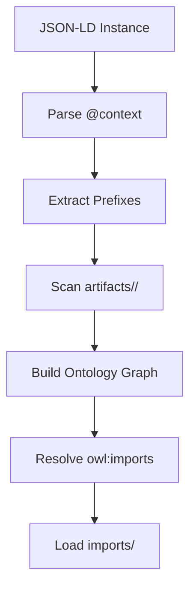

# Ontology Discovery

This document explains how the validation tools automatically discover and load ontology dependencies.

## Overview

The SHACL validator uses a multi-stage discovery process to find all required ontologies:



## Discovery Stages

### 1. Context Resolution

The validator first parses the JSON-LD `@context` to identify namespace prefixes:

```json
{
  "@context": {
    "hdmap": "https://w3id.org/.../hdmap/",
    "schema": "http://schema.org/"
  }
}
```

### 2. Prefix-Based Discovery

For each prefix, the validator searches:

1. `artifacts/{prefix}/{prefix}.owl.ttl`
2. `imports/{prefix}/`
3. Legacy locations for submodule consumers

### 3. Type-Based Discovery

The validator extracts all `rdf:type` values from instances and matches them against an IRI index:

```python
# Build index: IRI -> file path
iri_index = {
    "https://w3id.org/.../hdmap/": "artifacts/hdmap/hdmap.owl.ttl",
    "http://schema.org/": "imports/schema/schema_ontology.ttl"
}

# For each type, find defining ontology
for rdf_type in used_types:
    if rdf_type.startswith(ontology_iri):
        load_ontology(ontology_file)
```

### 4. Transitive Dependencies

After loading primary ontologies, the validator resolves `owl:imports`:

```turtle
<https://w3id.org/.../hdmap/> a owl:Ontology ;
    owl:imports <https://w3id.org/.../general/> .
```

This triggers recursive loading of imported ontologies.

### 5. Base Ontologies

Standard W3C ontologies from `imports/` are always available:

- RDF/RDFS/OWL
- SHACL
- Schema.org
- Dublin Core
- FOAF, SKOS, PROV

## Catalog-Driven Resolution

Ontology and SHACL discovery is driven by XML catalogs:

- `artifacts/catalog-v001.xml` for domain ontologies, shapes, and contexts
- `imports/catalog-v001.xml` for base vocabularies used during inference
- `tests/catalog-v001.xml` for test data and fixture resolution

Update these catalogs when adding or moving files.

## Context Files

Context files are treated as artifacts and resolved via the artifacts catalog.
Validators rely on the JSON-LD parser to interpret `@context` declarations.

## Configuration

Discovery is configured through the catalogs rather than hardcoded directories.

## Troubleshooting

### Missing Ontology Errors

If validation fails with "ontology not found":

1. Check the domain entry in `artifacts/catalog-v001.xml`
2. Verify the file exists at the catalog path
3. Confirm you are running from the repository root

### Slow Discovery

For large repositories:

1. Install `oxrdflib` for faster parsing
2. Reduce data size or scope the domain with `--domain`
