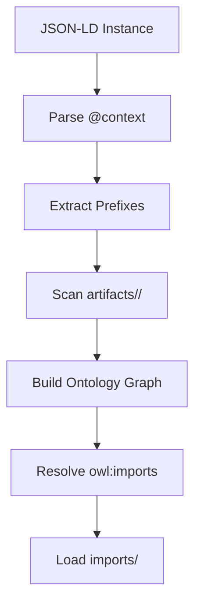

# Ontology Discovery

This document explains how the validation tools automatically discover and load ontology dependencies.

## Overview

The SHACL validator uses a multi-stage discovery process to find all required ontologies:



## Discovery Stages

### 1. Context Resolution

The validator first parses the JSON-LD `@context` to identify namespace prefixes:

```json
{
  "@context": {
    "hdmap": "https://w3id.org/.../hdmap/",
    "schema": "http://schema.org/"
  }
}
```

### 2. Prefix-Based Discovery

For each prefix, the validator searches:

1. `artifacts/{prefix}/{prefix}.owl.ttl`
2. `imports/{prefix}/`
3. Legacy locations for submodule consumers

### 3. Type-Based Discovery

The validator extracts all `rdf:type` values from instances and matches them against an IRI index:

```python
# Build index: IRI -> file path
iri_index = {
    "https://w3id.org/.../hdmap/": "artifacts/hdmap/hdmap.owl.ttl",
    "http://schema.org/": "imports/schema/schema_ontology.ttl"
}

# For each type, find defining ontology
for rdf_type in used_types:
    if rdf_type.startswith(ontology_iri):
        load_ontology(ontology_file)
```

### 4. Transitive Dependencies

After loading primary ontologies, the validator resolves `owl:imports`:

```turtle
<https://w3id.org/.../hdmap/> a owl:Ontology ;
    owl:imports <https://w3id.org/.../general/> .
```

This triggers recursive loading of imported ontologies.

### 5. Base Ontologies

Standard W3C ontologies from `imports/` are always available:
- RDF/RDFS/OWL
- SHACL
- Schema.org
- Dublin Core
- FOAF, SKOS, PROV

## Caching

For performance, ontology IRI mappings are cached in `.ontology_iri_cache.json`:

```json
{
  "artifacts/hdmap/hdmap.owl.ttl": {
    "mtime": 1706789012.5,
    "iri": "https://w3id.org/.../hdmap/"
  }
}
```

The cache is invalidated when file modification times change.

## Local Context Resolution

Remote `@context` URLs are mapped to local files:

| Remote URL | Local File |
|------------|------------|
| `https://w3id.org/.../envited-x/context` | `artifacts/envited-x/envited-x.context.jsonld` |
| `https://schema.org/context` | `imports/schema/schema_context.jsonld` |

This enables offline validation and faster processing.

## Configuration

Discovery directories are configured in `check_jsonld_against_shacl_schema.py`:

```python
DIR_NAME_IMPORTS = "imports"
DIR_NAME_ARTIFACTS = "artifacts"
```

## Troubleshooting

### Missing Ontology Errors

If validation fails with "ontology not found":

1. Check the prefix in your `@context`
2. Verify the file exists in `artifacts/<ontology>/`
3. Clear the cache: `rm .ontology_iri_cache.json`

### Slow Discovery

For large repositories:

1. Install `oxrdflib` for faster parsing
2. Use `--force-load` to skip discovery and load all ontologies
3. Check cache validity
