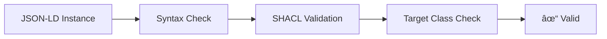

# Validation Tools Catalog

This section documents the validation tools available in the Ontology Management Base.

## Overview

The validation pipeline consists of several components that work together to ensure ontology quality:



## Available Tools

### Core Validators

| Tool                             | Purpose                                          | Documentation                                |
| -------------------------------- | ------------------------------------------------ | -------------------------------------------- |
| `conformance_validator.py` | Validates JSON-LD instances against SHACL shapes | [Details](check-jsonld-against-shacl.md) |
| `coherence_validator.py`   | Verifies SHACL target classes exist in OWL       | [Details](check-target-classes.md)       |
| `validation_suite.py`            | Orchestrates all validation checks               | [Details](run-all-checks.md)                 |

### Documentation Tools

| Tool                          | Purpose                            | Documentation                  |
| ----------------------------- | ---------------------------------- | ------------------------------ |
| `utils/properties_updater.py` | Generates PROPERTIES.md from SHACL | [Details](readme-generator.md) |

## Quick Reference

### Run All Checks

```bash
python3 -m src.tools.validators.validation_suite --run all
```

### Run Specific Check

```bash
# Syntax only
python3 -m src.tools.validators.validation_suite --run check-syntax

# SHACL only
python3 -m src.tools.validators.validation_suite --run check-data-conformance

# Target classes only
python3 -m src.tools.validators.validation_suite --run check-artifact-coherence

# Failing tests only
python3 -m src.tools.validators.validation_suite --run check-failing-tests
```

### Run for Specific Domain

```bash
python3 -m src.tools.validators.validation_suite --run all --domain hdmap scenario
```

## Exit Codes

| Code    | Meaning                          |
| ------- | -------------------------------- |
| 0       | Success - all validations passed |
| 1       | General error                    |
| 100     | No files found                   |
| 101-102 | Data graph loading errors        |
| 200     | Target class validation failure  |
| 210     | SHACL validation failure         |

## CI Integration

The validation tools are integrated into the CI pipeline via GitHub Actions. See `.github/workflows/ci.yml` for the workflow definition.

### Workflow Jobs

1. **Standards & Syntax** - Runs linting and syntax checks
2. **SHACL Validation** - Validates instances against shapes
3. **OWL Classes** - Checks target class consistency
4. **Regression Tests** - Runs failing test cases
5. **Documentation** - Generates PROPERTIES.md files
