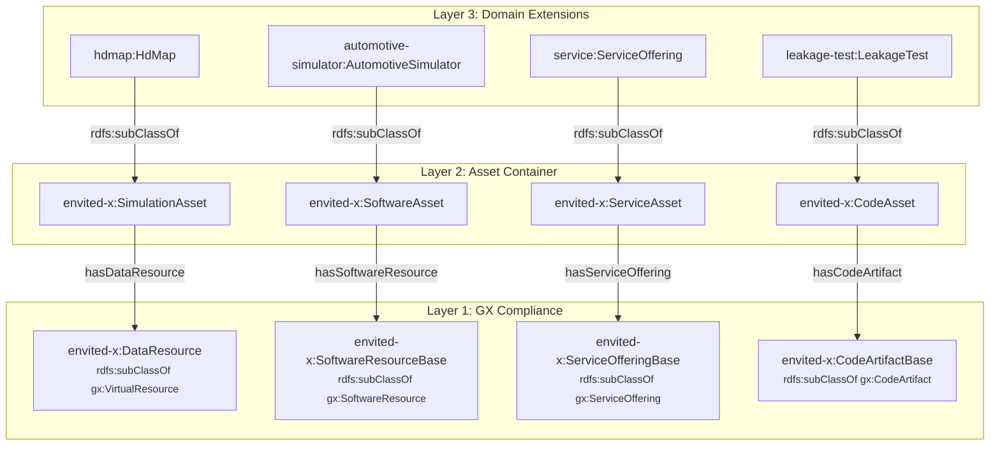

# GX Integration Pattern

How ENVITED-X domain ontologies integrate with Gaia-X 25.11 while preserving semantic precision.

## The `sh:closed` Problem

Gaia-X 25.11 removed `gx:DataResource` and `gx:DataExchangeComponent`. The remaining class hierarchy imposes a critical SHACL constraint: several key GX types use `sh:closed true`, which rejects any property not explicitly listed in the shape.

```
gx:VirtualResource         sh:closed false   ← ONLY open class
  └─ gx:SoftwareResource   sh:closed true    ← blocks extensions
       └─ gx:CodeArtifact  sh:closed false   (but parent shape is closed!)
  └─ gx:ServiceOffering    sh:closed true    ← blocks extensions
```

When a domain class (e.g., `automotive-simulator:AutomotiveSimulator`) is declared as `rdfs:subClassOf gx:SoftwareResource`, SHACL validation fires `gx:SoftwareResourceShape` on every instance. Because that shape is closed, any domain-specific property (`automotive-simulator:simulatorMake`, etc.) triggers a validation failure.

!!! warning "Why `owl:unionOf` doesn't help"
    Making a domain class a union member of a closed GX type still triggers the closed SHACL shape via RDFS inference. The reasoner infers that the instance is a `gx:SoftwareResource`, so `gx:SoftwareResourceShape` fires and rejects unknown properties.

### Current workaround

As a temporary fix, all domain OWL files were changed to:

```turtle
automotive-simulator:AutomotiveSimulator a owl:Class ;
    rdfs:subClassOf gx:VirtualResource .  # ← loses semantic precision
```

This passes SHACL validation (since `gx:VirtualResourceShape` has `sh:closed false`) but loses the semantic distinction between data assets, software, services, and code artifacts.

## The Three-Layer Wrapper Pattern

The existing `envited-x:SimulationAsset` already solves this problem for data resources. The pattern generalizes into three layers:



### How it works

| Layer | Role | SHACL openness |
|-------|------|----------------|
| **Layer 1 — GX Compliance Resource** | A minimal node typed to the closed GX class. Carries only GX-required properties (`gx:name`, `gx:license`, etc.), so it passes the closed SHACL shape. | Constrained by GX shape |
| **Layer 2 — Asset Container** | An envited-x wrapper class (`sh:closed false`). Links to the Layer 1 resource via a dedicated property and to a manifest. Stays open for domain-specific properties. | Open |
| **Layer 3 — Domain Extensions** | Domain-specific subclasses that add their own metadata. Inherit the wrapper structure from Layer 2 and can freely add properties. | Open (inherited) |

The key insight: **the closed GX shape only fires on the Layer 1 node**, which contains only GX properties. Domain properties live on the Layer 2/3 nodes, which are never typed to the closed GX class.

## Wrapper Class Catalog

| Wrapper Class | GX Target Type | Linking Property | GX Base Class | Use Cases |
|---|---|---|---|---|
| `envited-x:SimulationAsset` | `gx:VirtualResource` | `hasDataResource` | `envited-x:DataResource` | hdmap, ositrace, scenario, environment-model, surface-model |
| `envited-x:SoftwareAsset` | `gx:SoftwareResource` | `hasSoftwareResource` | `envited-x:SoftwareResourceBase` | automotive-simulator, simulated-sensor, simulation-model |
| `envited-x:ServiceAsset` | `gx:ServiceOffering` | `hasServiceOffering` | `envited-x:ServiceOfferingBase` | service, survey, tzip21 |
| `envited-x:CodeAsset` | `gx:CodeArtifact` | `hasCodeArtifact` | `envited-x:CodeArtifactBase` | leakage-test, vv-report |

## Existing Pattern: SimulationAsset

The `SimulationAsset` is the existing reference implementation. It is defined in `artifacts/envited-x/envited-x.owl.ttl`:

```turtle
envited-x:SimulationAsset a owl:Class ;
    rdfs:subClassOf owl:Thing ;
    rdfs:subClassOf [
        a owl:Restriction ;
        owl:onProperty envited-x:hasDataResource ;
        owl:someValuesFrom [
            a owl:Class ;
            owl:unionOf ( envited-x:DataResource manifest:Link )
        ]
    ] ;
    rdfs:subClassOf [
        a owl:Restriction ;
        owl:onProperty envited-x:hasDataResourceExtension ;
        owl:minCardinality 0
    ] ;
    rdfs:subClassOf [
        a owl:Restriction ;
        owl:onProperty envited-x:hasManifest ;
        owl:cardinality 1
    ] .

envited-x:DataResource a owl:Class ;
    rdfs:subClassOf gx:VirtualResource .
```

Domain classes like `hdmap:HdMap` are subclasses of `SimulationAsset` and use `hasDataResource` to link to a `DataResource` node that is typed to `gx:VirtualResource`. The domain's own properties live on the `HdMap` node, safely outside the GX shape scope.

## OWL Pattern Templates

The following templates show the OWL definitions for each new wrapper class.

### SoftwareAsset (for `gx:SoftwareResource`)

```turtle
# Asset container for software resources
envited-x:SoftwareAsset a owl:Class ;
    rdfs:label "Class definition for SoftwareAsset"@en ;
    rdfs:comment """A structured digital asset wrapping a GX SoftwareResource.
        Carries domain-specific metadata while delegating GX compliance
        to the linked SoftwareResourceBase node."""@en ;
    rdfs:subClassOf owl:Thing ;
    rdfs:subClassOf [
        a owl:Restriction ;
        owl:onProperty envited-x:hasSoftwareResource ;
        owl:someValuesFrom [
            a owl:Class ;
            owl:unionOf ( envited-x:SoftwareResourceBase manifest:Link )
        ]
    ] ;
    rdfs:subClassOf [
        a owl:Restriction ;
        owl:onProperty envited-x:hasDataResourceExtension ;
        owl:minCardinality 0
    ] ;
    rdfs:subClassOf [
        a owl:Restriction ;
        owl:onProperty envited-x:hasManifest ;
        owl:cardinality 1
    ] .

# GX-coupled base resource
envited-x:SoftwareResourceBase a owl:Class ;
    rdfs:label "Class definition for SoftwareResourceBase"@en ;
    rdfs:comment "Base class coupling ENVITED-X software assets to gx:SoftwareResource."@en ;
    rdfs:subClassOf gx:SoftwareResource .

# Linking property
envited-x:hasSoftwareResource a owl:ObjectProperty ;
    rdfs:label "has software resource"@en ;
    rdfs:comment "Links a SoftwareAsset to its GX-compliant SoftwareResourceBase."@en ;
    rdfs:domain envited-x:SoftwareAsset ;
    rdfs:range [
        a owl:Class ;
        owl:unionOf ( envited-x:SoftwareResourceBase manifest:Link )
    ] ;
    rdfs:subPropertyOf envited-x:hasDataResource .
```

### ServiceAsset (for `gx:ServiceOffering`)

```turtle
# Asset container for service offerings
envited-x:ServiceAsset a owl:Class ;
    rdfs:label "Class definition for ServiceAsset"@en ;
    rdfs:comment """A structured digital asset wrapping a GX ServiceOffering.
        Carries domain-specific metadata while delegating GX compliance
        to the linked ServiceOfferingBase node."""@en ;
    rdfs:subClassOf owl:Thing ;
    rdfs:subClassOf [
        a owl:Restriction ;
        owl:onProperty envited-x:hasServiceOffering ;
        owl:someValuesFrom [
            a owl:Class ;
            owl:unionOf ( envited-x:ServiceOfferingBase manifest:Link )
        ]
    ] ;
    rdfs:subClassOf [
        a owl:Restriction ;
        owl:onProperty envited-x:hasDataResourceExtension ;
        owl:minCardinality 0
    ] ;
    rdfs:subClassOf [
        a owl:Restriction ;
        owl:onProperty envited-x:hasManifest ;
        owl:cardinality 1
    ] .

# GX-coupled base resource
envited-x:ServiceOfferingBase a owl:Class ;
    rdfs:label "Class definition for ServiceOfferingBase"@en ;
    rdfs:comment "Base class coupling ENVITED-X service assets to gx:ServiceOffering."@en ;
    rdfs:subClassOf gx:ServiceOffering .

# Linking property
envited-x:hasServiceOffering a owl:ObjectProperty ;
    rdfs:label "has service offering"@en ;
    rdfs:comment "Links a ServiceAsset to its GX-compliant ServiceOfferingBase."@en ;
    rdfs:domain envited-x:ServiceAsset ;
    rdfs:range [
        a owl:Class ;
        owl:unionOf ( envited-x:ServiceOfferingBase manifest:Link )
    ] ;
    rdfs:subPropertyOf envited-x:hasDataResource .
```

### CodeAsset (for `gx:CodeArtifact`)

```turtle
# Asset container for code artifacts
envited-x:CodeAsset a owl:Class ;
    rdfs:label "Class definition for CodeAsset"@en ;
    rdfs:comment """A structured digital asset wrapping a GX CodeArtifact.
        Carries domain-specific metadata while delegating GX compliance
        to the linked CodeArtifactBase node."""@en ;
    rdfs:subClassOf owl:Thing ;
    rdfs:subClassOf [
        a owl:Restriction ;
        owl:onProperty envited-x:hasCodeArtifact ;
        owl:someValuesFrom [
            a owl:Class ;
            owl:unionOf ( envited-x:CodeArtifactBase manifest:Link )
        ]
    ] ;
    rdfs:subClassOf [
        a owl:Restriction ;
        owl:onProperty envited-x:hasDataResourceExtension ;
        owl:minCardinality 0
    ] ;
    rdfs:subClassOf [
        a owl:Restriction ;
        owl:onProperty envited-x:hasManifest ;
        owl:cardinality 1
    ] .

# GX-coupled base resource
envited-x:CodeArtifactBase a owl:Class ;
    rdfs:label "Class definition for CodeArtifactBase"@en ;
    rdfs:comment "Base class coupling ENVITED-X code assets to gx:CodeArtifact."@en ;
    rdfs:subClassOf gx:CodeArtifact .

# Linking property
envited-x:hasCodeArtifact a owl:ObjectProperty ;
    rdfs:label "has code artifact"@en ;
    rdfs:comment "Links a CodeAsset to its GX-compliant CodeArtifactBase."@en ;
    rdfs:domain envited-x:CodeAsset ;
    rdfs:range [
        a owl:Class ;
        owl:unionOf ( envited-x:CodeArtifactBase manifest:Link )
    ] ;
    rdfs:subPropertyOf envited-x:hasDataResource .
```

## Disjointness

Each wrapper class and its corresponding base resource class are disjoint, preventing accidental conflation:

```turtle
[ a owl:AllDisjointClasses ;
  owl:members (
    envited-x:SimulationAsset
    envited-x:SoftwareAsset
    envited-x:ServiceAsset
    envited-x:CodeAsset
    envited-x:DataResource
    envited-x:SoftwareResourceBase
    envited-x:ServiceOfferingBase
    envited-x:CodeArtifactBase
  )
] .
```

## OWL Constructs Used

| Construct | Purpose |
|-----------|---------|
| `owl:Restriction` + `owl:someValuesFrom` | Require at least one GX resource link on each wrapper |
| `owl:unionOf` | Allow either an inline resource or a `manifest:Link` reference |
| `owl:AllDisjointClasses` | Prevent wrapper/resource type confusion |
| `rdfs:subPropertyOf` | Make `hasSoftwareResource`, `hasServiceOffering`, `hasCodeArtifact` sub-properties of `hasDataResource` for query compatibility |
| `owl:cardinality 1` | Exactly one manifest per asset |

## Instance Data Structure

After migration, instance JSON-LD uses a nested structure where the GX-compliant metadata sits inside the linking property.

### Before (flat, current workaround)

The automotive simulator currently puts GX properties and domain properties on the same node:

```json
{
  "@type": "automotive-simulator:AutomotiveSimulator",
  "automotive-simulator:simulatorMake": "CARLA",
  "automotive-simulator:softwareVersion": "0.9.15",
  "gx:license": "EPL-2.0",
  "gx:producedBy": { "@id": "did:web:..." },
  "gx:copyrightOwnedBy": { "@id": "did:web:..." },
  "gx:containsPII": false,
  "gx:resourcePolicy": "allow intent"
}
```

### After (nested, using SoftwareAsset wrapper)

GX properties move into the `hasSoftwareResource` node:

```json
{
  "@type": "automotive-simulator:AutomotiveSimulator",
  "automotive-simulator:hasSoftwareResource": {
    "@id": "did:web:registry.envited-x.net::SoftwareResourceBase:abc123",
    "@type": "envited-x:SoftwareResourceBase",
    "gx:name": "CARLA Simulator Extension",
    "gx:description": "Modified CARLA simulator with degradation models.",
    "gx:license": "EPL-2.0",
    "gx:producedBy": { "@id": "did:web:..." },
    "gx:copyrightOwnedBy": { "@id": "did:web:..." },
    "gx:containsPII": false,
    "gx:resourcePolicy": "allow intent"
  },
  "automotive-simulator:hasDataResourceExtension": {
    "@type": "automotive-simulator:DataResourceExtension",
    "automotive-simulator:hasContent": {
      "@type": "automotive-simulator:Content",
      "automotive-simulator:simulatorMake": "CARLA",
      "automotive-simulator:softwareVersion": "0.9.15",
      "automotive-simulator:sensorFailureFlag": true,
      "automotive-simulator:sensorAttackFlag": true
    },
    "automotive-simulator:hasFormat": {
      "@type": "automotive-simulator:Format",
      "automotive-simulator:scenarioDefinition": ["ASAM OpenSCENARIO 2.x"],
      "automotive-simulator:interface": ["ROS1", "ROS2"]
    }
  },
  "automotive-simulator:hasManifest": {
    "@type": "manifest:Link",
    "manifest:iri": { "@id": "did:web:..." }
  }
}
```

## Comparison with SimulationAsset

The new wrapper classes follow the identical structural pattern as `SimulationAsset`:

| Aspect | SimulationAsset (existing) | SoftwareAsset / ServiceAsset / CodeAsset (new) |
|--------|---|---|
| Parent class | `owl:Thing` | `owl:Thing` |
| GX link property | `hasDataResource` | `hasSoftwareResource` / `hasServiceOffering` / `hasCodeArtifact` |
| GX base class | `DataResource` → `gx:VirtualResource` | `SoftwareResourceBase` → `gx:SoftwareResource`, etc. |
| Manifest link | `hasManifest` (cardinality 1) | `hasManifest` (cardinality 1) |
| Extension support | `hasDataResourceExtension` (min 0) | `hasDataResourceExtension` (min 0) |
| SHACL openness | Open (wrapper), constrained (base) | Open (wrapper), constrained (base) |

The only difference is which GX class the base resource extends and which linking property is used. The structural pattern is identical.
