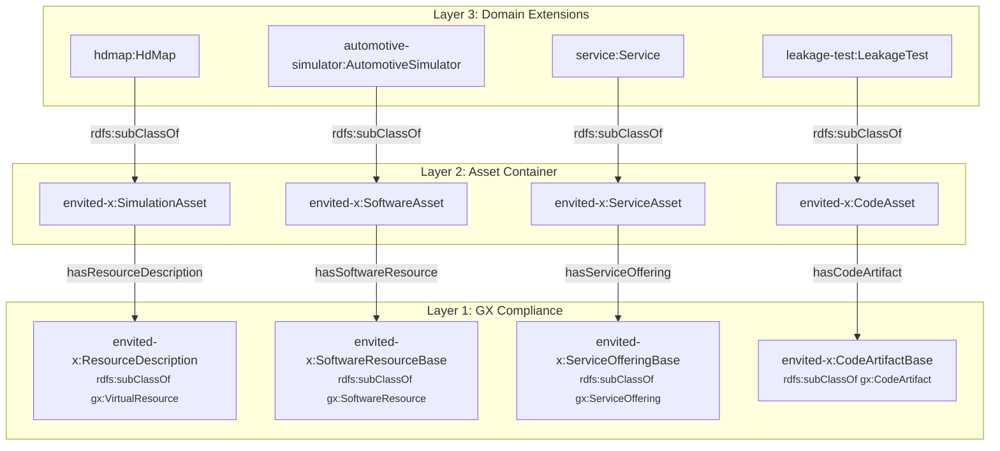

# GX Integration Pattern

How ENVITED-X domain ontologies integrate with Gaia-X 25.11 while preserving semantic precision.

## The `sh:closed` Problem

Gaia-X 25.11 removed `gx:DataResource` and `gx:DataExchangeComponent`. The remaining class hierarchy imposes a critical SHACL constraint: several key GX types use `sh:closed true`, which rejects any property not explicitly listed in the shape.

```
gx:VirtualResource         sh:closed false   ← ONLY open class
  └─ gx:SoftwareResource   sh:closed true    ← blocks extensions
       └─ gx:CodeArtifact  sh:closed false   (but parent shape is closed!)
  └─ gx:ServiceOffering    sh:closed true    ← blocks extensions
```

When a domain class (e.g., `automotive-simulator:AutomotiveSimulator`) is declared as `rdfs:subClassOf gx:SoftwareResource`, SHACL validation fires `gx:SoftwareResourceShape` on every instance. Because that shape is closed, any domain-specific property (`automotive-simulator:simulatorMake`, etc.) triggers a validation failure.

!!! warning "Why `owl:unionOf` doesn't help"
    Making a domain class a union member of a closed GX type still triggers the closed SHACL shape via RDFS inference. The reasoner infers that the instance is a `gx:SoftwareResource`, so `gx:SoftwareResourceShape` fires and rejects unknown properties.

## The Three-Layer Wrapper Pattern

The ENVITED-X wrapper architecture solves this by **composing** rather than **inheriting** from GX types. Each asset wrapper delegates GX compliance to a separate node that carries only GX-allowed properties.



### How it works

| Layer | Role | SHACL openness |
|-------|------|----------------|
| **Layer 1 — GX Compliance Resource** | A minimal node typed to the closed GX class. Carries only GX-required properties, so it passes the closed SHACL shape. | Constrained by GX shape |
| **Layer 2 — Asset Container** | An envited-x wrapper class (`sh:closed false`). Links to the Layer 1 resource via a dedicated property, to a DomainSpecification, and to a manifest. Stays open for domain-specific properties. | Open |
| **Layer 3 — Domain Extensions** | Domain-specific subclasses that add their own metadata via DomainSpecification (Content, Format, Quality, Quantity, DataSource). Inherit the wrapper structure from Layer 2. | Open (inherited) |

The key insight: **the closed GX shape only fires on the Layer 1 node**, which contains only GX properties. Domain properties live on the Layer 2/3 nodes, which are never typed to the closed GX class.

## The Coupling Principle

The `ascs-ev/envited-x` IRI namespace (`https://w3id.org/ascs-ev/envited-x/`) acts as the **single coupling point** between ENVITED-X domain ontologies and the Gaia-X ecosystem. Domain ontologies never directly subclass or reference GX types — they only interact with GX through the envited-x wrapper layer:

```
Domain Ontology  ──imports──►  envited-x/v3  ──imports──►  gx:development#
     (Layer 3)                  (Layer 2)                    (Layer 1)
```

This decoupling provides several benefits:

1. **GX version isolation** — When Gaia-X releases a new version (e.g., 26.x), only the envited-x wrapper needs updating. Domain ontologies remain unchanged.
2. **Property namespace separation** — GX properties (`schema:name`, `gx:license`, etc.) live on the Layer 1 node. Domain properties live on the DomainSpecification node. They never mix on the same typed node.
3. **Closed shape containment** — GX's `sh:closed true` constraints are satisfied at Layer 1 and cannot leak into domain-specific nodes.

### GX Property Namespaces per Base Type

Different GX types require different property namespaces:

| Base Type | Name Property | Description Property | Notes |
|-----------|--------------|---------------------|-------|
| `ResourceDescription` (→ `gx:VirtualResource`) | `gx:name` | `gx:description` | Open shape, uses `gx:` namespace |
| `SoftwareResourceBase` (→ `gx:SoftwareResource`) | `schema:name` | `schema:description` | Closed shape, uses `schema:` namespace |
| `ServiceOfferingBase` (→ `gx:ServiceOffering`) | `schema:name` | `schema:description` | Closed shape, does **not** allow `gx:license` |
| `CodeArtifactBase` (→ `gx:CodeArtifact`) | `schema:name` | `schema:description` | Open shape (but parent SoftwareResource shape is closed) |

!!! warning "ServiceOffering has no `gx:license`"
    Unlike VirtualResource and SoftwareResource, `gx:ServiceOfferingShape` does **not** include `gx:license` in its allowlist. Service domain instances must omit this property.

## Wrapper Class Catalog

| Wrapper Class | GX Target Type | Linking Property | GX Base Class | Use Cases |
|---|---|---|---|---|
| `envited-x:SimulationAsset` | `gx:VirtualResource` | `hasResourceDescription` | `envited-x:ResourceDescription` | hdmap, ositrace, scenario, environment-model, surface-model, survey (result) |
| `envited-x:SoftwareAsset` | `gx:SoftwareResource` | `hasSoftwareResource` | `envited-x:SoftwareResourceBase` | automotive-simulator, simulation-model |
| `envited-x:ServiceAsset` | `gx:ServiceOffering` | `hasServiceOffering` | `envited-x:ServiceOfferingBase` | service, survey (service offering) |
| `envited-x:CodeAsset` | `gx:CodeArtifact` | `hasCodeArtifact` | `envited-x:CodeArtifactBase` | leakage-test, vv-report |

!!! info "Domains not using wrappers"
    **simulated-sensor** and **tzip21** remain as `rdfs:subClassOf gx:VirtualResource` (open shape). simulated-sensor is nested within automotive-simulator instances — making it a SoftwareAsset would require adding hasSoftwareResource/hasManifest to every nested sensor node. tzip21 uses the unique TZIP-21 NFT metadata standard with its own structure.

## DomainSpecification Pattern

Each wrapper asset links to a `DomainSpecification` node that provides structured domain metadata through facets:

```turtle
envited-x:DomainSpecification a owl:Class .
envited-x:Content a owl:Class .    # What the asset contains
envited-x:Format a owl:Class .     # How the asset is formatted
envited-x:Quality a owl:Class .    # Quality characteristics
envited-x:Quantity a owl:Class .   # Quantity metrics
envited-x:DataSource a owl:Class . # Origin/provenance
```

Domain ontologies subclass these to add their own properties:

```turtle
hdmap:DomainSpecification rdfs:subClassOf envited-x:DomainSpecification .
hdmap:Content rdfs:subClassOf envited-x:Content .
hdmap:Format rdfs:subClassOf envited-x:Format .
```

The `hasContent` facet is **required** at the base level. All other facets (`hasFormat`, `hasQuality`, `hasQuantity`, `hasDataSource`) are **optional** — domain-specific shapes can enforce stricter constraints.

## OWL Pattern Templates

The following templates show the OWL definitions for each wrapper class.

### SoftwareAsset (for `gx:SoftwareResource`)

```turtle
# Asset container for software resources
envited-x:SoftwareAsset a owl:Class ;
    rdfs:label "Class definition for SoftwareAsset"@en ;
    rdfs:subClassOf owl:Thing ;
    rdfs:subClassOf [
        a owl:Restriction ;
        owl:onProperty envited-x:hasSoftwareResource ;
        owl:someValuesFrom [
            a owl:Class ;
            owl:unionOf ( envited-x:SoftwareResourceBase manifest:Link )
        ]
    ] ;
    rdfs:subClassOf [
        a owl:Restriction ;
        owl:onProperty envited-x:hasDomainSpecification ;
        owl:minCardinality 0
    ] ;
    rdfs:subClassOf [
        a owl:Restriction ;
        owl:onProperty envited-x:hasManifest ;
        owl:cardinality 1
    ] .

# GX-coupled base resource
envited-x:SoftwareResourceBase a owl:Class ;
    rdfs:subClassOf gx:SoftwareResource .

# Linking property
envited-x:hasSoftwareResource a owl:ObjectProperty ;
    rdfs:range [
        a owl:Class ;
        owl:unionOf ( envited-x:SoftwareResourceBase manifest:Link )
    ] ;
    rdfs:subPropertyOf envited-x:hasResourceDescription .
```

### ServiceAsset (for `gx:ServiceOffering`)

```turtle
envited-x:ServiceAsset a owl:Class ;
    rdfs:subClassOf owl:Thing ;
    rdfs:subClassOf [
        a owl:Restriction ;
        owl:onProperty envited-x:hasServiceOffering ;
        owl:someValuesFrom [
            a owl:Class ;
            owl:unionOf ( envited-x:ServiceOfferingBase manifest:Link )
        ]
    ] ;
    rdfs:subClassOf [
        a owl:Restriction ;
        owl:onProperty envited-x:hasDomainSpecification ;
        owl:minCardinality 0
    ] ;
    rdfs:subClassOf [
        a owl:Restriction ;
        owl:onProperty envited-x:hasManifest ;
        owl:cardinality 1
    ] .

envited-x:ServiceOfferingBase a owl:Class ;
    rdfs:subClassOf gx:ServiceOffering .

envited-x:hasServiceOffering a owl:ObjectProperty ;
    rdfs:range [
        a owl:Class ;
        owl:unionOf ( envited-x:ServiceOfferingBase manifest:Link )
    ] ;
    rdfs:subPropertyOf envited-x:hasResourceDescription .
```

### CodeAsset (for `gx:CodeArtifact`)

```turtle
envited-x:CodeAsset a owl:Class ;
    rdfs:subClassOf owl:Thing ;
    rdfs:subClassOf [
        a owl:Restriction ;
        owl:onProperty envited-x:hasCodeArtifact ;
        owl:someValuesFrom [
            a owl:Class ;
            owl:unionOf ( envited-x:CodeArtifactBase manifest:Link )
        ]
    ] ;
    rdfs:subClassOf [
        a owl:Restriction ;
        owl:onProperty envited-x:hasDomainSpecification ;
        owl:minCardinality 0
    ] ;
    rdfs:subClassOf [
        a owl:Restriction ;
        owl:onProperty envited-x:hasManifest ;
        owl:cardinality 1
    ] .

envited-x:CodeArtifactBase a owl:Class ;
    rdfs:subClassOf gx:CodeArtifact .

envited-x:hasCodeArtifact a owl:ObjectProperty ;
    rdfs:range [
        a owl:Class ;
        owl:unionOf ( envited-x:CodeArtifactBase manifest:Link )
    ] ;
    rdfs:subPropertyOf envited-x:hasResourceDescription .
```

## Disjointness

Each wrapper class and its corresponding base resource class are disjoint, preventing accidental conflation:

```turtle
[ a owl:AllDisjointClasses ;
  owl:members (
    envited-x:SimulationAsset
    envited-x:SoftwareAsset
    envited-x:ServiceAsset
    envited-x:CodeAsset
    envited-x:ResourceDescription
    envited-x:SoftwareResourceBase
    envited-x:ServiceOfferingBase
    envited-x:CodeArtifactBase
  )
] .
```

## OWL Constructs Used

| Construct | Purpose |
|-----------|---------|
| `owl:Restriction` + `owl:someValuesFrom` | Require at least one GX resource link on each wrapper |
| `owl:unionOf` | Allow either an inline resource or a `manifest:Link` reference |
| `owl:AllDisjointClasses` | Prevent wrapper/resource type confusion |
| `rdfs:subPropertyOf` | Make `hasSoftwareResource`, `hasServiceOffering`, `hasCodeArtifact` sub-properties of `hasResourceDescription` for query compatibility |
| `owl:cardinality 1` | Exactly one manifest per asset |

## Instance Data Structure

After migration, instance JSON-LD uses a nested structure where the GX-compliant metadata sits inside the linking property.

### Before (flat, old workaround)

```json
{
  "@type": "automotive-simulator:AutomotiveSimulator",
  "automotive-simulator:simulatorMake": "CARLA",
  "automotive-simulator:softwareVersion": "0.9.15",
  "gx:license": "EPL-2.0",
  "gx:producedBy": { "@id": "did:web:..." },
  "gx:copyrightOwnedBy": { "@id": "did:web:..." },
  "gx:containsPII": false,
  "gx:resourcePolicy": "allow intent"
}
```

### After (nested, using SoftwareAsset wrapper)

GX properties move into the `hasSoftwareResource` node. Domain properties move into `hasDomainSpecification`:

```json
{
  "@type": "automotive-simulator:AutomotiveSimulator",
  "automotive-simulator:hasSoftwareResource": {
    "@type": "envited-x:SoftwareResourceBase",
    "schema:name": "CARLA Simulator Extension",
    "schema:description": "Modified CARLA simulator with sensor degradation models.",
    "gx:license": "EPL-2.0",
    "gx:producedBy": { "@id": "did:web:..." },
    "gx:copyrightOwnedBy": { "@id": "did:web:..." },
    "gx:containsPII": false,
    "gx:resourcePolicy": "allow intent"
  },
  "automotive-simulator:hasDomainSpecification": {
    "@type": "automotive-simulator:DomainSpecification",
    "automotive-simulator:hasContent": {
      "@type": "automotive-simulator:Content",
      "automotive-simulator:simulatorMake": "CARLA",
      "automotive-simulator:sensorFailureFlag": true,
      "automotive-simulator:sensorAttackFlag": true
    },
    "automotive-simulator:hasFormat": {
      "@type": "automotive-simulator:Format",
      "automotive-simulator:scenarioDefinition": ["ASAM OpenSCENARIO 2.x"],
      "automotive-simulator:interface": ["ROS1", "ROS2"]
    }
  },
  "automotive-simulator:hasManifest": {
    "@type": "manifest:Link",
    "manifest:iri": { "@id": "did:web:..." }
  }
}
```

## RDFS Inference and `schema:name`

The GX ontology imports `schema.owl.ttl`, which originally contained:

```turtle
schema:name rdfs:subPropertyOf rdfs:label .
```

This caused RDFS inference to add `rdfs:label` triples to any node with `schema:name`. Since `rdfs:label` is not in the GX closed shape allowlists, this triggered validation failures. The fix was to remove this `rdfs:subPropertyOf` declaration from the local `imports/schema/schema.owl.ttl`.

## Comparison with SimulationAsset

All wrapper classes follow the identical structural pattern as `SimulationAsset`:

| Aspect | SimulationAsset | SoftwareAsset / ServiceAsset / CodeAsset |
|--------|---|---|
| Parent class | `owl:Thing` | `owl:Thing` |
| GX link property | `hasResourceDescription` | `hasSoftwareResource` / `hasServiceOffering` / `hasCodeArtifact` |
| GX base class | `ResourceDescription` → `gx:VirtualResource` | `SoftwareResourceBase` → `gx:SoftwareResource`, etc. |
| Manifest link | `hasManifest` (cardinality 1) | `hasManifest` (cardinality 1) |
| Domain extension | `hasDomainSpecification` (min 0) | `hasDomainSpecification` (min 0) |
| SHACL openness | Open (wrapper), constrained (base) | Open (wrapper), constrained (base) |

The only difference is which GX class the base resource extends and which linking property is used. The structural pattern is identical.
